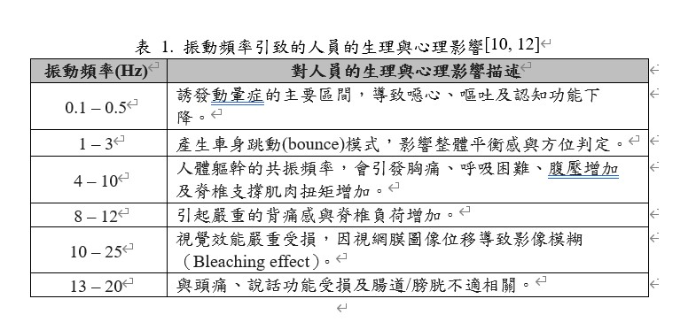

# HOME

[Private](Private/Private.md)

## 空力的pitch 行程限制
[Pitch Stiffness](open/Pitch_Stiffness/Pitch_Stiffness.md)
 : 空力允許攻角變化找出最低pitch剛性限制

## 懸吊行程的剛性限制
[Compressed travel](open/Compressed_travel/Compressed_travel.md)
 : 懸吊行程的最低剛性下限制

## 人體頻率限制

## 車架剛性參考
[Overall Rigidity](open/Overall_Rigidity/Overall_Rigidity.md) : 用於預設的車架剛性參考

## 輪胎環模態頻率
[Tire Ring Mode](open/Tire_Ring_Mode/Tire_Ring_Mode.md) : 
分析不同模態階數的頻率，理論上我們需要避開。但基本上結果都在和自然頻率差太多算是做好玩用的。

## 路面震動分析
[PSD](open/PSD/PSD.md) : 這個分析用來確認懸吊需要應付的主要振動頻率範圍，不過裡面有些分析實用性不高。
