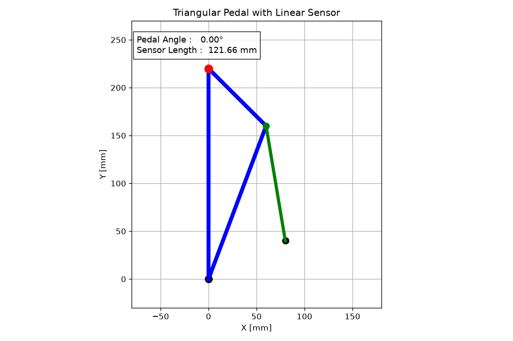

# 煞車

## [前後煞車比](Brake_ratio/Brake_ratio.md)

>計算前後煞車比，用於設計前後油路放大倍率。

車輛減速時，載荷會由後軸轉移至前軸。為了充分利用前後輪與路面間的摩擦極限（防止前輪或後輪過早鎖死），前後煞車力配比需隨著減速速度（gg 值）動態調整。但因為我們目前只打算使用固定比例，所以對理想曲線進行線性回歸，找出較適合的解當作我們油壓放大比例的參考。

## [計算踏板比](Pedal_ratio/Pedal_ratio.md)

>踏板比計算，並看看前後扭矩分配。

在選定煞車系統的零件之後最後我們可以調整讓車手能夠煞住車的地方就只剩下煞車踏板了，所以最後我們需要計算煞車踏板的槓桿需要放大多少煞車比例才足夠。

## [煞車力計算](Brake_force/Brake_force.md)

>計算煞車系統造成的煞車力。

設計煞車系統時候我們考慮每個部份造成的力量放大或縮小比例，並計算前後的煞車比例。同時計算車手出力與預期煞車力和加速度狀況

## [油管膨脹](Brake_hydraulic_pressure/Brake_hydraulic_pressure.md)

>分析油管膨脹影響。

目標計算在目標工作壓力下軟管的每米體積膨脹量$
mm^
3
/
m
$，作為液壓系統建模的依據。

## [建立煞車機構](Pedal_box/Pedal_box.md)

>踏板箱機構簡圖與機構分析。

這個工具用於計算踏板行程與 MC or sensor 的壓縮量的關係，設計煞車油門踏板都可以使用。主要確定我們的設計除了符合車手習慣之外也要讓壓縮輛變化是線性可預測的。

## 建立機構模擬

>如果想看看預期機構會怎麼動就把cad的參數建立進去看看，或者不覺得麻煩直接用cad拉也是可以。

[Download Code(機構動畫)](Pedal_box/Mechanical_structure_2Danimation.py)

