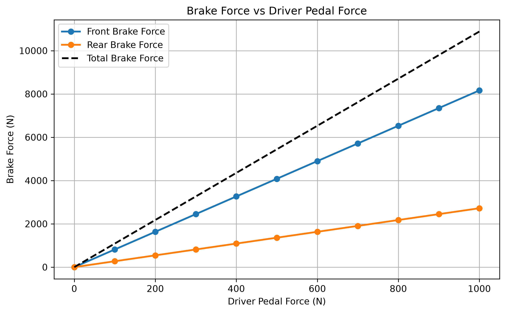
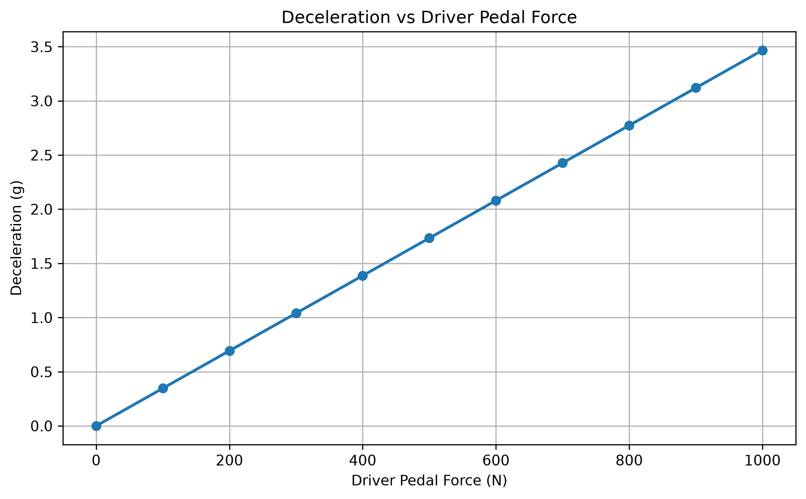

# 煞車系統煞車力計算

[Download Code](Brake_force.py)

## 參數

以下為計算中所採用的物理量與符號說明：

| 變數名稱 | 物理意義 | 單位 |
| --- | --- | --- |
| `m` | 車輛總質量 ($m$) | $kg$ |
| `F_driver` | 車手輸入踏板踩踏力 ($F_{driver}$) | $N$ |
| `PR` | 煞車踏板機構槓桿比 ($PR$) | 無因次 |
| `balance_bar` | 煞車平衡桿前軸分配比例 ($\text{bb}_f$) | 無因次 |
| `D_mc_f`, `D_mc_r` | 前後煞車總泵（Master Cylinder）活塞直徑 | $m$ |
| `D_caliper_f`, `D_caliper_r` | 前後煞車卡鉗（Caliper）活塞直徑 | $m$ |
| `N_caliper_f`, `N_caliper_r` | 前後卡鉗活塞總數量 | 個 |
| `mu_pad` | 來令片摩擦係數 ($\mu_{pad}$) | 無因次 |
| `r_disc_o`, `d_gap` | 碟盤外徑與受力有效點偏移距 | $m$ |
| `r_w` | 輪胎有效滾動半徑 ($r_w$) | $m$ |
| `P_mc_f`, `P_mc_r` | 前後軸液壓管路壓力 ($P_f, P_r$) | $Pa$ / $MPa$ |
| `R_brake_f`, `R_brake_r` | 單位踩踏力煞車力放大係數 ($R_{brake}$) | 無因次 |

## 計算

### 1. 踏板力與平衡桿分配 (Pedal & Balance Bar Force)

車手作用於踏板上的力 $F_{driver}$ 經過踏板槓桿比 $PR$ 放大後，作用於煞車平衡桿上的總主缸推力 $F_{mc}$ 為：

$$F_{mc} = F_{driver} \cdot PR$$

透過煞車平衡桿將推力分配至前主缸與後主缸：

$$F_{mc\_f} = F_{mc} \cdot \text{bb}_f, \quad F_{mc\_r} = F_{mc} \cdot (1 - \text{bb}_f)$$

### 2. 液壓壓力與卡鉗夾持力 (Hydraulic Pressure & Clamping Force)

計算前後主缸截面積 $A_{mc} = \pi \left(\frac{D_{mc}}{2}\right)^2$，求得前後液壓管路壓力 $P_{mc\_f}, P_{mc\_r}$：

$$P_{mc\_f} = \frac{F_{mc\_f}}{A_{mc\_f}}, \quad P_{mc\_r} = \frac{F_{mc\_r}}{A_{mc\_r}}$$

結合卡鉗總活塞面積 $A_{caliper} = N_{caliper} \cdot \pi \left(\frac{D_{caliper}}{2}\right)^2$ 與來令片摩擦係數 $\mu_{pad}$，計算雙側總摩擦夾持力：

$$F_{caliper\_f} = P_{mc\_f} \cdot A_{caliper\_f} \cdot \mu_{pad}$$

$$F_{caliper\_r} = P_{mc\_r} \cdot A_{caliper\_r} \cdot \mu_{pad}$$

### 3. 輪軸煞車力與車輛減速度 (Brake Force & Deceleration)

有效煞車力臂 $r_{disc} = \frac{r_{disc\_o}}{2} - d_{gap}$。卡鉗夾持力轉化為輪胎路面煞車力 $F_{brake}$：

$$F_{brake\_f} = \frac{F_{caliper\_f} \cdot r_{disc} \cdot 2}{r_w}, \quad F_{brake\_r} = \frac{F_{caliper\_r} \cdot r_{disc} \cdot 2}{r_w}$$

總煞車力 $F_{brake\_total} = F_{brake\_f} + F_{brake\_r}$。根據牛頓第二運動定律，獲得車輛之等效減速度（以 $g$ 為單位）：

$$a = \frac{F_{brake\_total}}{m}, \quad a_g = \frac{a}{g}$$

定義單位踏板力放大了多少煞車力（$R_{brake\_f} = \frac{F_{brake\_f}}{F_{driver}}$），進而快速掃描 $0 \sim 1000\text{ N}$ 踩踏力下之線性響應曲線。

## 結果

上圖可以看出我們設定的前後比例造成的煞車力前後軸的力量占比

上圖可以知道需要多少加速度時候理論車手要出多少力量
