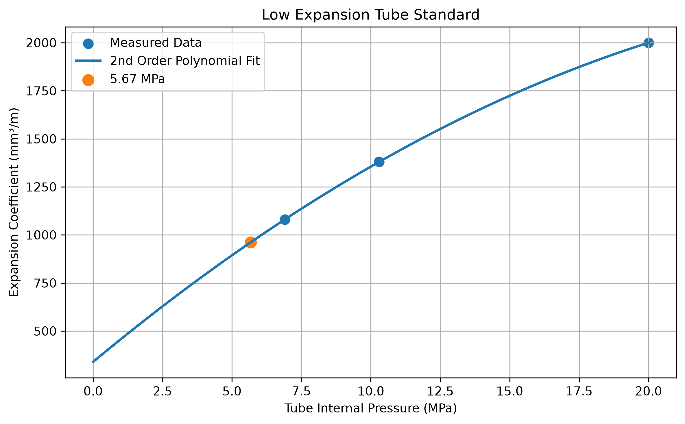
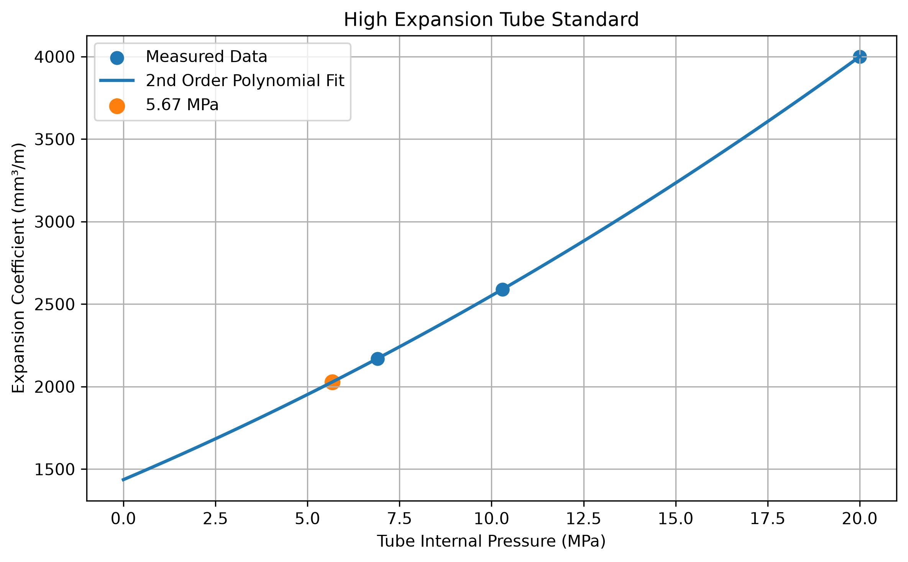

# 煞車油管膨脹特性分析

[Download Code](Brake_hydraulic_pressure.py)

## 簡介

目標計算在目標工作壓力下軟管的每米體積膨脹量（$\text{mm}^3/\text{m}$），作為液壓系統建模的依據。

## 參數

以下為計算中所採用的物理量與符號說明：

| 變數名稱 | 物理意義 | 單位 |
| --- | --- | --- |
| `pressure_target` | 評估目標管路壓力 ($P_{target} = 5.67$) | $MPa$ |
| `pl`, `ph` | 低膨脹與高膨脹軟管之實驗油壓數據點 ($P$) | $MPa$ |
| `cl`, `ch` | 低膨脹與高膨脹軟管之實驗膨脹係數數據點 ($C$) | $mm^3/m$ |
| `nl`, `nh` | 二階多項式擬合係數向量 ($[a, b, c]$) | - |
| `cl_target`, `ch_target` | 目標壓力下推算之軟管每米膨脹量 ($C_{target}$) | $mm^3/m$ |

## 計算

> 煞車系統 : SAE J1401 / ISO 3996 Road vehicles

### 1. 二階多項式最小二乘擬合 (2nd-Order Polynomial Fitting)

橡膠與複合纖維煞車軟管的體積膨脹與內部油壓呈非線性關係，選用二階多項式進行擬合：

$$C(P) = a \cdot P^2 + b \cdot P + c$$

利用 `numpy.polyfit(P, C, 2)` 確定方程組之最小二乘求解，導出係數 $a, b, c$。

### 2. 特徵點計算與內插評估

將擬合多項式在工作壓力區間 $0 \sim 20\text{ MPa}$（時間步長 $0.1\text{ MPa}$）進行連續插值，並在指定目標點 $P_{target}$ 處帶入多項式估算單位長度膨脹量：

$$C_{target} = \text{polyval}(n, P_{target}) = a \cdot (5.67)^2 + b \cdot (5.67) + c$$

此數據可用於後續計算總煞車油耗量與主缸行程容積需求。

## 結果

由下圖與計算結果可以觀察到兩種油管的差異

### 低膨脹

### 高膨脹

