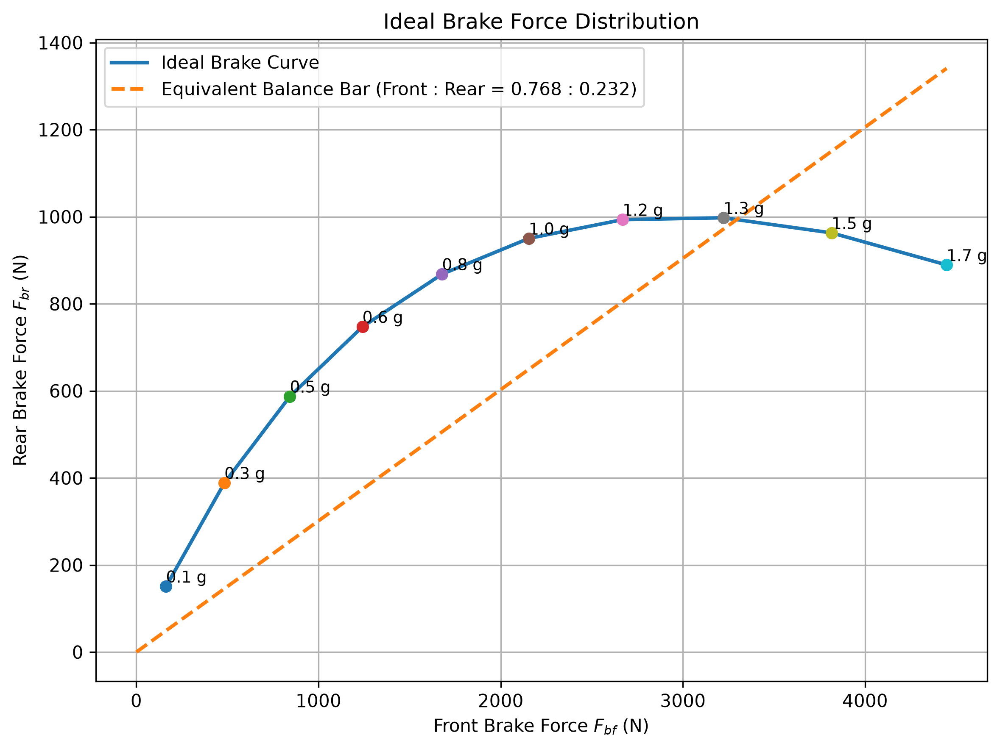

# 車輛理想煞車力比與等效煞車比

[Download Code](Brake_ratio.py)

## 參數

以下為計算中所採用的物理量與符號說明：

| 變數名稱 | 物理意義 | 單位 |
| --- | --- | --- |
| `g` | 重力加速度 ($g = 9.81$) | $m/s^2$ |
| `m` | 車輛總質量 ($m$) | $kg$ |
| `rf`, `rr` | 前輪與後輪靜止軸重分配比例 ($r_f, r_r$) | 無因次 |
| `h` | 車輛重心高度 ($h$) | $m$ |
| `L` | 車輛軸距 ($L$) | $m$ |
| `mu` | 縱向路面摩擦係數 ($\mu$) | 無因次 |
| `Wf`, `Wr` | 前軸與後軸靜止載荷 ($W_f, W_r$) | $N$ |
| `a_g` | 減速加速度（以 $g$ 為單位） | $g$ |
| `dW` | 減速動態軸重轉移量 ($\Delta W$) | $N$ |
| `Fbf`, `Fbr` | 理想前輪與後輪煞車力 ($F_{bf}, F_{br}$) | $N$ |
| `bias_ratio_f`, `bias_ratio_r` | 等效前輪與後輪煞車力百分比 ($\text{Bias}_f, \text{Bias}_r$) | $\%$ |

## 計算

> 參考車輛動力學 : *Fundamentals of Vehicle Dynamics*

### 1. 靜止軸載荷與動態軸重轉移 (Dynamic Load Transfer)

靜止狀態下前後軸載荷：

$$W_f = r_f \cdot m \cdot g, \quad W_r = r_r \cdot m \cdot g$$

車輛以加速度 $a$ 減速時，由重心高度 $h$ 與軸距 $L$ 引起的軸重轉移量 $\Delta W$ 為：

$$\Delta W = \frac{m \cdot a \cdot h}{L}$$

此時前後軸的動態垂直載荷變為 $W_f + \Delta W$ 與 $W_r - \Delta W$。

### 2. 理想前後煞車力分配 (Ideal Brake Force Distribution)
$$F_{bf} = \left(\frac{W_f + \Delta W}{W_f + W_r}\right) \cdot F_b$$

$$F_{br} = \left(\frac{W_r - \Delta W}{W_f + W_r}\right) \cdot F_b$$

由於 $\Delta W$ 隨加速度 $a$ 線性增加，理想前後煞車力關係曲線（$F_{bf}$ vs $F_{br}$）呈**二次非線性曲線（I-Curve）**。

### 3. 過原點線性迴歸與等效煞車配比 (Equivalent Balance Bar Ratio)

$$F_{br} = k \cdot F_{bf}$$

然後線性回歸

$$k = \frac{\sum (F_{bf} \cdot F_{br})}{\sum F_{bf}^2}$$

定義前煞車配比比例 $\text{bias\_ratio} = \frac{1}{k}$，並換算為百分比：

$$\text{Bias}_f = \frac{\text{bias\_ratio}}{\text{bias\_ratio} + 1} \times 100\%, \quad \text{Bias}_r = \frac{1}{\text{bias\_ratio} + 1} \times 100\%$$

## 結果

從以上結果我們可以看到線性回歸之後我們目標的煞車比，我們煞車設計油壓的放大前後比例先盡量貼近這個比例，最後再用bb去微調。