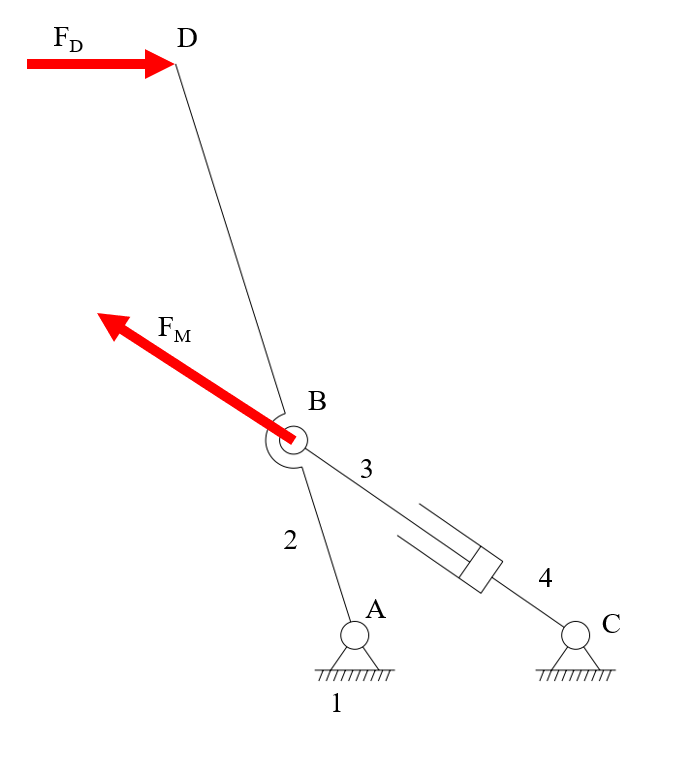
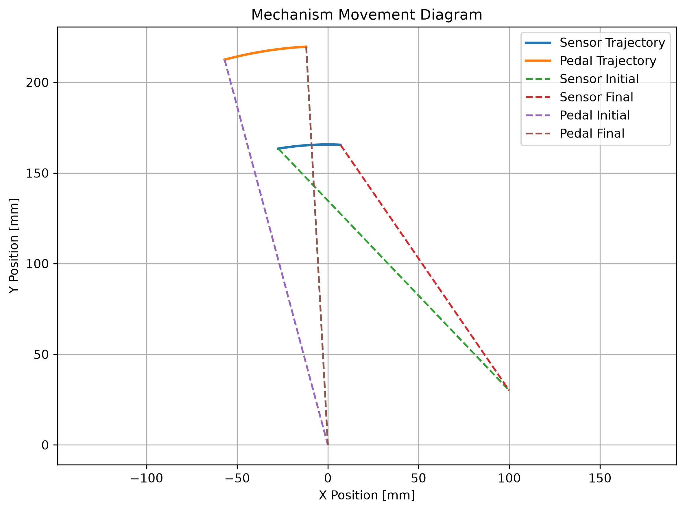
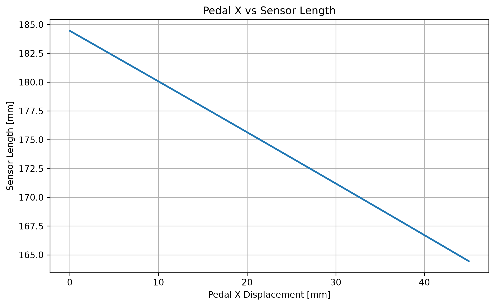
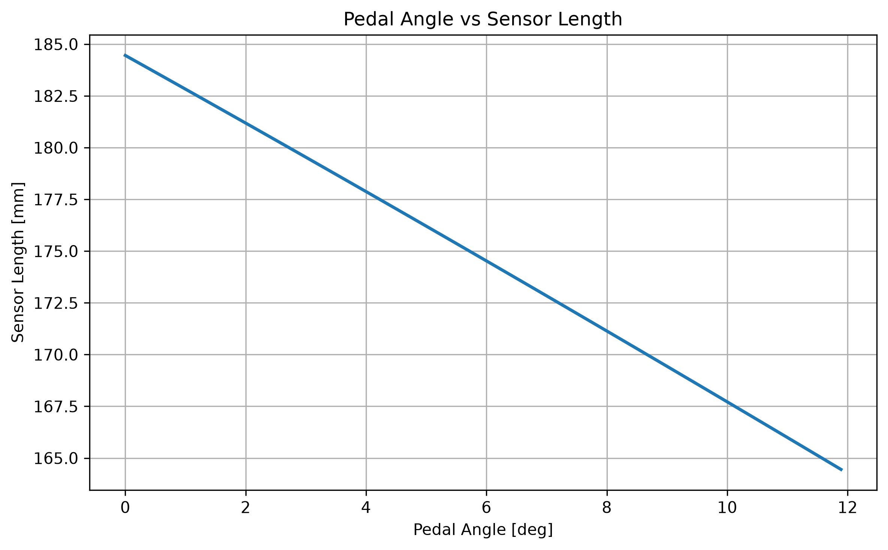
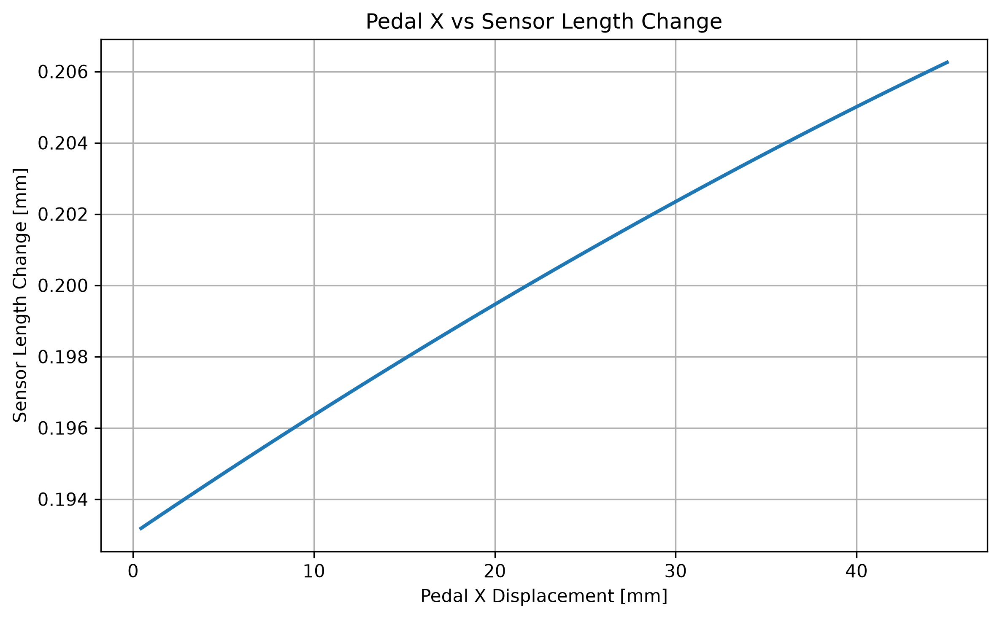
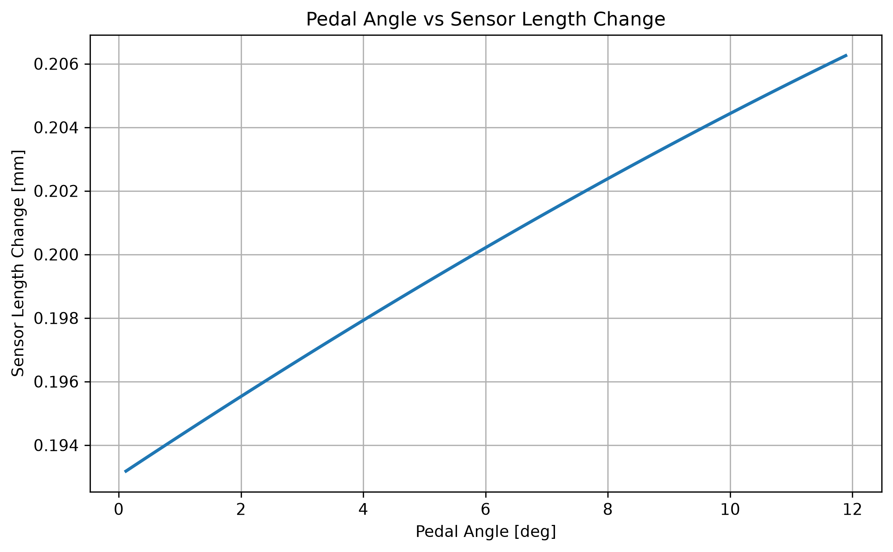

# 煞車踏板機構運動學與感測器行程（Pedal Mechanism Kinematics & Sensor Travel Analysis）分析說明

[Download Code](Pedal_box.py)

## 參數

以下為計算中所採用的幾何量與符號說明：

| 變數名稱 | 物理意義 | 單位 |
| --- | --- | --- |
| `px`, `py` | 感測器固定軸心於座標系之空間位置 ($[P_x, P_y]$) | $mm$ |
| `r_pedal` | 踏板旋轉軸心至踏板踩踏作用點之轉向半徑 ($r_{pedal}$) | $mm$ |
| `r_sensor` | 踏板旋轉軸心至感測器連桿固定點之轉向半徑 ($r_{sensor}$) | $mm$ |
| `pedal_i_angle_deg` | 踏板踩踏點初始安裝角度 ($\theta_{pedal\_i}$) | $^\circ$ |
| `sensor_i_angle_deg` | 感測器連桿點初始安裝角度 ($\theta_{sensor\_i}$) | $^\circ$ |
| `pedal_push_theta_deg` | 車手最大踩踏旋轉角度 ($\theta_{push}$) | $^\circ$ |
| `sensor_length` | 感測器兩端軸心之間距（即感測器即時長度 $L_{sensor}$） | $mm$ |
| `delta_sensor_length` | 每步長感測器長度縮減/壓縮量 ($\Delta L$) | $mm$ |
| `pedal_x_disp` | 踏板踩踏點於 X 軸向之累積位移量 ($\Delta X$) | $mm$ |

## 計算

### 1. 座標系旋轉矩陣與旋轉變換 (Rotation Kinematics)

為符合本系統特定幾何姿態定義，連桿點在繞原點 $(0,0)$ 旋轉角度 $\theta$ 後的即時座標 $(x', y')$ 透過以下變換矩陣求得

$$\begin{bmatrix} x' \\ y' \end{bmatrix} = \begin{bmatrix} \cos\theta & \sin\theta \\ -\sin\theta & \cos\theta \end{bmatrix} \begin{bmatrix} x \\ y \end{bmatrix}$$

其中初始座標由轉向半徑與初始角度確定：

$$\begin{cases} x_{init} = r \cdot \sin(\theta_i) \\ y_{init} = r \cdot \cos(\theta_i) \end{cases}$$

### 2. 即時感測器長度與位移計算 (Sensor Length & Displacement)

用畢氏定理可以記萬出

$$L_{sensor}(t) = \sqrt{(p_x - x_{sensor}(t))^2 + (p_y - y_{sensor}(t))^2}$$

踩踏點 X 軸位移量與感測器長度增量為

$$\text{Pedal } X_{\text{disp}}(t) = x_{pedal}(t) - x_{pedal}(0)$$

$$\Delta L_{sensor}(t) = -(L_{sensor}(t) - L_{sensor}(t-1))$$

## 結果

### 機構簡圖

在我們選定踏板比之後可以先在cad上面畫出如上圖的機構簡圖草圖然後再用此程式分析!!當我們固定踏板比的時候通常在cad上面會有兩個解，如果車體空間允許我們會希望使用踏板比增壓的解而不是踏板比越踩越小的解。

### 機構運動

這是機構運動狀態的圖

### 運動分析

可以看到踏板轉角變化時sensor的變化不會完全一致，盡量讓變化線性一點較佳。

