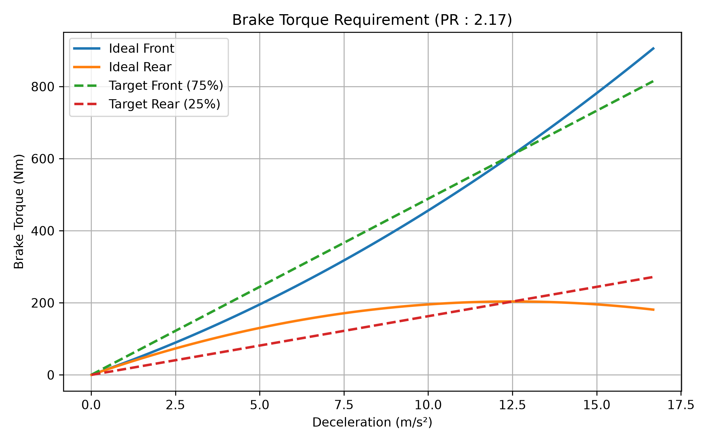

# Pedal Ratio 計算

[Download Code](Pedal_ratio.py)

## 簡介

在選定煞車系統的零件之後最後我們可以調整讓車手能夠煞住車的地方就只剩下煞車踏板了，所以最後我們需要計算煞車踏板的槓桿需要放大多少煞車比例才足夠。

## 參數

以下為計算中所採用的物理量與符號說明：

| 變數名稱 | 物理意義 | 單位 |
| --- | --- | --- |
| `g` | 重力加速度 ($g = 9.81$) | $m/s^2$ |
| `m` | 車輛總質量 ($m$) | $kg$ |
| `rf`, `rr` | 前輪與後輪靜止軸重分配比例 ($r_f, r_r$) | 無因次 |
| `h` | 車輛重心高度 ($h$) | $m$ |
| `L` | 車輛軸距 ($L$) | $m$ |
| `mu_w` | 輪胎縱向抓地力係數 ($\mu_w$) | 無因次 |
| `r_w` | 輪胎有效滾動半徑 ($r_w$) | $m$ |
| `r_disc_o` | 煞車碟盤外徑 ($r_{disc\_o}$) | $m$ |
| `d_gap` | 煞車夾持有效中心與外徑間距 ($d_{gap}$) | $m$ |
| `mu_pad` | 來令片摩擦係數 ($\mu_{pad}$) | 無因次 |
| `D_mc_f`, `D_mc_r` | 前後煞車總泵（Master Cylinder）活塞直徑 | $m$ |
| `D_caliper_f`, `D_caliper_r` | 前後煞車卡鉗（Caliper）活塞直徑 | $m$ |
| `N_caliper_f`, `N_caliper_r` | 前後卡鉗活塞數量（對向卡鉗數量） | 個 |
| `F_driver` | 車手踩踏力 ($F_{driver}$) | $N$ |
| `brake_rate` / `balance_bar` | 預期設定之煞車平衡桿前軸分配比 | 無因次 |
| `SF` | 設計安全係數 ($SF$) | 無因次 |

## 計算

### 1. 軸載荷與極限煞車扭矩 (Maximum Brake Torque)

在輪胎縱向摩擦係數 $\mu_w$ 下，極限減速度為 $a_{max} = \mu_w \cdot g$。動態軸重轉移量 $\Delta W$ 為：

$$\Delta W = \frac{m \cdot a_{max} \cdot h}{L}$$

前後軸動態垂直正向力 $N_f, N_r$ 與最大煞車力 $F_{f\_max}, F_{r\_max}$：

$$N_f = \frac{m \cdot g}{2} + \Delta W, \quad N_r = \frac{m \cdot g}{2} - \Delta W$$

$$F_{f\_max} = \mu_w \cdot N_f, \quad F_{r\_max} = \mu_w \cdot N_r$$

單輪所需承受之極限煞車扭矩 $M_{fw}, M_{rw}$ 為：

$$M_{fw} = \frac{F_{f\_max} \cdot r_w}{2}, \quad M_{rw} = \frac{F_{r\_max} \cdot r_w}{2}$$

### 2. 卡鉗正向力與液壓管路壓力 (Caliper Force & Line Pressure)

有效煞車作用半徑 $r_{disc} = \frac{r_{disc\_o}}{2} - d_{gap}$。碟盤切向摩擦力 $F_{disc}$ 與卡鉗夾持正向力 $F_{caliper}$：

$$F_{disc} = \frac{M_w}{r_{disc}}, \quad F_{caliper} = \frac{F_{disc}}{2 \cdot \mu_{pad}}$$

利用卡鉗單邊活塞面積 $A_{caliper} = \left(\frac{N_{caliper}}{2}\right) \cdot \pi \left(\frac{D_{caliper}}{2}\right)^2$，反推液壓管路壓力 $P$：

$$P = \frac{F_{caliper}}{A_{caliper}}$$

### 3. 主缸推力與必要煞車踏板比 (Required Pedal Ratio)

根據帕斯卡原理，主缸活塞面積 $A_{mc} = \pi \left(\frac{D_{mc}}{2}\right)^2$，作用於前後主缸的總推力 $F_{mc\_f}, F_{mc\_r}$ 為：

$$F_{mc\_f} = P_f \cdot A_{mc\_f}, \quad F_{mc\_r} = P_r \cdot A_{mc\_r}$$

考慮設計安全係數 $SF$，煞車踏板所需的機構槓桿放大比（Pedal Ratio, $PR$）推導如下：

$$PR = \frac{F_{mc\_f} + F_{mc\_r}}{F_{driver}} \times SF$$

## 結果

以上結果標題上就是我們需要的踏板比，然後可以看看我們預計設計煞車比例造成的前後煞車扭矩與實際的煞車扭矩需求關係的差異。