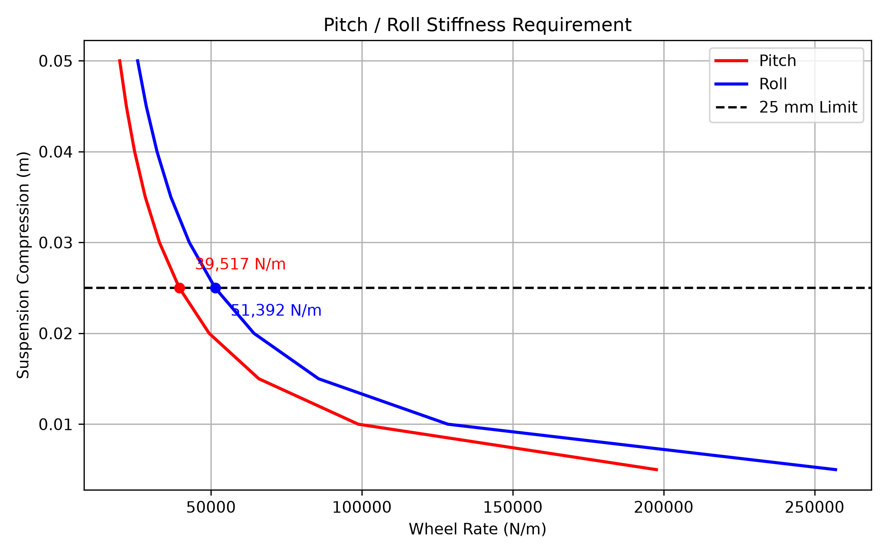
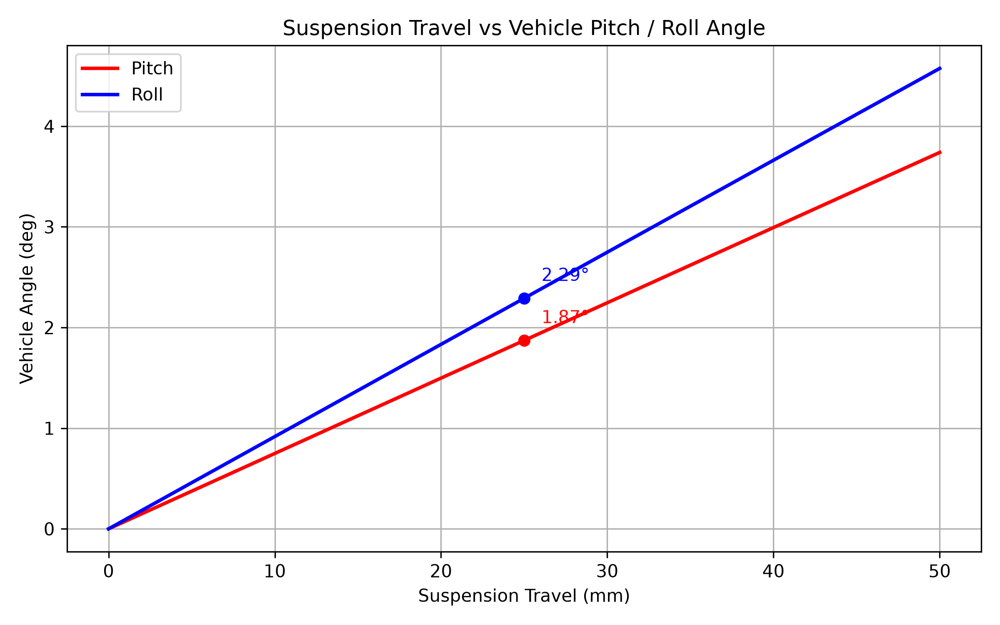

# 車輛俯仰與側傾剛度（Pitch / Roll Stiffness）計算與分析說明

## 簡介

規則中有提到懸吊行程5cm的限制，我們設定5cm為總懸吊行程向上向下各2.5cm。不能不能讓車輛在最大加速度時直接觸底懸吊行程因此需要訂下限制。另外順便分析行程與車輛姿態角度關係。

## 參數

| 變數名稱 | 物理意義 | 單位 |
| :--- | :--- | :--- |
| `m` | 車輛總質量 ($m$) | $kg$ |
| `ax` | 最大縱向加速度 ($a_x$) | $g$ |
| `ay` | 最大側向加速度 ($a_y$) | $g$ |
| `h` | 重心高度 ($h$) | $m$ |
| `L` | 軸距 ($L$) | $m$ |
| `t` | 輪距 ($t$) | $m$ |
| `s` | 容許懸吊壓縮行程 ($s$) | $m$ |
| `K_pitch` | 對應縱向限制之所需剛度 | $N/m$ |
| `K_roll` | 對應側向限制之所需剛度 | $N/m$ |

## 計算

### 1. 縱向與側向動態負載轉移

當車輛產生縱向加速度 $a_x \cdot g$ 時，作用於質心的縱向慣性力為 $m \cdot a_x \cdot g$，其pitch moment 為

$$M_{\text{pitch}} = m \cdot a_x \cdot g \cdot h$$

由前後軸之間力矩平衡可知，前後軸產生的動態垂直負載轉移量為 $F_x$ 。

$$F_x = \frac{M_{\text{pitch}}}{L} = \frac{m \cdot a_x \cdot g \cdot h}{L}$$

同理，當車輛產生側向加速度 $a_y \cdot g$ 時，側向慣性力產生的 roll moment 為

$$M_{\text{roll}} = m \cdot a_y \cdot g \cdot h$$

由左右輪之間力矩平衡可知，左右側產生的動態垂直負載轉移量 $F_y$ ，與pitch 不同的是

$$F_y = \frac{M_{\text{roll}}}{t} = \frac{m \cdot a_y \cdot g \cdot h}{t}$$

### 2. 懸吊剛度需求推導

當設定單側懸吊壓縮量為 $s$ 時，懸吊剛度 $K$ 定義為總外力除以壓縮位移量（$s$）：

$$K_{\text{pitch}} = \frac{F_x}{s}$$

$$K_{\text{roll}} = \frac{F_y}{s}$$

代入負載轉移公式後可得：

$$K_{\text{pitch}} = \frac{m \cdot a_x \cdot g \cdot h}{L \cdot s}$$

$$K_{\text{roll}} = \frac{m \cdot a_y \cdot g \cdot h}{t \cdot s}$$

### 3. 懸吊行程與車身傾角幾何轉換

當懸吊產生壓縮量 $s$ 時，車身相對於轉動中心會產生角度變化。

對俯仰運動而言，前後軸產生的相對高低差為 $2s$，繞幾何中心旋轉臂長為 $L$：

$$\tan(\theta_{\text{pitch}}) = \frac{2s}{L} \implies \theta_{\text{pitch}} = \arctan\left(\frac{2s}{L}\right)$$

對側傾運動而言，左右輪產生的相對高低差為 $2s$，繞幾何中心旋轉臂長為 $t$：

$$\tan(\theta_{\text{roll}}) = \frac{2s}{t} \implies \theta_{\text{roll}} = \arctan\left(\frac{2s}{t}\right)$$

將弧度轉為角度（Deg）：

$$\theta_{\text{deg}} = \text{rad2deg}\left(\theta\right)$$

## 結果

根據懸吊行程估算出來的最低剛性限制如上，此限制通常可能比空力的攻角限制小。需取較大值的當作下限制

以上為不同行程設定與最大姿態變化角度關係，可以用這個角度與空力限制交叉驗證。