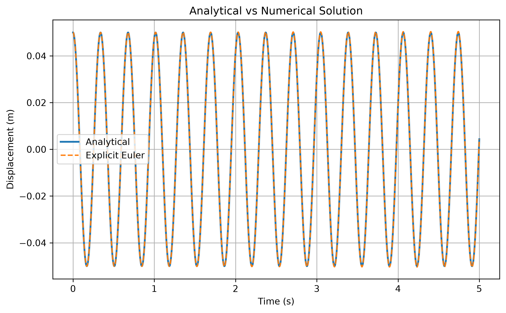
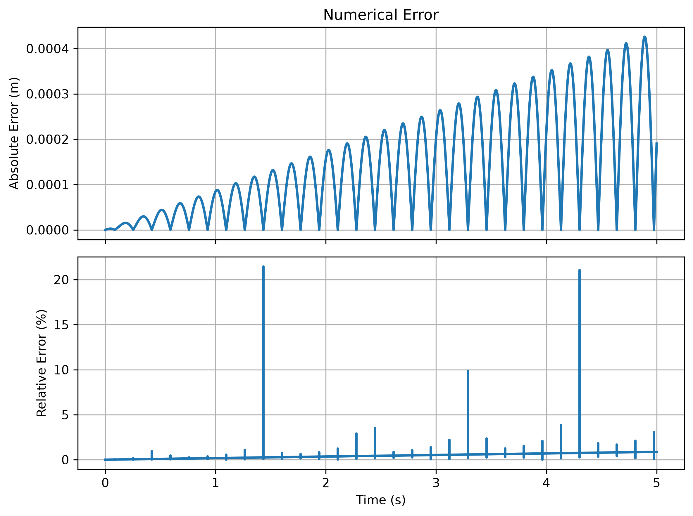

# 解析解與顯式歐拉數值解比較

[Download Code](Analytical_Numerical_Simulation.py)

## 參數

以下為計算中所採用的物理量與符號說明：

| 變數名稱 | 物理意義 | 單位 |
| --- | --- | --- |
| `m` | 四分之一車等效質量 / 系統質量 ($m$) | $kg$ |
| `k` | 彈簧剛性 ($k$) | $N/m$ |
| `wn` | 無阻尼自然角頻率 ($\omega_n$) | $rad/s$ |
| `fn` | 自然頻率 ($f_n$) | $Hz$ |
| `x0` | 初始位移 ($x_0$) | $m$ |
| `v0` | 初始速度 ($v_0$) | $m/s$ |
| `dt` | 數值積分時間步長 ($\Delta t$) | $s$ |
| `t_end` | 總模擬時間 ($t_{end}$) | $s$ |

## 計算

> 參考結構動力學 : Mario Paz, *Structural Dynamics: Theory and Computation*

### 1. 自然頻率與解析解 (Analytical Solution)

系統之自然角頻率 $\omega_n$ 與赫茲頻率 $f_n$ 為：

$$\omega_n = \sqrt{\frac{k}{m}}, \quad f_n = \frac{\omega_n}{2\pi}$$

無阻尼自由振動之二階微分方程：

$$m\ddot{x} + kx = 0$$

在初始條件 $x(0) = x_0$ 與 $\dot{x}(0) = v_0$ 下之解析解為：

$$x(t) = x_0 \cos(\omega_n t) + \frac{v_0}{\omega_n} \sin(\omega_n t)$$

### 2. 顯式歐拉數值解 (Explicit Euler Method)

將二階微分方程化為一階聯立方程組，利用目前時間步 $i$ 之狀態推算下一步 $i+1$ 之狀態：

$$a_i = -\frac{k}{m} x_i$$

$$v_{i+1} = v_i + a_i \cdot \Delta t$$

$$x_{i+1} = x_i + v_i \cdot \Delta t$$

### 3. 數值誤差分析 (Error Analysis)

計算時間點 $t$ 的絕對誤差（Absolute Error）與相對誤差（Relative Error）：

$$\text{Absolute Error} = \vert{}x_{num}(t) - x_{analytical}(t)\vert{}$$

$$\text{Relative Error} = \frac{\vert{}x_{num}(t) - x_{analytical}(t)\vert{}}{\vert{}x_{analytical}(t)\vert{} + \varepsilon} \times 100\%$$

其中 $\varepsilon = 10^{-12}$ 為防止分母為零之極小數值。

## 結果

顯式歐拉法在長時域模擬中會不斷向系統注入非物理性質的數值能量（Numerical Energy Generation），導致數值解振幅隨時間呈線性或指數型增長。

隨著模擬時間 $t$ 增加，絕對誤差開始擴大，而相對誤差出現震盪造成的週期性峰值變化。但這個通常要時間拉長之後會比較明顯