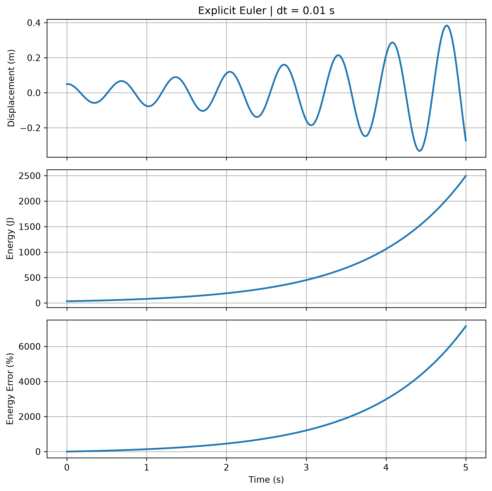
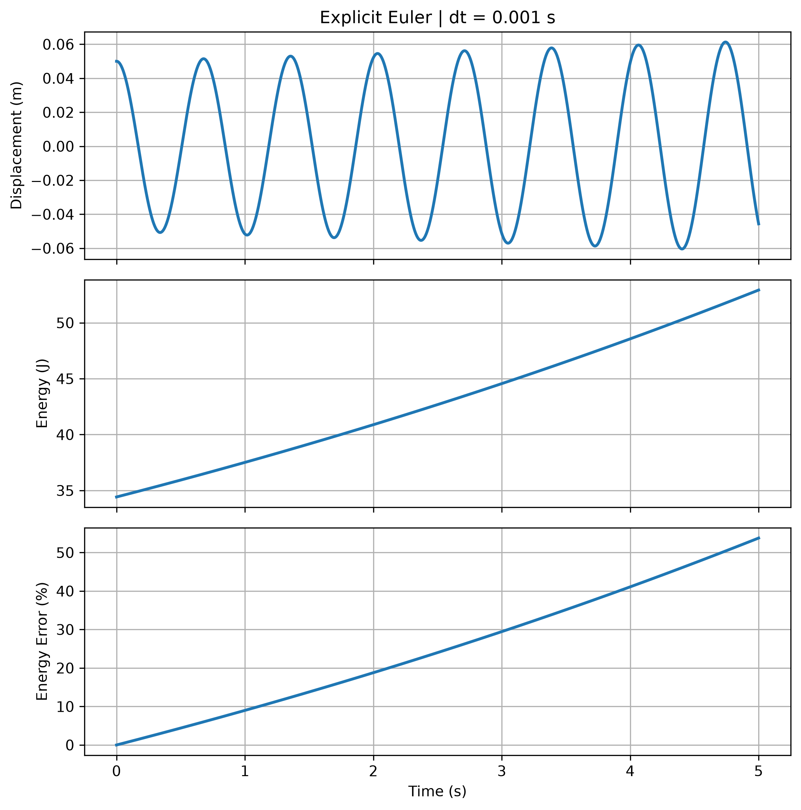
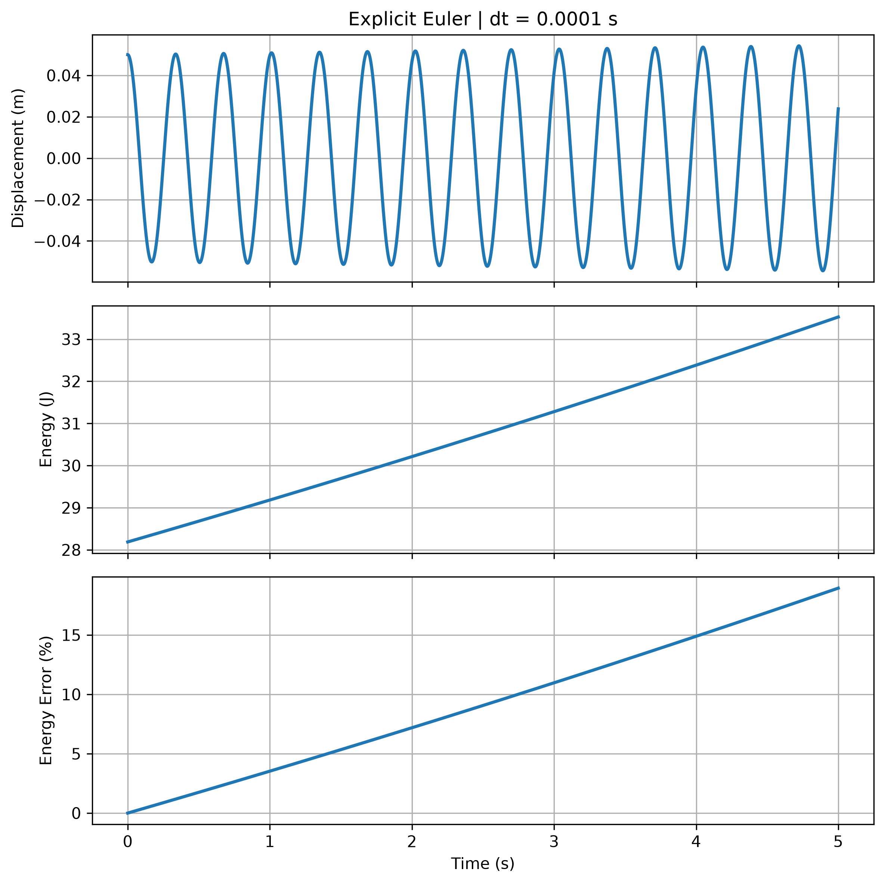
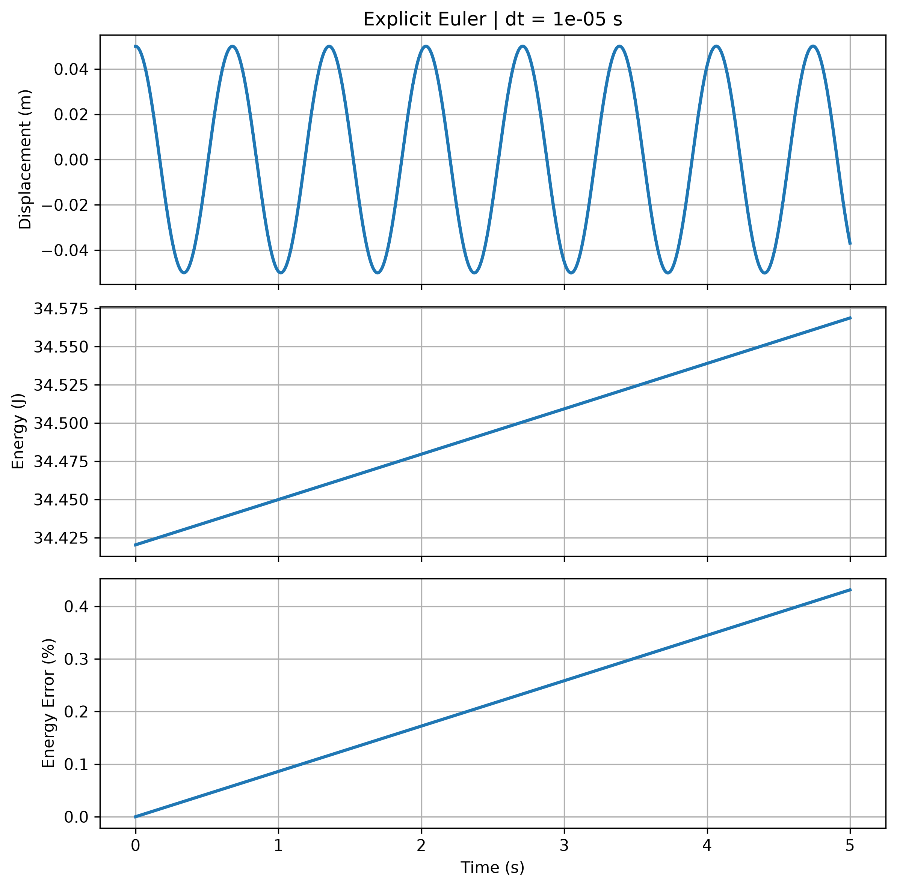

# 時間解析度與精確度敏感性

[Download Code](Time_sensitivity.py)

## 參數

以下為計算中所採用的物理量與符號說明：

| 變數名稱 | 物理意義 | 單位 |
| --- | --- | --- |
| `m` | 四分之一車等效質量 / 系統質量 ($m$) | $kg$ |
| `k` | 行駛剛性 / 彈簧剛性 ($k$) | $N/m$ |
| `x0` | 初始位移 ($x_0$) | $m$ |
| `v0` | 初始速度 ($v_0$) | $m/s$ |
| `t_end` | 總模擬時間 ($t_{end}$) | $s$ |
| `dt_list` | 待測試之時間步長列表 ($\Delta t$) | $s$ |
| `KE` | 系統動能 (Kinetic Energy) | $J$ |
| `PE` | 系統位能 (Potential Energy) | $J$ |
| `E_total` | 系統總機械能 ($E_{total}$) | $J$ |
| `E_error_percent` | 總能量誤差百分比 ($\Delta E\%$) | $\%$ |

## 計算

> 參考數值分析與物理模擬 : Burden & Faires, *Numerical Analysis*

### 1. 顯式歐拉數值更新機制

於每個時間步長 $\Delta t$ 下，系統狀態更新公式為：

$$a_i = -\frac{k}{m} x_i$$

$$v_{i+1} = v_i + a_i \cdot \Delta t$$

$$x_{i+1} = x_i + v_i \cdot \Delta t$$

### 2. 系統能量與能量誤差計算

在任意時間點 $t$，系統之動能 $KE(t)$、位能 $PE(t)$ 與總機械能 $E_{total}(t)$ 計算如下：

$$KE(t) = \frac{1}{2} m v(t)^2, \quad PE(t) = \frac{1}{2} k x(t)^2$$

$$E_{total}(t) = KE(t) + PE(t)$$

以初始總能量 $E_0 = E_{total}(0)$ 為基準，計算相對能量誤差百分比：

$$\Delta E\%(t) = \frac{E_{total}(t) - E_0}{E_0} \times 100\%$$

### 3. 數值發散率理論分析

顯式歐拉法在經過一個時間步長 $\Delta t$ 後，放大矩陣之行列式值大於 $1$：

$$\det(\mathbf{A}) = 1 + \omega_n^2 \Delta t^2 > 1 \quad \left(\text{其中 } \omega_n = \sqrt{\frac{k}{m}}\right)$$

這代表系統總能量會隨著時間以 $(1 + \omega_n^2 \Delta t^2)^n$ 的幾何級數發散。縮小 $\Delta t$ 可大幅抑制每步的能量注入量，但無法徹底消除發散本質。

## 結果

*(註：程式將針對 `dt` = 1e-2, 1e-3, 1e-4, 1e-5 分別繪製並輸出 4 張能量分析圖)*

以上圖形與計算結果可以觀察到時間解析度與精度關係並進行取捨。

