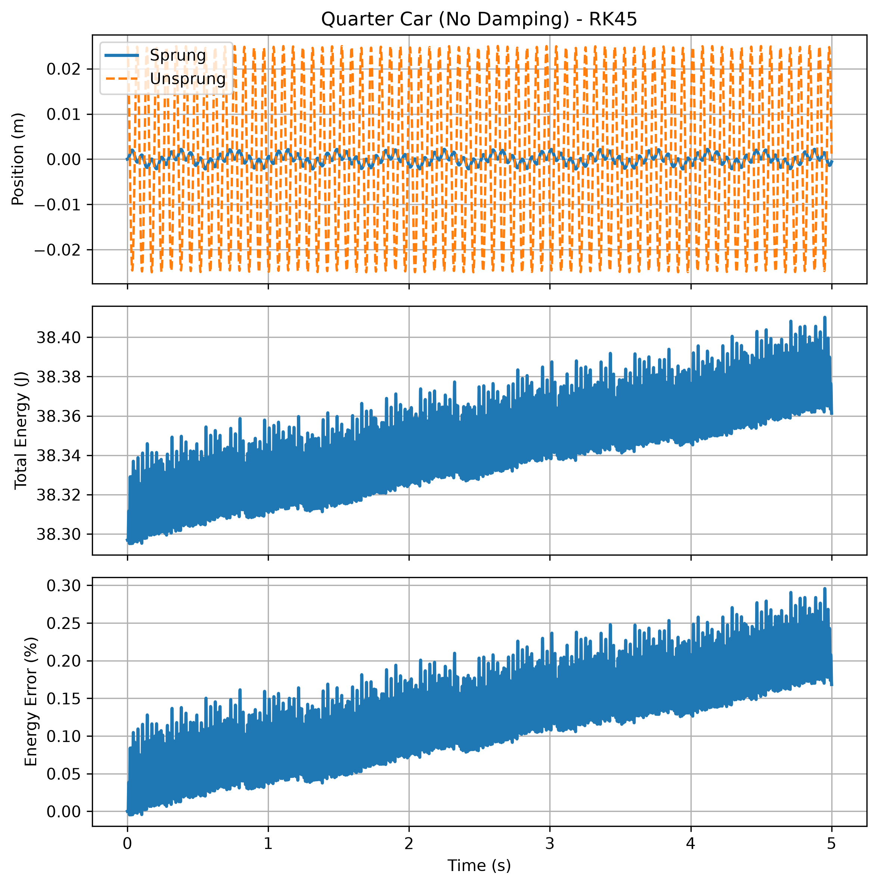
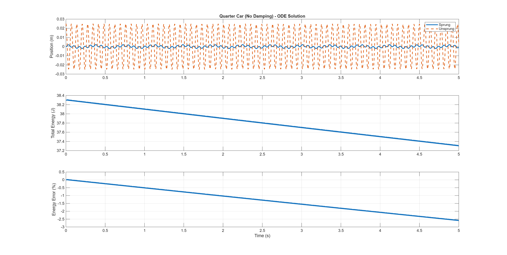

# 2DOF無阻尼四分之一車模型 Runge-Kutta 45 (RK45 / MATLAB ode45) 數值模擬比較

[Download Code](ode_spring.m) : matlab

[Download Code](ode_spring.py) : python

## 參數

以下為計算中所採用的物理量與符號說明：

| 變數名稱 | 物理意義 | 單位 |
| --- | --- | --- |
| `ms` | 簧上質量 ($m_s$) | $kg$ |
| `mu` | 簧下質量 ($m_u$) | $kg$ |
| `ks` | 懸吊彈簧剛性 ($k_s$) | $N/m$ |
| `kt` | 輪胎剛性 ($k_t$) | $N/m$ |
| `xs0`, `vs0` | 簧上質量初始位移 ($x_{s0}$) 與初始速度 ($v_{s0}$) | $m$, $m/s$ |
| `xu0`, `vu0` | 簧下質量初始位移 ($x_{u0}$) 與初始速度 ($v_{u0}$) | $m$, $m/s$ |
| `X0` | 系統初始狀態向量 $\mathbf{X}_0 = [x_{s0}, v_{s0}, x_{u0}, v_{u0}]^T$ | - |
| `KE` | 系統總動能 (Kinetic Energy) | $J$ |
| `PE` | 系統總位能 (Potential Energy) | $J$ |
| `E` | 系統總機械能 ($E_{total}$) | $J$ |
| `E_error` | 總能量誤差百分比 ($\Delta E\%$) | $\%$ |

## 計算

> 參考mathwork ode45 : https://www.mathworks.com/help/matlab/ref/ode45.html

### 1. 雙自由度懸吊運動方程 (Equations of Motion)

根據牛頓第二運動定律，無阻尼雙自由度懸吊系統之微分方程組如下：

* **簧上質量（車體 $m_s$）**：

$$m_s \ddot{x}_s + k_s (x_s - x_u) = 0 \implies \ddot{x}_s = -\frac{k_s}{m_s} (x_s - x_u)$$

* **簧下質量（車輪 $m_u$）**：

$$m_u \ddot{x}_u - k_s (x_s - x_u) + k_t x_u = 0 \implies \ddot{x}_u = \frac{k_s}{m_u} (x_s - x_u) - \frac{k_t}{m_u} x_u$$

將二階微分方程組轉化為一階微分方程組之狀態空間形式

$$\frac{d}{dt} \begin{bmatrix} x_s \\ v_s \\ x_u \\ v_u \end{bmatrix} = \begin{bmatrix} v_s \\ -\frac{k_s}{m_s}(x_s - x_u) \\ v_u \\ \frac{k_s}{m_u}(x_s - x_u) - \frac{k_t}{m_u}x_u \end{bmatrix}$$

### 2. 多自由度能量計算與守恆驗證

$$KE(t) = \frac{1}{2} m_s v_s(t)^2 + \frac{1}{2} m_u v_u(t)^2$$

$$PE(t) = \frac{1}{2} k_s \left(x_s(t) - x_u(t)\right)^2 + \frac{1}{2} k_t x_u(t)^2$$

$$E(t) = KE(t) + PE(t)$$

相對能量誤差百分比計算

$$\Delta E\%(t) = \frac{E(t) - E(0)}{E(0)} \times 100\%$$

### 3. Python (solve_ivp RK45) 與 MATLAB (ode45) 演算法對齊

 Python 與 MATLAB 兩種語言比較

* **Python**：使用 `scipy.integrate.solve_ivp` 並指定 `method="RK45"`。
* **MATLAB**：使用內建之 `ode45` 函數。
* 兩者皆採用 **Dormand-Prince 顯式單步法（4階精度、5階誤差估算）**，具備自適應時間步長（Adaptive Time-stepping）控制功能

## 結果

### python RK45

### matlab ode45

從上圖可以看到RK45的誤差大概是ode45的十分之一，使用RK45的目的是為了效率和拿到比積分器更高的求解精度，ode45其實比1e-5步長積分差兩倍所以其實直接使用積分器就可以，如果要要求高精細度則考慮使用RK45。不過為了方便直覺操作我還是想直接使用積分器。