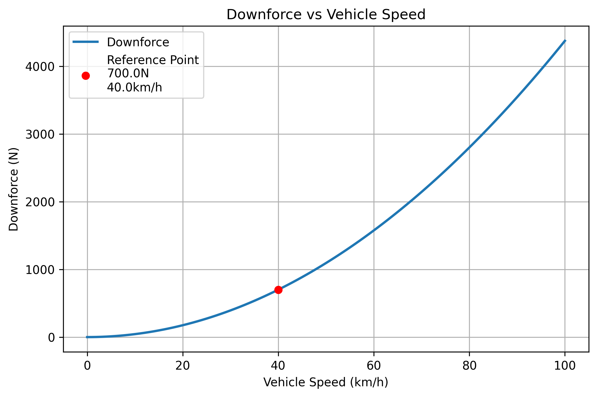

# 賽車下壓力係數反推

[Download Code](Aero_Cl_Cd.py)

## 參數

以下為系統採用的空氣物理性質、迎風參考面積與基準空氣動力數據：

| 變數名稱 | 物理意義 | 單位 |
| --- | --- | --- |
| `rho` ($\rho$) | 大氣空氣密度（標準海平面條件） | $\text{ kg/m}^3$ |
| `w`, `h` | 車體參考寬度與高度 | $\text{ m} \times \text{ m}$ |
| `A` | 車體投影參考面積 ($A = w \cdot h$) | $\text{ m}^2$ |
| `v_ref_kmh` | 基準測試車速 | $\text{ km/h}$ |
| `F_ref` | 基準車速下所測得之總下壓力 | $\text{ N}$ |

## 計算

### 1. 基準下壓力係數反推 (Lift/Downforce Coefficient Calculation)

根據流體力學中的動壓（Dynamic Pressure）與空氣動力學公式，車輛所受到的下壓力 $F$ 表示為：

$$F = \frac{1}{2} C_l \cdot \rho \cdot A \cdot v^2$$

給定基準條件下的下壓力 $F_{ref}$ 與車速 $v_{ref} = \frac{v_{ref\_kmh}}{3.6}$，反推空氣動力學下壓力係數 $C_l$：

$$C_l = \frac{F_{ref}}{\frac{1}{2} \cdot \rho \cdot A \cdot v_{ref}^2}$$

### 2. 全速域下壓力連續推算 (Speed Sweep Prediction)

$$F(v) = \frac{1}{2} C_l \cdot \rho \cdot A \cdot v^2$$

## 結果

