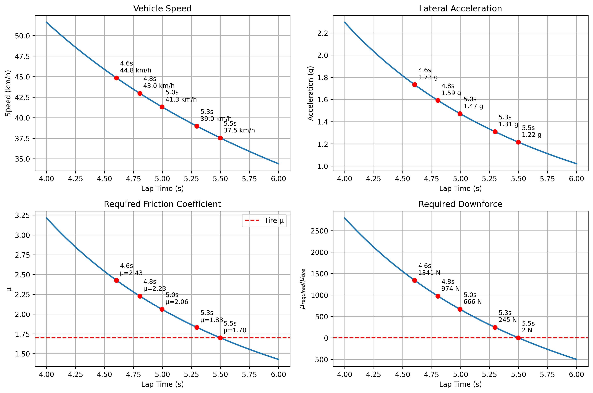
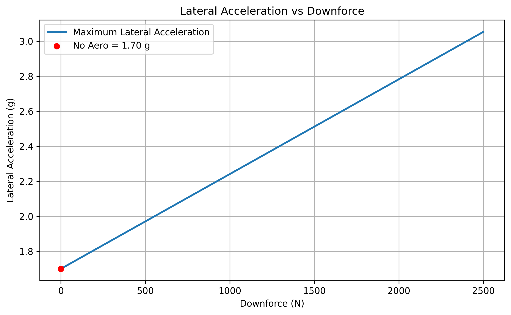

# 空力目標分析

[Download Code (skidpad_test)](skidpad_test.py)

[Download Code (Donwforce_Target)](Donwforce_Target.py)

## 參數說明

以下為系統採用的幾何、車輛與動態參數說明：

| 變數名稱 | 物理意義 | 數值與單位 |
| --- | --- | --- |
| `D` | Skidpad 賽道中心線直徑 | $18.25\text{ m}$ |
| `R` | 旋轉半徑 ($R = D/2$) | $9.125\text{ m}$ |
| `L` | 單圈行駛周長 ($L = \pi \cdot D$) | $\approx 57.33\text{ m}$ |
| `g` | 重力加速度 | $9.81\text{ m/s}^2$ |
| `m` | 車輛總質量（含車手） | $\text{ kg}$ |
| `mu_tire` ($\mu_{tire}$) | 輪胎純機械抓地力最大縱向/橫向摩擦係數 | （無因次） |
| `factors` | 動態/安全修正係數 | 無因次） |
| `t` | 單圈時間掃描範圍 | $4.0 \sim 6.0\text{ s}$ |

## 計算與數學模型

### 1. Skidpad 運動學與向心加速度 (Kinematics & Centripetal Acceleration)

$$v = \frac{L}{t} = \frac{\pi \cdot D}{t} \quad \text{[m/s]}, \quad v_{kmh} = v \times 3.6 \quad \text{[km/h]}$$

$$a_c = \frac{v^2}{R} = \frac{2 \cdot v^2}{D} \quad \text{[m/s}^2\text{]}$$

### 2. 等效所需摩擦係數與下壓力需求 (Required Friction Coefficient & Downforce)

$$\mu_{required} = \frac{a_c}{g} \cdot \text{factors}$$

當 $\mu_{required} > \mu_{tire}$ 時，代表純輪胎機械抓地力已不足以支撐過彎所需側向力，必須藉由空氣下壓力 $F_{down}$ 增加正向載荷以擴充抓地極限：

$$F_{down} = \left( \frac{\mu_{required}}{\mu_{tire}} - 1 \right) \cdot m \cdot g \quad \text{[N]}$$

### 3. 下壓力對極限側向加速度之增益模型 (Lateral Acceleration vs Downforce)

$$a_y = \frac{\mu_{tire} \cdot (m \cdot g + F_{down})}{m} = \mu_{tire} \cdot g + \frac{\mu_{tire} \cdot F_{down}}{m} \quad \text{[m/s}^2\text{]}$$

$$a_{y\_g} = \frac{a_y}{g} = \mu_{tire} + \frac{\mu_{tire} \cdot F_{down}}{m \cdot g} \quad \text{[g]}$$

## 結果

### skidpad參考分析

### 側向與下壓力需求

