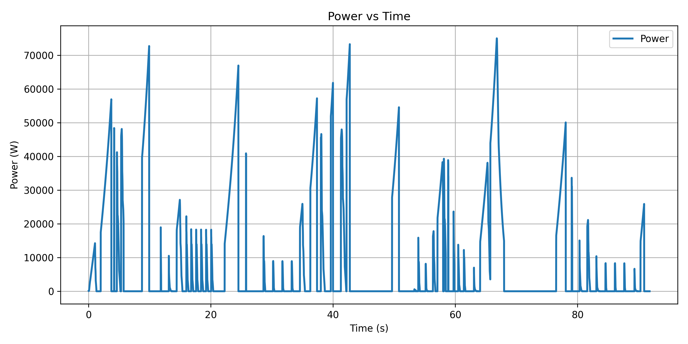
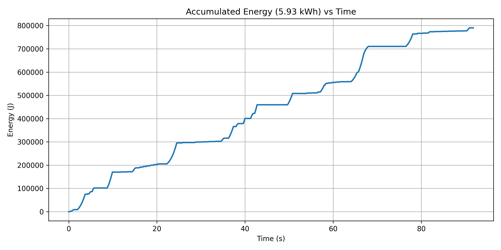

# 能量與功耗分析

[Download Code (Total_Energy)](Total_Energy.py)

[Download Code (Power)](Power.py)

## 參數

以下為資料欄位與能量計算中採用的系統參數說明：

| 變數 / 欄位名稱 | 物理意義 | 單位 |
| --- | --- | --- |
| `time` ($t$) | 賽道時間軸 | $\text{s}$ |
| `position` ($x$) | 賽車於賽道上的累積位移 | $\text{m}$ |
| `force` ($F$) | 輪端縱向作用力（僅保留正值驅動力 $F > 0$） | $\text{N}$ |
| `speed` ($V$) | 賽車即時車速 | $\text{m/s}$ |
| `P` | 即時輸出功率 ($P = F \cdot V$) | $\text{W}$ |
| `eta` ($\eta$) | 系統總傳動與電能轉換效率  | 無因次 |
| `SF` | 電池容量設計安全係數  | 無因次 |
| **耐久賽圈數** | FSAE 標準耐久賽總圈數 | 圈 |

## 計算

### 1. 即時驅動功率計算 (Instantaneous Power)

將讀入之力量數據 $F$ 經過濾處理，僅保留大於 0 之驅動力（忽略煞車減速力）：

$$F_{propulsion} = \max(F, \; 0)$$

即時驅動功率 $P(t)$ 定義為驅動力與車速之標量積：

$$P(t) = F_{propulsion}(t) \cdot V(t)$$

由 $P(t)$ 可求得單圈最大峰值功率 $P_{max}$ 與平均功率 $P_{avg}$：

$$P_{max} = \max(P(t)), \quad P_{avg} = \frac{1}{N} \sum_{i=1}^{N} P(t_i)$$

### 2. 單圈能量梯形數值積分 (Energy Integration)

根據功的定義 $W = \int F \, dx$，在離散位移點 $x_i$ 到 $x_{i+1}$ 之間採用梯形法（Trapezoidal Rule）進行數值積分：

$$\Delta W_i = \frac{F_{propulsion}(x_i) + F_{propulsion}(x_{i+1})}{2} \cdot (x_{i+1} - x_i)$$

累積能量 $W_{lap}$ 經系統效率 $\eta$ 折算後為：

$$W_{lap} = \frac{\sum \Delta W_i}{\eta} \quad \text{[焦耳, J]}$$

### 3. 耐久賽總能量與電池容量需求 (Battery Capacity Requirement)

$$E = W_{lap} \cdot N$$

$$E_{battery} = E \cdot \text{SF} \quad \text{[J]}$$

單位換算為千瓦時（$\text{kWh}$，即俗稱的「度」）：

$$E_{battery\_kWh} = \frac{E_{battery}}{3.6 \times 10^6} \quad \text{[kWh]}$$

## 結果

即時功率時域響應圖表。

單圈累積能量隨時間變化趨勢圖表。
