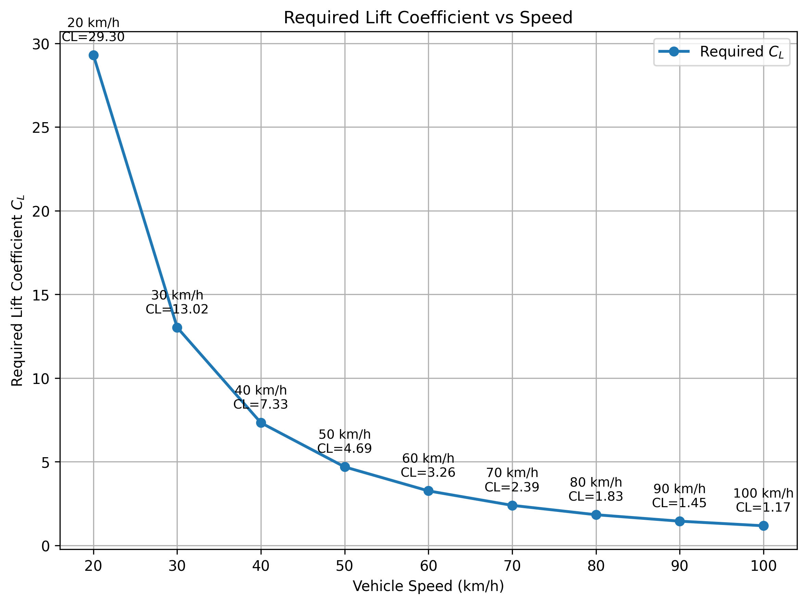

# Cl分析

[Download Code](Cl_Target.py)

## 參數與幾何設定

以下為系統採用的車輛質量、輪胎摩擦係數、目標側向加速度與參考氣動幾何參數：

| 變數名稱 | 物理意義 | 數值與單位 |
| --- | --- | --- |
| `g` | 重力加速度  | $m/s^2$ |
| `m` | 車輛總質量 | $kg$ |
| `mu` ($\mu$) | 輪胎最大橫向摩擦係數 | 無因次 |
| `target_g` | 目標側向加速度 | $g$ |
| `rho` ($\rho$) | 大氣空氣密度 | $1.225\text{ kg/m}^3$ |
| `A` | 車體參考迎風面積 | $\text{ m}^2$ |

## 計算

根據牛頓第二運動定律，車輛以 $2.0\text{ g}$ 側向加速度過彎時，所需的總側向抓地力 $F_{required}$ 為：
$$a_c = v^2/R$$

$$
F_y = m\cdot a_c = \mu(N)
$$

$$
N=mg+F_{down}
$$

$$
F_{down}=\frac12\rho C_L A v^2
$$

$$
ma_y= \mu(mg+F_{down}) = \mu\left(mg+\frac12\rho C_LAv^2\right)
$$

整理即可得到

$$
F_{down} = m(\frac{a_y}{\mu}-g)
$$

$$
\boxed{
C_L=
\frac{2\left(\dfrac{ma_y}{\mu}-mg\right)}
{\rho Av^2}
}
$$

## 結果

