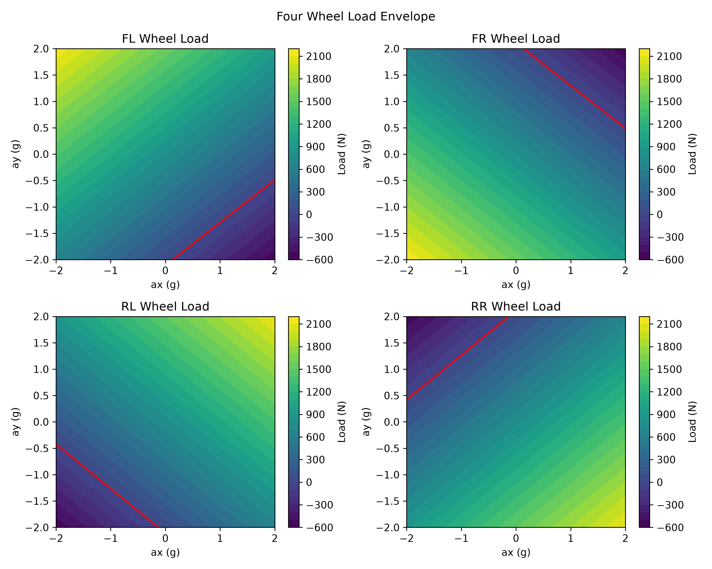
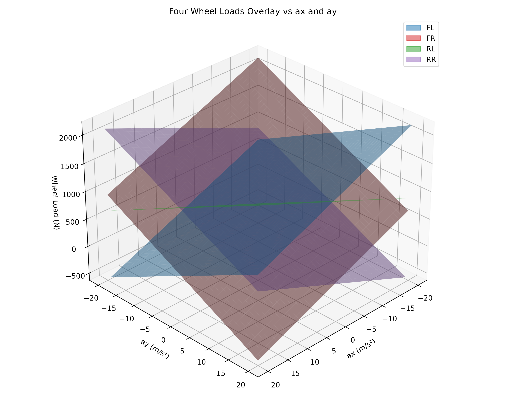

# 車輛四輪載荷轉移

[Download Code](FWL.py)

## 參數

以下為計算中所採用的物理量與符號說明：

| 變數名稱 | 物理意義 | 單位 |
| --- | --- | --- |
| `g` | 重力加速度 ($g$) | $m/s^2$ |
| `m` | 車輛總質量 ($m$) | $kg$ |
| `h` | 重心高度 ($h$) | $m$ |
| `L` | 軸距 ($L$) | $m$ |
| `d` | 輪距 ($d$) | $m$ |
| `CG_x` | 重心前後分佈比例 ($[\text{Front}, \text{Rear}]$) | 無因次 |
| `CG_y` | 重心左右分佈比例 ($[\text{Left}, \text{Right}]$) | 無因次 |
| `ax` | 縱向加速度 ($a_x$) | $m/s^2$ |
| `ay` | 側向加速度 ($a_y$) | $m/s^2$ |
| `F_add` | 額外外力向量 ($[F_x, F_y, F_z]$) | $N$ |
| `CF_rela` | 額外外力相對於重心之作用點位置 ($[x, y, z]$) | $m$ |
| `Mx_add` | 額外外力產生之繞 X 軸力矩 ($M_{x\_add}$) | $N \cdot m$ |
| `My_add` | 額外外力產生之繞 Y 軸力矩 ($M_{y\_add}$) | $N \cdot m$ |
| `dF` | 慣性與外力產生之總動態載荷轉移量 | $N$ |
| `N` | 四輪正向載荷向量 ($[FL, FR, RL, RR]$) | $N$ |

## 計算

### 1. 靜態四輪載荷分佈

車輛在靜止狀態下，依據前後與左右重心分配比例，靜態輪載矩陣 $F_s$ 為：

$$W = m \cdot g$$

$$F_s = W \cdot \begin{bmatrix} \text{CG}_{x,f} \\ \text{CG}_{x,r} \end{bmatrix} \otimes \begin{bmatrix} \text{CG}_{y,l} & \text{CG}_{y,r} \end{bmatrix} = W \begin{bmatrix} \text{CG}_{x,f} \cdot \text{CG}_{y,l} & \text{CG}_{x,f} \cdot \text{CG}_{y,r} \\ \text{CG}_{x,r} \cdot \text{CG}_{y,l} & \text{CG}_{x,r} \cdot \text{CG}_{y,r} \end{bmatrix}$$

### 2. 慣性力與額外外力矩導致之載荷轉移

縱向加速度 $a_x$ 與側向加速度 $a_y$ 所產生的慣性載荷轉移量，結合外部作用力（如空力套件）對重心產生的附加俯仰力矩 $M_{y\_add}$ 與側滾力矩 $M_{x\_add}$：

$$M_{x\_add} = r_y \cdot F_z - r_z \cdot F_y$$

$$M_{y\_add} = r_z \cdot F_x - r_x \cdot F_z$$

縱向與側向的總載荷轉移量計算如下：

$$\Delta F_{long} = \frac{m \cdot h \cdot a_x + M_{y\_add}}{L}$$

$$\Delta F_{lat} = \frac{m \cdot h \cdot a_y + M_{x\_add}}{d}$$

### 3. 動態四輪正向載荷疊加

將靜態載荷與動態縱向、側向轉移量疊加至各輪：

$$F_{long\_matrix} = \Delta F_{long} \cdot \begin{bmatrix} -\text{CG}_{y,l} & -\text{CG}_{y,r} \\ \text{CG}_{y,l} & \text{CG}_{y,r} \end{bmatrix}$$

$$F_{lat\_matrix} = \Delta F_{lat} \cdot \begin{bmatrix} \text{CG}_{x,f} & -\text{CG}_{x,f} \\ \text{CG}_{x,r} & -\text{CG}_{x,r} \end{bmatrix}$$

整車四輪動態載荷矩陣為：

$$F = F_s + F_{long\_matrix} + F_{lat\_matrix}$$

導出的四輪載荷分別對應：$FL = F_{0,0}$、$FR = F_{0,1}$、$RL = F_{1,0}$、$RR = F_{1,1}$。

## 結果

上圖展示四個輪胎（FL, FR, RL, RR）在不同縱向加速度（$a_x$）與側向加速度（$a_y$）下的輪載等高線圖。圖中**紅色虛線**標註為載荷等於 $0\text{ N}$ 的等高線，代表輪胎剛好抬離地面的極限臨界邊界（Lift-off Envelope）。

上圖為四輪受力包絡面的 3D 疊加曲面圖，直觀顯示了四輪載荷隨動態加速度變化的消長關係：
* 當車輛強烈煞車並右轉（$a_x < 0, a_y > 0$）時，左前輪（FL）載荷顯著上升，右後輪（RR）載荷急劇下降。
* 當車輛全力加速並左轉（$a_x > 0, a_y < 0$）時，右後輪（RR）載荷達到峰值，左前輪（FL）則易面臨舉升脫離風險。