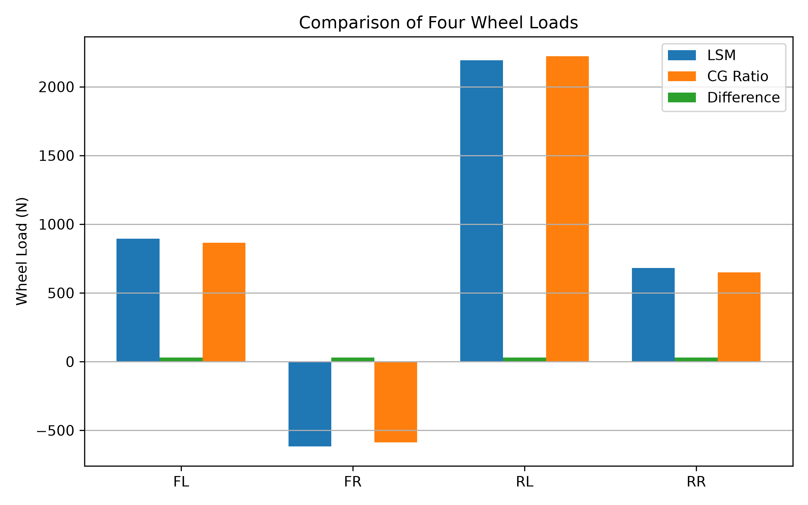
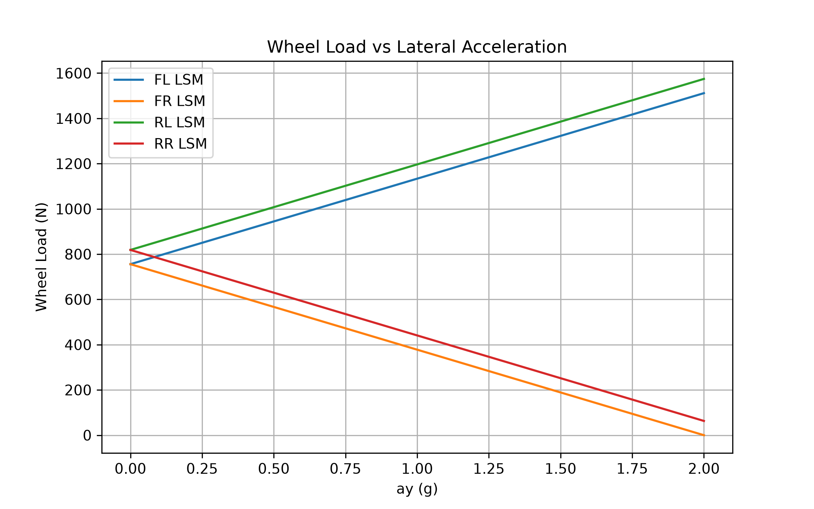
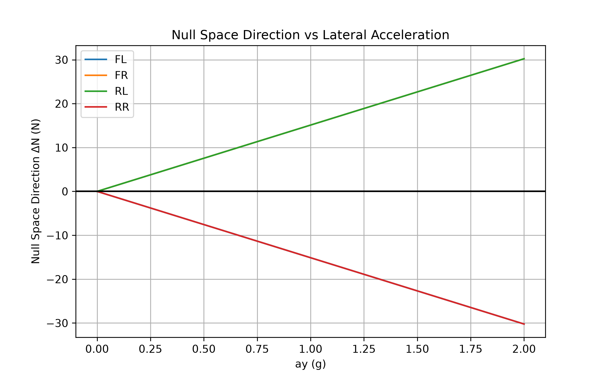
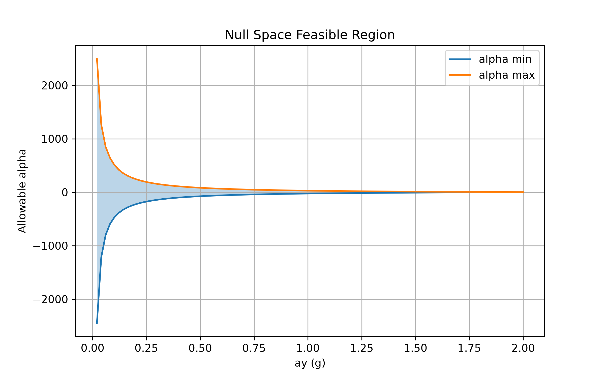

# 車輛四輪正向載荷靜不定系統零空間分析

[Download Code](solver_compar.py)

## 參數

以下為計算中所採用的物理量與符號說明：

| 變數名稱 | 物理意義 | 單位 |
| --- | --- | --- |
| `g` | 重力加速度 ($g$) | $m/s^2$ |
| `m` | 車輛總質量 ($m$) | $kg$ |
| `h` | 重心高度 ($h$) | $m$ |
| `L` | 軸距 ($L$) | $m$ |
| `d` | 輪距 ($d$) | $m$ |
| `CG_x` | 重心前後分佈比例 ($[\text{Front}, \text{Rear}]$) | 無因次 |
| `CG_y` | 重心左右分佈比例 ($[\text{Left}, \text{Right}]$) | 無因次 |
| `ax` | 縱向加速度 ($a_x$) | $m/s^2$ |
| `ay` | 側向加速度 ($a_y$) | $m/s^2$ |
| `A` | 靜力平衡矩陣 ($3 \times 4$) | 多重單位 |
| `b` | 外力與慣性力矩向量 ($3 \times 1$) | $N$ / $N \cdot m$ |
| `N_lsm` / `N1` | LSM 方法求解之四輪載荷 ($[FL, FR, RL, RR]$) | $N$ |
| `N_cg` / `N2` | CG 比率法求解之四輪載荷 ($[FL, FR, RL, RR]$) | $N$ |
| `V` | 零空間差異向量 ($\Delta N = N_{CG} - N_{LSM}$) | $N$ |
| `alpha` | 零空間任意純量倍率 ($\alpha$) | 無因次 |

## 計算

### 問題定義
我們希望計算4個車輪的附載，在定義受力之後我們可以得知以下資訊:
**力平衡**
$$\sum F_z = 0$$

$$\sum M_x = 0$$

$$\sum M_y = 0$$

**輸入**
$$\sum Fz = \sum N - mg = 0$$

$$\sum Mx = \sum N_iy_i - ma_yh/d = 0$$

$$\sum My = \sum N_ix_i - ma_xh/L = 0$$

### 問題分析

很明顯從以上資訊我們可以發現這是個靜不定問題，假設我們不使用重心幾何分配希望可以更具有物理意義，就必須套用**最小作用量原理**。由此我們可以把輸入與平衡式寫成以下關係。

$$A = \left[ \begin{matrix} y_1&y_2&y_3&y_4\\\ x_1&x_2&x_3&x_4\\\ 1&1&1&1\end{matrix}\right]$$

$$b = \left[ \begin{matrix} ma_yh/d\\\ ma_yh/d\\\ mg\end{matrix}\right]$$

我們希望在滿足線性約束 $A N = b$ 的情況下，找到一個向量 $N$，使得它的範數平方 $\|N\|^2$ 最小，符合最小作用量。這是一個典型的「最小範數解」問題。

### 拉格朗日函數的設計

為了同時考慮目標函數與約束條件，我們引入拉格朗日乘子 $\lambda$，構造函數：
$$\mathcal{L}(N, \lambda) = N^T N + \lambda^T (b - A N)$$

其中：
- 第一項 $N^T N$：代表我們要最小化的範數平方，是純量。展開後就是 $\min(\sum N^2_i)$
- 第二項 $\lambda^T (b - A N)$：將約束 $A N = b$ 強制加入，用 $\lambda$ 進行約束的耦合分配。

對 $N$ 求偏導：
$$\frac{\partial \mathcal{L}}{\partial N} = 2N - A^T \lambda = 0$$

$$N = \tfrac{1}{2} A^T \lambda$$

### 對 $\lambda$ 微分去除影響
對 $\lambda$ 求偏導：
$$\frac{\partial \mathcal{L}}{\partial \lambda} = b - A N = 0$$

$$A N = b$$

代回過程將 $N = \tfrac{1}{2} A^T \lambda$ 代入 $A N = b$：
$$A \left(\tfrac{1}{2} A^T \lambda \right) = b$$

$$\tfrac{1}{2} (A A^T) \lambda = b$$

解出 $\lambda$

$$\lambda = 2 (A A^T)^{-1} b$$

### 最終解
再代回 $N = \tfrac{1}{2} A^T \lambda$：

$$N = \tfrac{1}{2} A^T \lambda = \tfrac{1}{2} A^T ( 2 (A A^T)^{-1} b )$$

$$N = A^T (A A^T)^{-1} b$$

### 零空間與可行區間（Null Space Feasible Region）

由於 $A$ 的秩為 3，其零空間（Kernel）維度為 1。$\mathbf{N}_{CG}$ 與 $\mathbf{N}_{LSM}$ 均滿足靜力平衡，故兩者之差必定落在零空間內：

$$\mathbf{V} = \mathbf{N}_{CG} - \mathbf{N}_{LSM} \in \text{null}(A)$$

通解可表示為 $\mathbf{N}(\alpha) = \mathbf{N}_{LSM} + \alpha \mathbf{V}$。若要求所有車輪受力非負（未抬輪）：

$$N_{LSM, i} + \alpha V_i \ge 0 \quad \forall i \in \{FL, FR, RL, RR\}$$

界定 $\alpha$ 的邊界：

* 若 $V_i > 0 \implies \alpha \ge -\frac{N_{LSM, i}}{V_i}$
* 若 $V_i < 0 \implies \alpha \le -\frac{N_{LSM, i}}{V_i}$

整理可得可行區間 $\alpha \in [\alpha_{min}, \alpha_{max}]$。

## 結果

上圖展示在極限工況（$a_x = 2g, a_y = 2g$）下，LSM 方法與 CG 比率法計算出的四輪載荷數值比較。可發現兩者在各輪上的正向力存在顯著差異（$\Delta N$），這源於超靜定系統中對對角線載荷交叉轉移（Diagonal Load Transfer）假設的不同。

上圖顯示當側向加速度 $a_y$ 從 $0$ 增加至 $2g$ 時，LSM 方法下四輪載荷的動態變化情況。隨著側向力增加，外側輪（FR, RR）載荷持續上升，內側輪（FL, RL）載荷下降。

上圖顯示兩求解法之間的零空間方向向量 $V = \mathbf{N}_{CG} - \mathbf{N}_{LSM}$ 隨 $a_y$ 的變化。這代表不破壞靜力平衡的前提下，載荷在對角線輪胎之間轉移的自由度分量。

上圖展示零空間可行係數 $\alpha$ 的上界與下界。陰影區域代表保證四輪正向力皆大於等於 $0$（無輪胎離地）的合法解空間。當 $a_y$ 過大時，可行區間收窄，代表系統接近物理抬輪極限。