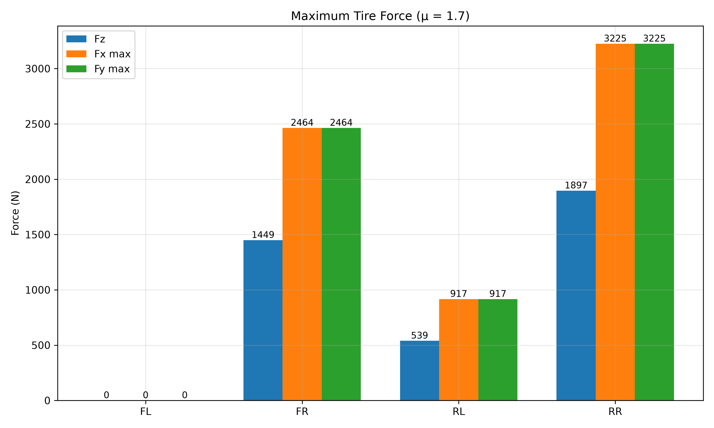

# 極限負荷分析（Maximum Tire Friction Force & Normal Load Analysis）

[Download Code](max_load.py)

## 參數

以下為計算中所採用的物理量與符號說明：

| 變數名稱 | 物理意義 | 單位 |
| --- | --- | --- |
| `mass` | 車輛總質量 ($m$) | $kg$ |
| `g` | 重力加速度 ($g$) | $m/s^2$ |
| `aero` | 總空氣動力下壓力 ($F_{aero}$) | $N$ |
| `cg_height` | 重心高度 ($h_{cog}$) | $m$ |
| `wheelbase` | 軸距 ($L$) | $m$ |
| `front_ratio` | 前軸靜態重力分佈比例 ($l_r / L$) | 無因次 |
| `track_front` | 前輪輪距 ($t_f$) | $m$ |
| `track_rear` | 後輪輪距 ($t_r$) | $m$ |
| `k_heave_front` | 前軸跳動剛度 ($K_{heave\_f}$) | $N/m$ |
| `k_heave_rear` | 後軸跳動剛度 ($K_{heave\_r}$) | $N/m$ |
| `k_roll_front` | 前軸側滾剛度 ($K_{roll\_f}$) | $N \cdot m/rad$ |
| `k_roll_rear` | 後軸側滾剛度 ($K_{roll\_r}$) | $N \cdot m/rad$ |
| `mu_x` | 輪胎縱向摩擦係數 ($\mu_x$) | 無因次 |
| `mu_y` | 輪胎側向摩擦係數 ($\mu_y$) | 無因次 |
| `ax` | 縱向加速度 ($a_x$) | $m/s^2$ |
| `ay` | 側向加速度 ($a_y$) | $m/s^2$ |
| `Fz` | 各輪正向載荷向量 ($[FL, FR, RL, RR]$) | $N$ |
| `Fx` / `Fy` | 各輪極限縱向 / 側向切向力向量 | $N$ |

## 計算

### 1. 動態四輪正向力求解與物理截斷

依據懸吊跳動與側滾剛度分佈，求解動態加速度 $(a_x, a_y)$ 下之四輪載荷 $F_{z,raw}$。考慮輪胎無法提供垂直拉力，施行非負截斷修正：

$$F_z = \max(F_{z,raw}, 0)$$

### 2. 極限摩擦力（抓地力極限）計算

假設縱向與側向摩擦係數為線性，根據簡化摩擦模型計算各輪可承受之最大切向力：

$$F_{x,max} = \mu_x \cdot F_z$$

$$F_{y,max} = \mu_y \cdot F_z$$

## 結果

在工況 $a_x = 2g, a_y = 2g$ 且摩擦係數 $\mu_x = \mu_y = 1.7$ 情況下之各輪受力極限：

* **受力集中效應**：當車輛於高 $g$ 狀態全力加速並左轉時，動態載荷大量轉移至**右後輪（RR）**，使其正向力（$F_z$）與最大可用摩擦力（$F_{x,max}, F_{y,max}$）遠高於其他三個輪胎。
* **輪胎舉升風險**：**左前輪（FL）**正向力急劇下降，若載荷降至 $0\text{ N}$ 則代表輪胎完全脫離地面，無法再輸出任何切向縱向力與側向力。
* **底盤調校參考**：長條圖直觀呈現了各輪受力極限，可作為煞車分配比（Brake Bias）、驅動扭力分配及防傾桿剛度調校之直接依據。