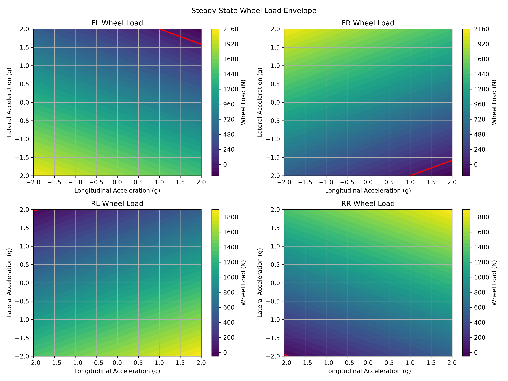

# 車輛懸吊剛度載荷轉移分析（Stiffness-Based Steady-State Wheel Load Analysis）

[Download Code](sus_load.py)

## 參數

以下為計算中所採用的物理量與符號說明：

| 變數名稱 | 物理意義 | 單位 |
| --- | --- | --- |
| `g` | 重力加速度 ($g$) | $m/s^2$ |
| `mass` | 車輛總質量 ($m$) | $kg$ |
| `aero` | 總下壓力 ($F_{aero}$) | $N$ |
| `cg_height` | 重心高度 ($h_{cog}$) | $m$ |
| `wheelbase` | 軸距 ($L$) | $m$ |
| `front_ratio` | 前軸靜態重力分佈比例 ($l_r / L$) | 無因次 |
| `track_front` | 前輪輪距 ($t_f$) | $m$ |
| `track_rear` | 後輪輪距 ($t_r$) | $m$ |
| `k_heave_front` | 前軸跳動剛度 ($K_{heave\_f}$) | $N/m$ |
| `k_heave_rear` | 後軸跳動剛度 ($K_{heave\_r}$) | $N/m$ |
| `k_roll_front` | 前軸側滾剛度 ($K_{roll\_f}$) | $N \cdot m/rad$ |
| `k_roll_rear` | 後軸側滾剛度 ($K_{roll\_r}$) | $N \cdot m/rad$ |
| `ax` / `ay` | 縱向 / 側向加速度 ($a_x, a_y$) | $m/s^2$ |

## 計算

### 1. 靜態與空力載荷計算

考慮車輛重力與空氣動力學下壓力之總垂直載荷 $W$：

$$W = m \cdot g + F_{aero}$$

依據重心幾何比例分配前後軸靜態載荷：

$$F_{front\_static} = W \cdot \text{front\_ratio}$$

$$F_{rear\_static} = W - F_{front\_static}$$

### 2. 縱向俯仰載荷轉移（Pitch Load Transfer）

縱向加速度 $a_x$ 產生俯仰力矩 $M_{pitch}$，並按前後軸跳動剛度比例分配：

$$M_{pitch} = m \cdot a_x \cdot h_{cog}$$

$$M_{pitch\_front} = M_{pitch} \cdot \frac{K_{heave\_f}}{K_{heave\_f} + K_{heave\_r}}$$

$$M_{pitch\_rear} = M_{pitch} \cdot \frac{K_{heave\_r}}{K_{heave\_f} + K_{heave\_r}}$$

前後軸總軸載荷變化為：

$$\Delta F_{front\_pitch} = \frac{M_{pitch\_front}}{L}, \quad \Delta F_{rear\_pitch} = \frac{M_{pitch\_rear}}{L}$$

$$F_{front} = F_{front\_static} - \Delta F_{front\_pitch}$$

$$F_{rear} = F_{rear\_static} + \Delta F_{rear\_pitch}$$

### 3. 側向側滾載荷轉移（Roll Load Transfer）

側向加速度 $a_y$ 產生側滾力矩 $M_{roll}$，依據前後軸側滾剛度分配至左右輪：

$$M_{roll} = m \cdot a_y \cdot h_{cog}$$

$$M_{roll\_front} = M_{roll} \cdot \frac{K_{roll\_f}}{K_{roll\_f} + K_{roll\_r}}$$

$$M_{roll\_rear} = M_{roll} \cdot \frac{K_{roll\_r}}{K_{roll\_f} + K_{roll\_r}}$$

左右輪之單側載荷轉移量為：

$$\Delta F_{front\_roll} = \frac{M_{roll\_front}}{t_f}, \quad \Delta F_{rear\_roll} = \frac{M_{roll\_rear}}{t_r}$$

### 4. 四輪載荷合成

最終四輪正向力為：

$$\begin{aligned}
FL &= \frac{F_{front}}{2} - \Delta F_{front\_roll} \\
FR &= \frac{F_{front}}{2} + \Delta F_{front\_roll} \\
RL &= \frac{F_{rear}}{2} - \Delta F_{rear\_roll} \\
RR &= \frac{F_{rear}}{2} + \Delta F_{rear\_roll}
\end{aligned}$$

## 結果

上圖展示車輛在動態 $g\text{-}g$ 區域（$a_x$ 與 $a_y$ 掃略）下，四個車輪的正向受力包絡圖：
* **四輪等高線圖**：顏色深淺代表輪胎正向力（$N$）的大小。
* **紅色極限線（Red Contour Line）**：代表輪胎載荷為 $0\text{ N}$ 的邊界。一旦加速度超過此紅線區域，對應位置的輪胎將會離開地面（Wheel Lift-off），進而失去抓地力傳遞能力。
* **剛度分配特徵**：透過調整前後軸剛度比（$K_{roll}$ 與 $K_{heave}$），工程師可有效微調極限邊界形狀，以達成預期的底盤轉向特性（過度轉向或不足轉向）。