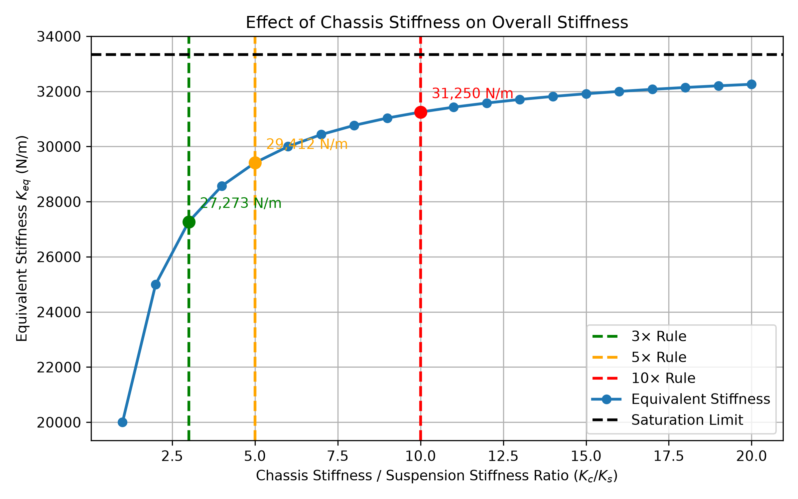

# 車架剛性與等效懸吊剛度（Overall Rigidity & Equivalent Stiffness）計算與分析說明

## 一、 簡介與物理機制

車輛懸吊系統並非直接固定於絕對剛性的牆面上，而是安裝於具有彈性變形能力的車架（Chassis/Frame）上，並透過彈性輪胎（Tire）接觸地面。

從彈簧串聯（Series Springs）的力學模型來看，總體等效剛度（Equivalent Stiffness, $K_{\text{eq}}$）由三個主要彈性元件共同決定：
1. **輪胎剛度 $K_t$**
2. **懸吊剛度 $K_s$**（或輪率 Wheel Rate）
3. **車架剛性 $K_c$**

當車架剛性不夠高時，車架變形會削弱懸吊系統的實際表現，導致等效剛度遠低於設計之懸吊剛度。因此，工程上常使用「10倍原則」（即 $K_c \ge 10 \cdot K_s$）作為車架結構設計之目標。但實際上扭轉剛度要做到10倍這麼高其實有一定難度，為了不為難車體組所以我們先用3~5倍當作要求。而其他部分的剛性分析可能比較困難，所以幾何傳力的時候我們就直接當作是10倍的剛性來進行分析。

## 二、 符號與變數定義

以下為計算中所採用的物理量與符號說明：

| 變數名稱 | 物理意義 | 單位 |
| :--- | :--- | :--- |
| `Ks` | 懸吊剛性 ($K_s$) | $N/m$ |
| `Kt` | 輪胎剛性 ($K_t$) | $N/m$ |
| `Kc` | 車體剛性 ($K_c$) | $N/m$ |
| `ratio` | 車體剛性與懸吊剛性之比值 ($K_c / K_s$) | 無因次 |
| `Keq` | 系統整體等效剛度 ($K_{eq}$) | $N/m$ |

## 三、 力學與數學推導

### 1. 串聯彈簧等效剛度推導

在車輛受力傳遞路徑中，輪胎、懸吊與車架承受相同的作用力 $F$。各元件之變形量分別為：

$$\delta_t = \frac{F}{K_t}, \quad \delta_s = \frac{F}{K_s}, \quad \delta_c = \frac{F}{K_c}$$

總變形量 $\delta_{\text{total}}$ 為三者之和：

$$\delta_{\text{total}} = \delta_t + \delta_s + \delta_c = F \cdot \left(\frac{1}{K_t} + \frac{1}{K_s} + \frac{1}{K_c}\right)$$

根據等效剛度定義 $K_{\text{eq}} = \frac{F}{\delta_{\text{total}}}$，可得倒數和公式：

$$\frac{1}{K_{\text{eq}}} = \frac{1}{K_t} + \frac{1}{K_s} + \frac{1}{K_c}$$

整理後可得等效剛度 $K_{\text{eq}}$ 為：

$$K_{\text{eq}} = \frac{1}{\frac{1}{K_t} + \frac{1}{K_s} + \frac{1}{K_c}}$$

### 2. 車架剛性飽和極限與 10 倍原則

當車架結構極度剛硬（$K_c \to \infty$）時，$\frac{1}{K_c} \to 0$，此時系統剛度受限於輪胎與懸吊，達到飽和極限（Saturation Limit）：

在實務設計中，若車架剛性過低（如 $K_c \approx K_s$），等效剛度會大幅下降；但若盲目提升車架剛性（如超過 $10 \cdot K_s$），由於邊際效益遞減，車架重量大幅增加卻無法顯著提升 $K_{\text{eq}}$。

因此，賽車與車輛工程中常採用 **10倍原則**（$K_c = 10 \cdot K_s$）作為設計折衷點，確保能夠獲得飽和極限約 $90\% \sim 95\%$ 以上的剛度表現。

## 結果

我們之後會採用上圖中10倍的剛性用於懸吊roll center 的幾何傳力分析，上圖並不是用來當扭轉剛性參考值用的