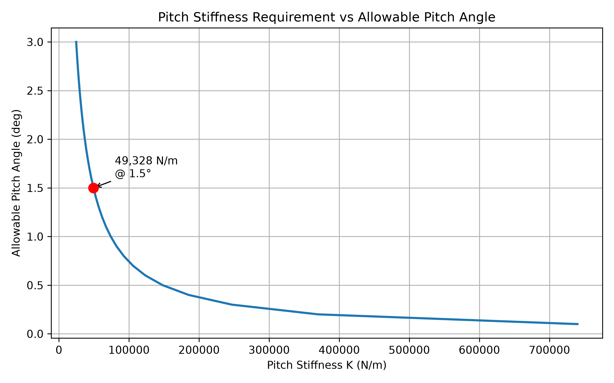

# Pitch Stiffness

## 簡介

當車輛進行直線加速時，慣性力會作用於車輛質心（Center of Gravity, CG），產生一個使車身繞質心旋轉的俯仰力矩（Pitch Moment）。此力矩會導致前懸吊拉伸、後懸吊壓縮，從而產生俯仰角（Pitch Angle, $\theta$）。

Pitch Angle會影響空力攻角，為了避免空力失效我們需要將俯仰角控制在設計目標（$\theta_{\text{target}} = 1.5^\circ$）以內，懸吊系統必須具備足夠的俯仰剛度（Pitch Stiffness, $K$）。

## 參數
| 變數名稱 | 物理意義 | 單位 |
| :--- | :--- | :--- |
| `m` | 車輛總質量 ($m$) | $kg$ |
| `a` | 最大加速度標竿值 ($a$) | $g$ |
| `h` | 重心高度 ($h$) | $m$ |
| `L` | 軸距 ($L$) | $m$ |
| `theta` | 容許俯仰角度 ($\theta$) | $rad$ |
| `s` | 懸吊行程位移 ($s$) | $m$ |
| `F` | 單軸等效垂直力 ($F$) | $N$ |
| `K` | 單側所需垂直剛度 ($K$) | $N/m$ |

## 計算

### 1. 縱向慣性力與俯仰力矩

當車輛以加速度 $a\cdot g$ 加速時，作用於質心的縱向慣性力 $F_x$ ，其中加速度設定為極限的x方向加速度。

$$F_x = m \cdot a \cdot g$$

此作用力相對於底盤旋轉中心（距離為質心高度 $h$）產生俯仰力矩 $M$：

$$M = F_x \cdot h = m \cdot a \cdot g \cdot h$$

### 2. 軸位置的受力與垂直位移

則俯仰力矩 $M$ 分配到前/後軸產生的垂直負載量 $F$ 如下，單側力矩由前後兩側的彈簧力量組成，力臂為 $L/2$

$$M = F/2 \cdot \left(\frac{L}{2}\right) \implies F = \frac{2M}{\frac{L}{2}} = \frac{M}{L}$$

在小角度近似下，俯仰角為 $\theta$（弧度）時，半軸距 $\frac{L}{2}$ 處產生的垂直位移量 $s$ 為

$$s = \left(\frac{L}{2}\right) \cdot \theta$$

### 3. 所需俯仰剛度推導

假設前後懸吊系統在該自由度下之幾何對稱，總位移量由雙側懸吊共同承擔，剛度定義為單位位移所需的力：

$$K = \frac{F}{s}$$

將 $F$ 與 $s$ 代入上式：

$$K = \frac{\frac{M}{L}}{\left(\frac{L}{2} \cdot \theta\right)} = \frac{2M}{L^2 \cdot \theta} = \frac{2 \cdot m \cdot a \cdot g \cdot h}{L^2 \cdot \theta}$$

由此式可知，所需的俯仰剛度 $K$ 與俯仰角 $\theta$ 成反比關係：若允許的俯仰角 $\theta$ 越小，所需之剛度 $K$ 越高。

## 結果

如上圖計算結果可以得知前後懸吊pitch的剛性下限需求，真實車輛的heave剛性前後不同，這邊計算出來的剛性是最低下限值。