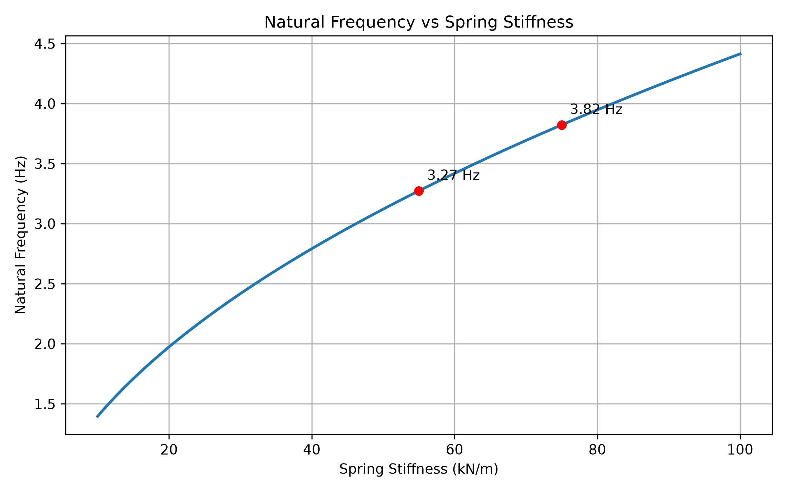

# Quarter-Car 懸吊自然頻率分析 (Natural Frequency vs. Spring Stiffness)

[Download Code](Frequency_Stiffness.py)

## 簡介
將剛性需求轉換成自然頻率方便檢查我們設定的數值是否合理，另外也與輪胎自然頻率比較看有沒有超過3~5倍以上

## 計算

$$f_n = \frac{1}{2\pi} \sqrt{\frac{k_{ride}}{m}}$$

* **$m$ (Sprung Mass)**：車體分擔之彈簧上質量，此處取半車

* **$k_{ride}$ (Ride Rate)**：實際作用於輪端的輪剛度（Wheel Rate/Ride Rate）。若考慮輪胎剛度 $k_{tire}$ 串聯，輪端總剛度應為：
  $$\frac{1}{k_{ride}} = \frac{1}{k_{wheel}} + \frac{1}{k_{tire}}$$

## 結果

從上圖可以看看自然頻率是否合理，並與後續車輪自然頻率進行比較確定有自然頻率3~5倍以上