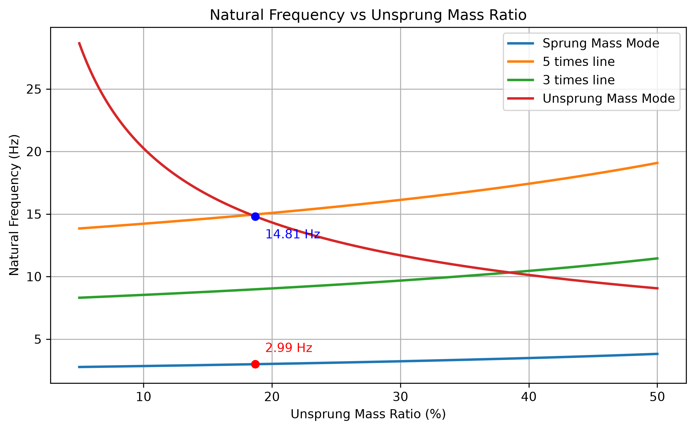

# 簧下質量比例與簧上簧下自然頻率

[Download Code](Frequency_mass.py)

## 參數

以下為計算中所採用的物理量與符號說明：

| 變數名稱 | 物理意義 | 單位 |
| --- | --- | --- |
| `m_total` | 單輪等效總質量 ($m_{total}$) | $kg$ |
| `target_ratio` | 目標簧下質量比例 ($\mu_{ratio}$) | 無因次 |
| `Ks` | 懸吊彈簧剛性 ($K_s$) | $N/m$ |
| `Kt` | 輪胎剛性 ($K_t$) | $N/m$ |
| `MR` | 懸吊傳動比 / 槓桿比 ($MR$) | 無因次 |
| `Kw` | 輪剛性 ($K_w$) | $N/m$ |
| `Kr` | 行駛剛性 / 輪上有效剛性 ($K_r$) | $N/m$ |
| `mu` | 簧下質量 ($m_u$) | $kg$ |
| `ms` | 簧上質量 ($m_s$) | $kg$ |

## 計算

> 參考車輛動力學 : *Race Car Vehicle Dynamics* (RCVD)
> 簧上下自然頻率參考P236~240
### 1. 質量分割與行駛剛性 (Ride Rate)

給定單輪總質量 $m_{total}$ 與簧下質量比例 $\mu_{ratio}$，可將質量劃分為簧下質量 $m_u$ 與簧上質量 $m_s$：

$$m_u = m_{total} \cdot \mu_{ratio}, \quad m_s = m_{total} - m_u$$

輪剛性 $K_w$ 與輪上有效剛性 $K_r$ 計算如下：

$$K_w = K_s \cdot MR^2, \quad K_r = \frac{K_w \cdot K_t}{K_w + K_t}$$

### 2. 簧上質量模態自然頻率 (Sprung Mass Mode)

簧上質量的低頻彈跳模態主要由行駛剛性 $K_r$ 與簧上質量 $m_s$ 所支配，其自然頻率 $f_{n\_sprung}$（單位：$\text{Hz}$）推導如下：

$$f_{n\_sprung} = \frac{1}{2\pi} \sqrt{\frac{K_r}{m_s}}$$

### 3. 簧下質量模態自然頻率 (Unsprung Mass / Wheel Hop Mode)

簧下質量的高頻車輪跳動模態受懸吊彈簧剛性與輪胎剛性並聯影響（兩者對簧下質量 $m_u$ 皆形成約束），其自然頻率 $f_{n\_unsprung}$ 推導如下：

$$f_{n\_unsprung} = \frac{1}{2\pi} \sqrt{\frac{K_t + K_w}{m_u}}$$

### 4. 頻率耦合與倍數分析

為評估低頻簧上模態與高頻簧下模態之間的頻率間隔狀況，計算中亦納入簧上頻率的參考倍數線（$3 \times f_{n\_sprung}$ 與 $5 \times f_{n\_sprung}$），用以避開懸吊諧振與動態耦合區域。

## 結果

**簧下質量比例 ($\mu_{ratio}$) 增加時**簧下模態自然頻率大幅下降，代表車輪跳動反應變慢，抓地力表現受阻。另外可以觀察一下目前設計的設定點是否有接近5倍線。