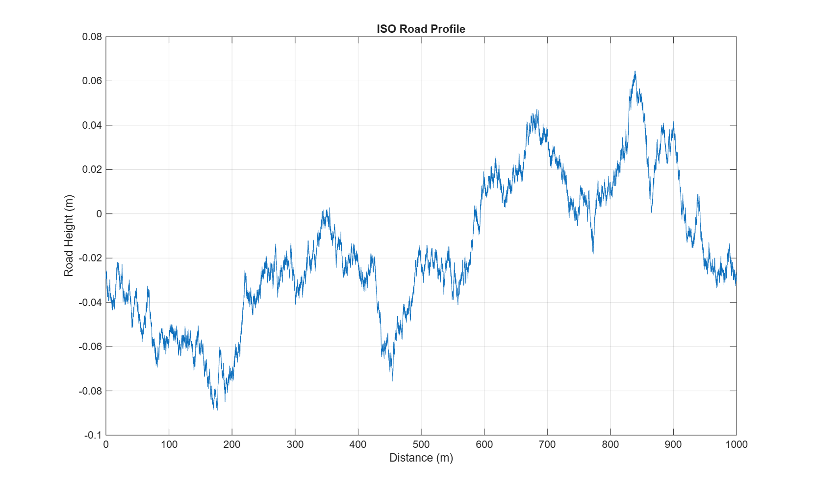
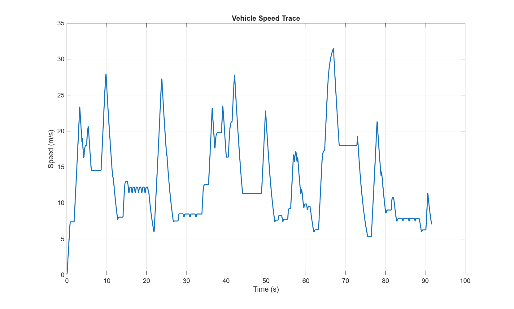
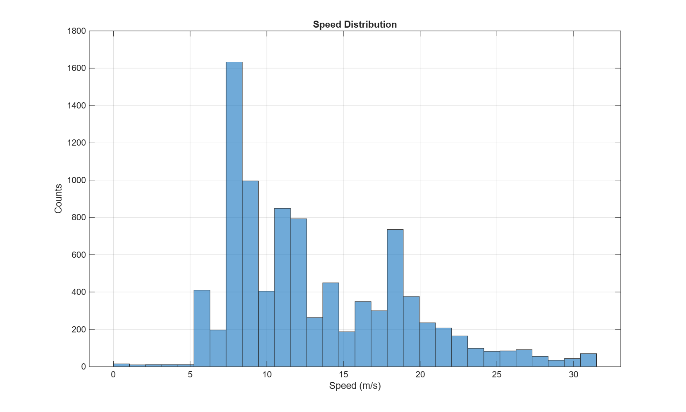
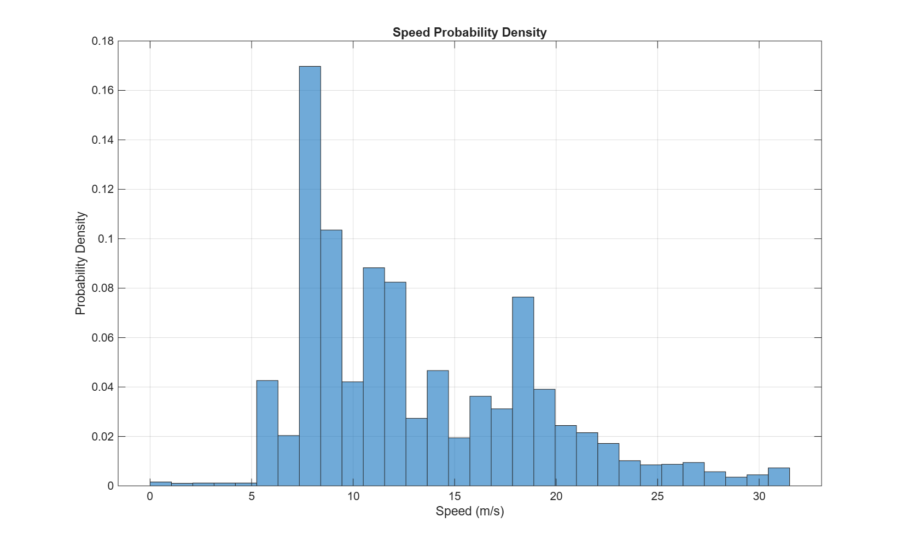
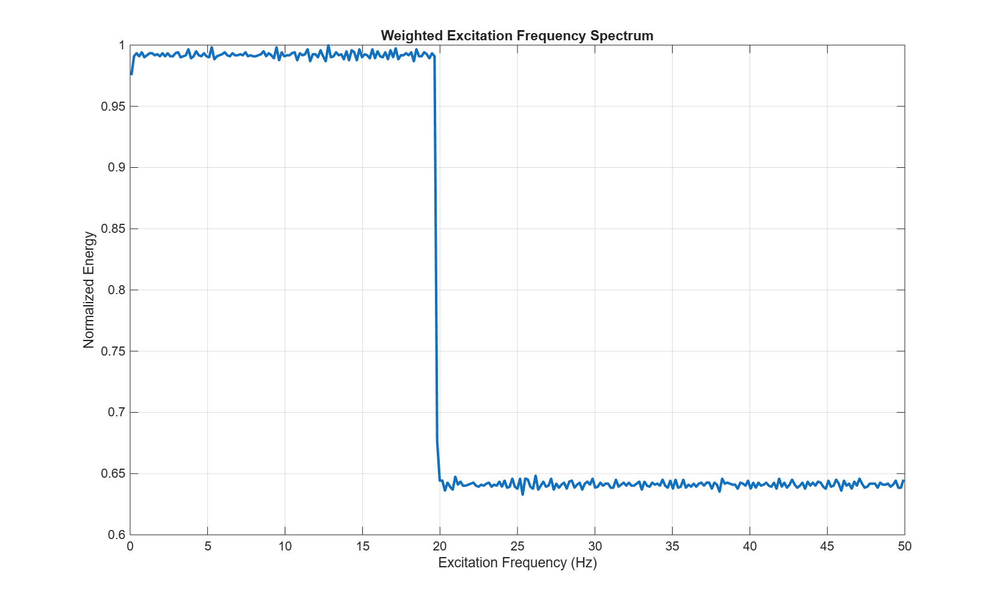
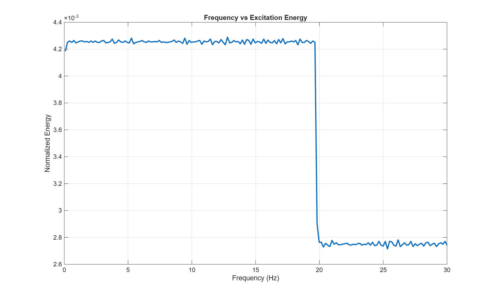
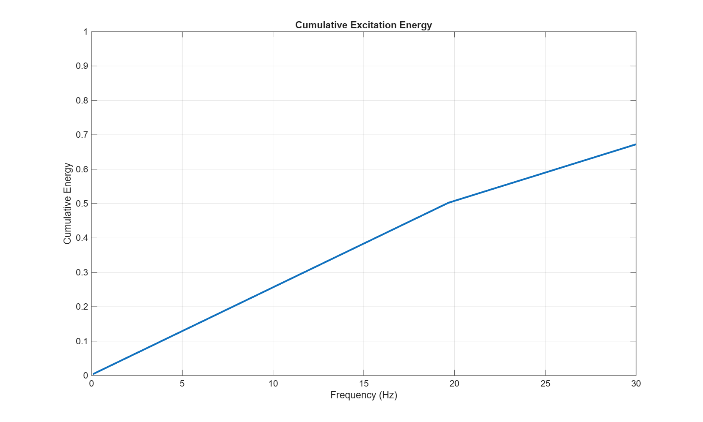
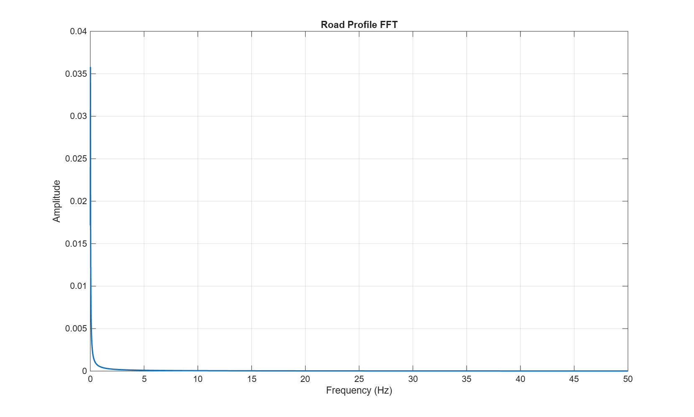
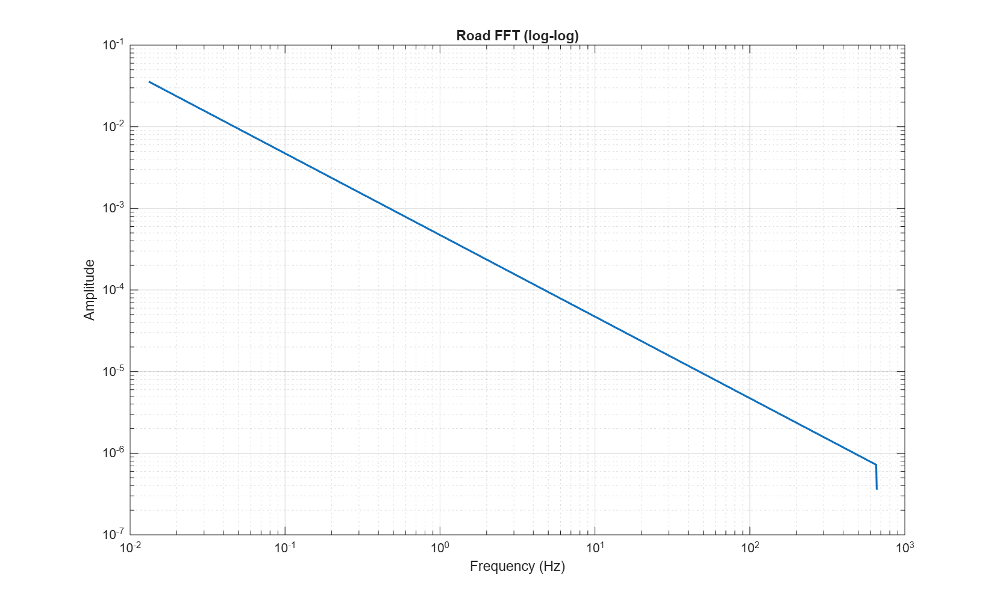

# ISO 8608 路面不平度產生與車輛動態激振頻譜分析說明

[Download Code](PSD.m)

## 簡介

車輛在路面上行駛時，懸吊系統受到的路面激振力取決於兩個核心因素：
1. **路面的空間高程起伏**：由 ISO 8608 標準定義的功率譜密度（Power Spectral Density, PSD）描述。
2. **車輛的行駛速度**：車輛速度將空間頻率（Cycles/m）轉化為懸吊系統實際承受的時間激振頻率（Hz）。

透過結合路面空間功率譜密度與車速概率密度函數（PDF），工程團隊能評估懸吊系統在實際行駛條件下的主激振頻段（Dominant Excitation Band）與能量累積分佈。

## 參數

以下為計算中所採用的物理量與符號說明：

| 變數符號 | 描述 | 單位 | 範例設定值 |
| :--- | :--- | :--- | :--- |
| $L$ | 生成路面總長度 | $\text{m}$ | $1000.0$ |
| $dx$ | 空間採樣間隔（Resolution） | $\text{m}$ | $0.01$ |
| $n_0$ | 參考空間頻率（Reference Spatial Frequency） | $\text{m}^{-1}$ | $0.1$ |
| $G_{d0}$ | 參考空間頻率下之路面平整度係數（Class C） | $\text{m}^3$ | $16 \times 10^{-6}$ |
| $w$ | 功率譜指數（Power Rate） | 無因次 | $2.0$ |
| $n$ | 空間頻率（Spatial Frequency） | $\text{m}^{-1}$ | 計算得出 |
| $G_d(n)$ | 位移功率譜密度（Displacement PSD） | $\text{m}^3$ | 計算得出 |
| $V$ | 車輛實測行駛速度 | $\text{m/s}$ | 自 Excel 載入 |
| $f_{\text{exc}}$ | 懸吊承受之時間激振頻率（Temporal Frequency） | $\text{Hz}$ | $f_{\text{exc}} = n \cdot V$ |
| $P(V)$ | 車速之概率密度函數（Probability Density Function） | $\text{s/m}$ | 統計得出 |

## 計算

### 1. ISO 8608 路面高程功率譜密度（PSD）

依據 ISO 8608 標準，路面垂直位移之空間功率譜密度 $G_d(n)$ 公式為：

$$G_d(n) = G_{d0} \cdot \left(\frac{n}{n_0}\right)^{-w}$$

將空間頻率分量 $n$ 對應之振幅 $A_k$ 透過逆快速傅立葉變換（IFFT）與隨機相位 $\phi_k \in [0, 2\pi)$ 組合，即可重建時域/空域路面高程 $z(x)$：

$$A_k = \sqrt{2 \cdot G_d(n_k) \cdot \Delta n}$$

$$X(n_k) = A_k \cdot e^{j \phi_k}$$

$$z(x) = \text{Re}\left\{\text{IFFT}(X)\right\} \cdot N$$

### 2. 空間頻率轉時間激振頻率

車輛以速度 $V$ 行駛於空間頻率為 $n$（$\text{cycles/m}$）的路面上時，車輛懸吊承受的時間激振頻率 $f$（$\text{Hz}$ 或 $\text{cycles/s}$）轉換關係式為：

$$f = n \cdot V$$

### 3. 車速概率加權激振能量頻譜

若車速分佈符合概率密度 $P(V)$，則特定時間激振頻率 $f$ 所包含的加權能量 $E(f)$ 由速度概率與路面能量共同決定：

$$E(f) \propto \iint P(V) \cdot G_d(n) \cdot \delta(f - n \cdot V) \, dn \, dV$$

最終的正規化加權能量頻譜與累積能量 $C(f)$ 可表示為：

$$E_{\text{norm}}(f) = \frac{E(f)}{\max(E(f))}$$

$$C(f) = \frac{\int_0^f E(f') \, df'}{\int_0^{\infty} E(f') \, df'}$$

### 4. 傅立葉單邊頻譜（FFT）

對於以平均速度 $V_{\text{mean}}$ 計算之時間序列 $t = \frac{x}{V_{\text{mean}}}$，採樣頻率 $F_s = \frac{1}{\Delta t}$。雙邊頻譜 $P_2$ 修正為單邊振幅頻譜 $P_1$：

$$P_1(f_k) = 2 \cdot \vert{}Y(f_k)\vert{}, \quad \text{for } k = 1, 2, \dots, \frac{N}{2}$$

## 結果

根據 ISO 8608 標準（Class C 路面等級）並透過逆快速傅立葉轉換 (IFFT) 所模擬出的 1000 公尺長度空間路面不平度高程波形，呈現車輛行駛時實際產生的路面上下起伏變化。

畫vt圖用，澳洲賽的速度資料

簡單統計速度出現時間

將車速分佈進行歸一化後的概率密度函數 (PDF) 圖

結合路面功率譜密度 (PSD) 與車速概率密度 (PDF)，將空間頻率轉化為時間激振頻率並進行歸一化後得到的綜合激振能量頻譜，展現車輛實際承受的頻率能量分佈。

將總激振能量歸一化後的頻率能量分佈圖，呈現哪些頻率區間貢獻了主要的激振能量。基本上就是20以下的低頻

激振能量隨頻率增加的累積曲線（0–100%）可以用斜率變化進行分析

對時域路面高程進行快速傅立葉轉換 (FFT)，顯示在固定平均車速下，路面起伏在各時間頻率 (Hz) 上的幅值大小。基本上ISO就是完全沒有規律所以這是做好玩的

將路面 FFT 頻譜以雙對數 (Log-Log) 座標呈現。由於 ISO 8608 路面 PSD 具備負指數特性，雙對數圖中會呈現經典的高頻衰減直線特徵。這個驗證確認了上個分析是做好玩用的

