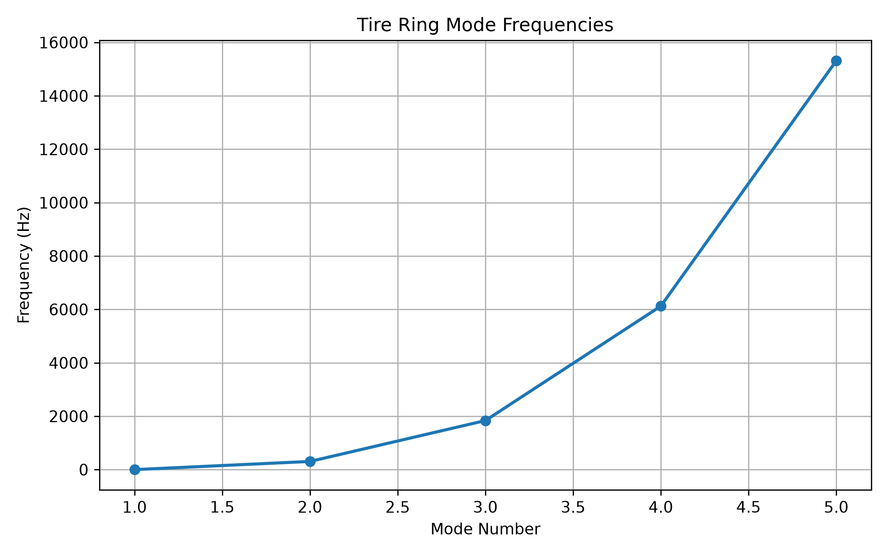

# 輪胎環形振動模態（Tire Ring Mode Frequencies）計算與分析說明

## 簡介

將輪胎簡化為一個具有彈性的連續圓環結構。當環發生形變時，其位能主要儲存於彎曲應變能中，而動能則由環的質量分佈決定。利用古典彈性環理論（Classical Ring Theory），分析輪胎結構在面內彎曲（In-plane bending）下的各階自然頻率與振型。

## 參數

以下為計算中所採用的物理量與符號說明：

| 變數名稱 | 物理意義 | 單位 |
| :--- | :--- | :--- |
| `R` | 輪胎有效半徑 ($R$) | $m$ |
| `E` | 橡膠/複合材料等效模數 ($E$) | $Pa$ |
| `V` | 輪胎結構體積 ($V$) | $m^3$ |
| `m` | 輪胎質量 ($m$) | $kg$ |
| `rho` | 計算密度 ($\rho = m/V$) | $kg/m^3$ |
| `A` | 截面積 ($A$) | $m^2$ |
| `I` | 截面二次矩 ($I$) | $m^4$ |
| `mode_max` | 計算的最大模態階數 | 無因次 |

## 計算

> 參考環形振動學 : https://thesis.caltech.edu/3782/1/Evensen_d_1964.pdf

### 1. 材料密度與截面幾何計算

材料密度 $\rho$ 由質量 $m$ 除以體積 $V$ 求得：

$$\rho = \frac{m}{V}$$

單位長度之質量為 $\rho \cdot A$。

### 2. 薄環振動自然頻率推導

依據薄環振動理論（Thin Ring Bending Vibration），薄環在平面內彎曲變形的幾何特徵常數可表示為：

$$\beta^2 = \frac{E \cdot I}{\rho \cdot A \cdot R^4}$$

對於第 $n$ 階振動模態，其自然角頻率 $\omega_n$ 與模態階數 $n$ 之力學推導關係式為：

$$\omega_n = \sqrt{\frac{E \cdot I}{\rho \cdot A \cdot R^4}} \cdot n^2 \left(n^2 - 1\right)$$

將角頻率 $\omega_n$ 轉換為赫茲（$\text{Hz}$）之自然頻率 $f_n$：

$$f_n = \frac{\omega_n}{2\pi} = \frac{1}{2\pi} \sqrt{\frac{E \cdot I}{\rho \cdot A \cdot R^4}} \cdot n^2 \left(n^2 - 1\right)$$

### 3. 特殊階數說明

* **當 $n = 1$ 時**：
  $$f_1 = \frac{1}{2\pi} \sqrt{\frac{E \cdot I}{\rho \cdot A \cdot R^4}} \cdot (1)^2 \cdot (1^2 - 1) = 0\text{ Hz}$$
  代表無幾何應變的剛體平移或旋轉。

* **當 $n \ge 2$ 時**：
  隨著 $n$ 增加，頻率增長主要取決於多項式因子 $n^2(n^2 - 1) \approx n^4$，代表高階模態的剛度呈高次冪上升，頻率隨階數快速遞增。

## 結果

由此圖可以觀察到理論上需要避開的頻率