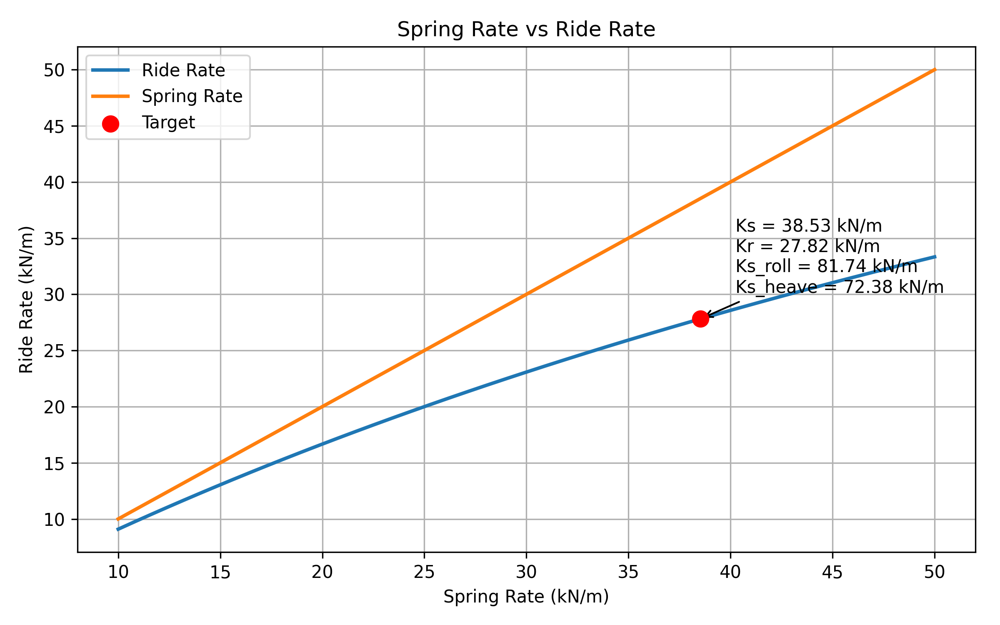

# 車輛懸吊剛性與輪胎鋼性關係

[Download Code](Tire_Stiffness.py)

## 參數

以下為計算中所採用的物理量與符號說明：

| 變數名稱 | 物理意義 | 單位 |
| :--- | :--- | :--- |
| `MR` | 懸吊傳動比 / 槓桿比 ($MR$) | 無因次 |
| `Kt` | 輪胎剛性 ($K_t$) | $N/m$ |
| `Ks` | 懸吊彈簧剛性 ($K_s$) | $N/m$ |
| `Kw` | 輪剛性 / 輪軸等效剛性 ($K_w$) | $N/m$ |
| `Kr` | 行駛剛性 / 輪上有效剛性 ($K_r$) | $N/m$ |
| `Kr_roll` | 目標軸側傾剛性 ($K_{r\_roll}$) | $N/m$ |
| `Kr_heave` | 目標軸垂直剛性 ($K_{r\_heave}$) | $N/m$ |
| `Kr_tag` | 目標單輪等效行駛剛性 ($K_{r\_tag}$) | $N/m$ |
| `k_rate` | 剛性折減率 ($k_{rate} = K_r / K_s$) | 無因次 |

## 計算

> 參考車輛動力學 : Milliken & Milliken, *Race Car Vehicle Dynamics*

### 1. 懸吊傳動比與輪剛性 (Wheel Rate)

輪剛性代表考慮懸吊連桿機構之槓桿比（Motion Ratio）後，作用於輪軸位置的等效剛性：

$$K_w = K_s \cdot MR^2$$

其中當 $MR = 1.0$ 時，輪剛性即等於彈簧剛性 ($K_w = K_s$)。

### 2. 輪上有效剛性 / 行駛剛性 (Ride Rate)

路面衝擊與載荷變化係同時傳遞至輪胎與懸吊彈簧，兩者在力學架構上屬於**串聯（Series）彈簧系統**。因此，輪上總有效剛性 $K_r$ 之數學推導如下：

$$\frac{1}{K_r} = \frac{1}{K_w} + \frac{1}{K_t}$$

經過通分與整理可得：

$$K_r = \frac{K_w \cdot K_t}{K_w + K_t} = \frac{(K_s \cdot MR^2) \cdot K_t}{(K_s \cdot MR^2) + K_t}$$

### 3. 多軸態剛性等效與修正計算

車輛於特定動態下的單輪目標剛性 $K_{r\_tag}$ 由軸側傾剛性 $K_{r\_roll}$ 與軸垂直剛性 $K_{r\_heave}$ 等效求得：

$$K_{r\_tag} = \frac{\frac{K_{r\_roll}}{2} + \frac{K_{r\_heave}}{2}}{2}$$

由於輪胎剛性 $K_t$ 之串聯效應，實際有效剛性必然小於彈簧剛性（$K_r < K_s$）。定義剛性折減率：

$$k_{rate} = \frac{K_{r\_tag}}{K_{s\_tag}}$$

反推特定動態目標所需匹配之實際彈簧剛性：

$$K_{s\_roll} = \frac{K_{r\_roll}}{k_{rate}}, \quad K_{s\_heave} = \frac{K_{r\_heave}}{k_{rate}}$$

## 結果

由此圖可以觀察到隨著彈簧剛性 $K_s$ 增加，輪胎剛性 $K_t$ 成爲限制系統總剛性 $K_r$ 上限的主導因素（漸近線趨近於 $K_t$）