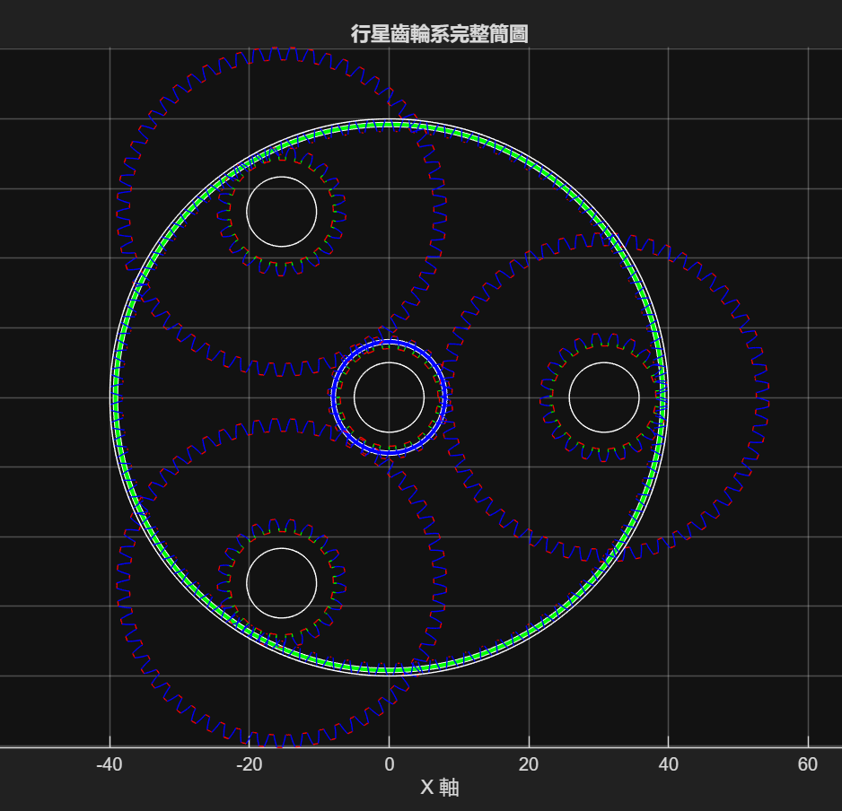
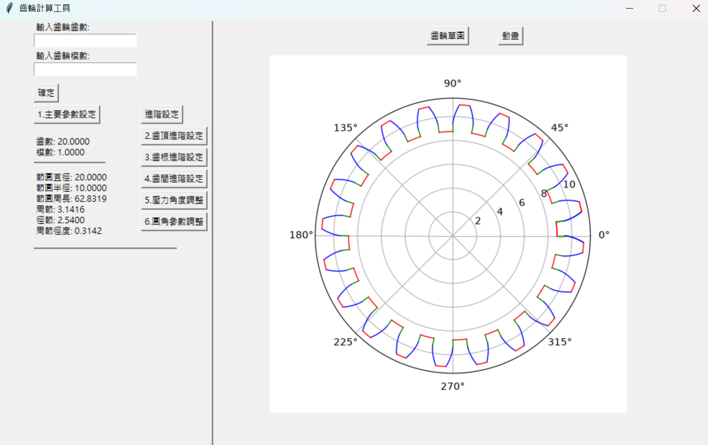

# 傳動系統與加速

## [減速比計算](Gear_rate/Gear_rate.md)

>計算齒輪箱目標減速比

根據**輪胎抓地力極限（Traction Limit）**與**目標極速（Top Speed Target）**，推導出最佳的傳動減速比（Gear Ratio, $Z$）。
## [齒數計算](Gear_teeth/Gear_tooth.md)

>計算每個齒輪的齒數

在給定模數 $M$、機構包絡尺寸上限 $D_{max}$ 與目標總減速比 $z$ 的條件下，對太陽輪（Sun）、齒圈（Ring）與兩層行星輪（Planetary Gears 1 & 2）的齒數組合進行空間窮舉。

行星齒輪組的設計遠比普通定軸齒輪箱複雜，除了基本的傳動比需求外，還必須同時滿足**空間尺寸限制**、**同心幾何同軸條件**、**多行星輪均勻裝配相位條件（Assembly Phase Condition）**以及**雙聯行星輪週期重複裝配限制**。我們透過四層巢狀迴圈篩選出所有物理可行且符合力學裝配的齒數組合。

## [齒輪數量干涉分析](Number_of_Gear/Number_of_Gear.md)

>確認齒輪不會互相干涉

針對 **行星齒輪機構（Planetary Gear Mechanism）** 進行相鄰行星齒輪間的**幾何干涉（Geometric Interference）**與**最大裝配數量極限**驗算。

## [加速負載轉移](Acc_load/Acc_load.md)

>計算加速造成的負載轉移

當車輛向前加速時，慣性力（Inertial Force）作用於車輛重心（CG），產生使車身繞 Y 軸仰俯的慣性力矩（Pitch Moment）。這會導致前軸正向載荷（Front Normal Load）轉移至後軸（Rear Normal Load）。

## [最後輸出檢查](Output_check/Output_check.md)

>確定輸出的加速度與極速

檢查我們使用的減速比與齒輪配置提供的加速與極速效果是否符合我們的預期。

## [轉動慣量計算](Rotational_inertia/Rotational_inertia.md)

>計算齒輪帶來的轉動慣量

建立**複式行星齒輪箱機構（Compound Planetary Gearbox）** 動力學上的等效轉動慣量（Equivalent Mass / Rotational Inertia）數學模型。

## [模數精度分析](tooth_Strength/tooth_Strength.md)

>這基本上是做好玩的強度與精度分析

透過理論計算強度需求模數，與加工極限進行疊加比較，定位出**強度主導區**與**加工精度主導區**。這個分析基本上是做好玩的真正需要使用kisssoft來計算。

## [減速比下限制與阻力估算](acc_resis/acc_resis.md)

>這也是做來玩的，算出最大會面對的阻力並確定減速比下限制。

把所有阻力加起來假設最糟的情況。我們設定的減速比必須要高過這個數值。但基本上依據我們恐怖的加速需求完全不會發生扭矩不足的情況，頂多加速度降低而已。

## 進階齒輪工具

  
  

1. 齒輪輪廓曲線設計界面 : 不再支援!!!
2. 齒輪系幾何視覺化 : 不再支援!!!
3. 齒輪傳動計算表 : 不再支援!!!

