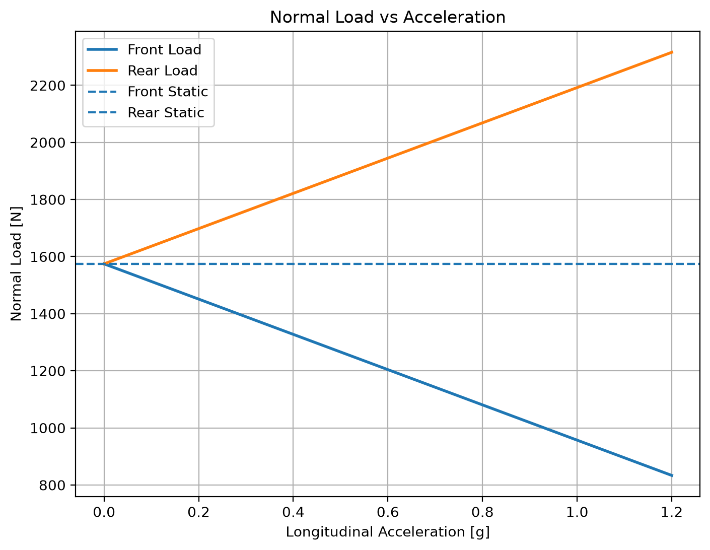

# 車輛縱向加速動態軸重轉移

[Download Code](Acc_load.py)

## 簡介

當車輛向前加速時，慣性力（Inertial Force）作用於車輛重心（CG），產生使車身繞 Y 軸仰俯的慣性力矩（Pitch Moment）。這會導致前軸正向載荷（Front Normal Load）轉移至後軸（Rear Normal Load）。

## 參數

以下為計算中採用的物理量與符號說明：

| 變數名稱 | 物理意義 | 單位 |
| --- | --- | --- |
| `g` | 重力加速度 ($g = 9.81$) | $m/s^2$ |
| `m` | 車輛總質量  | $kg$ |
| `l` | 車輛總軸距  | $m$ |
| `l_f` | 車輛重心（CG）至前軸距離  | $m$ |
| `l_r` | 車輛重心（CG）至後軸距離 ($l_r = l - l_f$) | $m$ |
| `h_cog` | 車輛重心高度 | $m$ |
| `mu_w` | 輪胎縱向最大摩擦係數 | 無因次 |
| `a_range` | 加速度範圍 ($0 \sim \mu_w \cdot g$) | $m/s^2$ |

## 計算

### 1. 靜態軸重計算 (Static Normal Load)

在車輛靜止（加速度 $a = 0$）狀態下，前後軸正向載荷由車輛重心幾何位置決定：

$$N_{r\_static} = \frac{m \cdot g \cdot l_f}{l}$$

$$N_{f\_static} = m \cdot g - N_{r\_static} = \frac{m \cdot g \cdot l_r}{l}$$

### 2. 動態軸重轉移 (Dynamic Load Transfer)

當車輛以加速度 $a$ 加速時，產生的總縱向慣性力為 $F_{x\_total} = m \cdot a$。以車輛前後軸接觸點進行力矩平衡分析，可得即時動態軸重：

* **後軸動態正向力 ($N_r$)**：

$$N_r = \frac{F_{x\_total} \cdot h_{cog} + m \cdot g \cdot l_f}{l} = N_{r\_static} + \Delta N$$

* **前軸動態正向力 ($N_f$)**：

$$N_f = m \cdot g - N_r = N_{f\_static} - \Delta N$$

其中，動態轉移載荷量 $\Delta N$ 定義為：

$$\Delta N = \frac{m \cdot a \cdot h_{cog}}{l}$$

## 結果

由上圖可以觀察加速時候的荷重變化