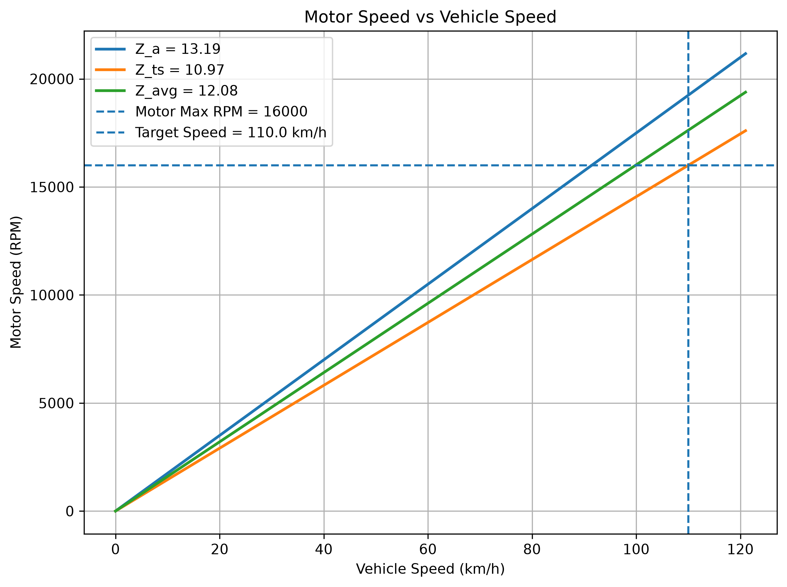

# 加速極限與減速比分析

[Download Code](Gear_rate.py)

## 參數

以下為計算中所採用的物理量與符號說明：

| 變數名稱 | 物理意義 | 單位 |
| --- | --- | --- |
| `g` | 重力加速度 ($g = 9.81$) | $m/s^2$ |
| `m` | 車輛總質量 ($m$) | $kg$ |
| `l`, `l_f`, `l_r` | 車輛軸距與重心至前後軸距離 ($l, l_f, l_r$) | $m$ |
| `h_cog` | 車輛重心高度 ($h_{cog}$) | $m$ |
| `mu_w` | 輪胎縱向摩擦係數 ($\mu_w$) | 無因次 |
| `r_w` | 輪胎有效滾動半徑 ($r_w$) | $m$ |
| `v_target` | 目標車速 | $km/h$ |
| `T_motor_max` | 馬達最大輸出扭矩 ($T_{motor\_max}$) | $Nm$ |
| `RPM_motor_max` | 馬達最高轉速限制 ($\text{RPM}_{motor\_max}$) | $RPM$ |
| `Z_a`, `Z_ts`, `Z_avg` | 加速取向、極速取向與平均減速比 ($Z$) | 無因次 |

## 計算

### 1. 動態軸重轉移與縱向極限

在輪胎摩擦係數 $\mu_w$ 下，極限縱向加速度 $a_{max} = \mu_w \cdot g$。加速度產生的縱向總驅動力為 $F_{x\_total} = m \cdot a_{max}$。

車輛加速時，正向載荷後移，動態後軸正向力 $N_r$ 為：

$$N_r = \frac{F_{x\_total} \cdot h_{cog} + m \cdot g \cdot l_f}{l}$$

由 $N_r$ 可算出後軸（驅動軸）所能傳遞的最大縱向摩擦力 $F_{xr} = \mu_w \cdot N_r$，進而算出單側驅動輪所需的最大極限扭矩 $M_w$（假設左右雙輪均分扭矩）：

$$M_{xr} = F_{xr} \cdot r_w, \quad M_w = \frac{M_{xr}}{2}$$

### 2. 加速取向減速比 (Acceleration Driven Gear Ratio)

為滿足輪胎極限抓地力下的驅動扭矩需求，傳動系統所需的最小放大倍率 $Z_a$ 為：

$$Z_a = \frac{M_w}{T_{motor\_max}}$$

### 3. 極速取向減速比 (Top Speed Driven Gear Ratio)

目標車速 $v_{target}$（換算為 $m/s$）對應之驅動輪最大旋轉角速度 $\omega_{w\_max}$ 與轉速 $\text{RPM}_w$：

$$\omega_{w\_max} = \frac{v_{target}}{r_w}, \quad \text{RPM}_w = \omega_{w\_max} \cdot \frac{60}{2\pi}$$

在馬達最高轉速 $\text{RPM}_{motor\_max}$ 限制下，允許的最大減速比 $Z_{ts}$ 為：

$$Z_{ts} = \frac{\text{RPM}_{motor\_max}}{\text{RPM}_w}$$

### 4. 馬達轉速與車速關係

在固定減速比 $Z$ 下，車速 $v$ 與馬達轉速 $\text{RPM}_{motor}$ 呈線性關係：

$$\text{RPM}_{motor}(v) = \left( \frac{v}{r_w} \cdot \frac{60}{2\pi} \right) \cdot Z$$

## 結果

可以看看選用極速,加速,平均的齒比效果。