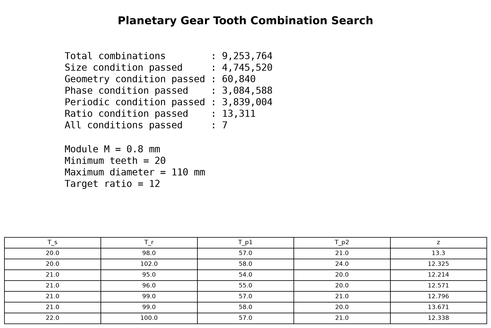

# 雙層複式行星齒輪組齒數搜尋

[Download Code](Gear_tooth.py)

## 簡介

在給定模數 $M$、機構包絡尺寸上限 $D_{max}$ 與目標總減速比 $z$ 的條件下，對太陽輪（Sun）、齒圈（Ring）與兩層行星輪（Planetary Gears 1 & 2）的齒數組合進行空間窮舉。

行星齒輪組的設計遠比普通定軸齒輪箱複雜，除了基本的傳動比需求外，還必須同時滿足**空間尺寸限制**、**同心幾何同軸條件**、**多行星輪均勻裝配相位條件（Assembly Phase Condition）**以及**雙聯行星輪週期重複裝配限制**。我們透過四層巢狀迴圈篩選出所有物理可行且符合力學裝配的齒數組合。

## 參數

以下為計算中所採用的幾何量與符號說明：

| 變數名稱 | 物理意義 | 單位 |
| --- | --- | --- |
| `M` | 齒輪法向模數 | $mm$ |
| `z` | 目標最小減速比 | 無因次 |
| `T_min` | 避免根切與保證齒輪強度的最小齒數 | 齒 |
| `D_max` | 機構外徑包絡尺寸上限 | $mm$ |
| `T_all` | 最大外徑所對應的極限總齒數容量 | 齒 |
| `T_s`, `T_r` | 太陽輪 ($T_s$) 與齒圈 ($T_r$) 齒數 | 齒 |
| `T_p1`, `T_p2` | 第一層與第二層行星輪 ($T_{p1}, T_{p2}$) 齒數 | 齒 |
| `P` | 第一與第二行星輪齒數之最大公因數 $\gcd(T_{p1}, T_{p2})$ | - |
| `K` | 行星輪裝配相位條件判定係數 ($K$) | - |
| `z_all` | 機構總減速比 ($z_{all} = z_1 \cdot z_2$) | 無因次 |

## 計算

### 1. 包絡邊界與齒數搜尋範圍 (Search Boundary)

根據最大允許外徑 $D_{max}$ 與模數 $M$，計算系統的總齒數空間上限 $T_{all}$：

$$T_{all} = \lfloor \frac{D_{max}}{M} \rfloor$$

進而確定各齒輪輪軸的合理搜尋邊界，大幅縮減非必要的計算花費：

* 太陽輪 $T_s \in [T_{min}, T_{all} - 2 T_{min}]$
* 行星輪 $T_{p1}, T_{p2} \in [T_{min}, \lfloor \frac{T_{all} - T_{min}}{2} \rfloor]$
* 齒圈 $T_r \in [3 T_{min}, T_{all}]$

### 2. 五大幾何與物理Constraint (Kinematic Constraints)

程式對所有潛在組合依次進行以下 5 重嚴格篩選：

1. **尺寸邊界限制 (Size Condition)**：
前級行星輪與太陽輪的組裝節圓直徑不得超過包絡總齒數上限：

$$2 T_{p1} + T_s \le T_{all}$$

2. **同心幾何同軸條件 (Concentricity / Geometry Condition)**：
前後級行星輪軸心距必須相等，確保太陽輪、行星架與齒圈同心：

$$T_s + T_{p1} + T_{p2} = T_r$$

3. **裝配相位條件 (Assembly / Phase Condition for 3 Planets)**：
若採用 3 顆行星輪均布（120° 對稱佈置），齒數組合必須滿足周向嚙合相位整數解：

$$P = \gcd(T_{p1}, T_{p2})$$

$$K = \frac{T_s \cdot T_{p2} - T_r \cdot T_{p1}}{3 \cdot P} \in \mathbb{Z}$$

4. **週期裝配限制 (Periodic Constraint)**：
雙聯行星輪（Compound Planets）相位必須具備非質數的同分週期，排除無法同相位同軸裝配的組合：

$$P = \gcd(T_{p1}, T_{p2}) \neq 1$$

5. **傳動減速比限制 (Ratio Condition)**：
總傳動減速比 $z_{all}$ 必須大於目標速比 $z$：

$$z_{all} = \left(\frac{T_{p1}}{T_s}\right) \cdot \left(\frac{T_r}{T_{p2}}\right) > z$$

## 結果

