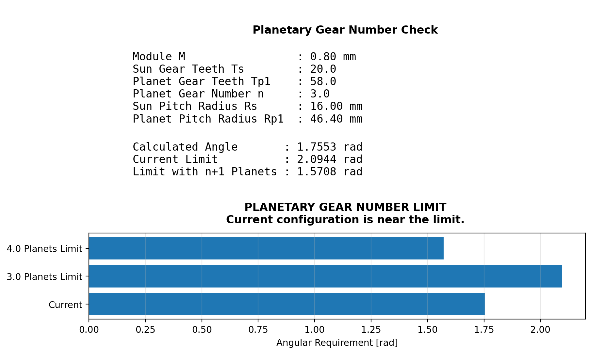

# 行星齒輪數量與相鄰齒輪頂圓干涉檢查

[Download Code](Number_of_Gear.py)

## 參數

以下為幾何建模與驗算中所採用的參數與符號說明：

| 變數名稱 | 物理意義 | 單位 |
| --- | --- | --- |
| `M` | 齒輪模數  | $mm$ |
| `Ts` | 太陽輪齒數  | 齒 |
| `Tp1` | 行星輪齒數 | 齒 |
| `n` | 預設佈置之行星齒輪數量 | 顆 |
| `Rs` | 太陽輪節圓半徑 ($R_s = T_s \cdot M$) | $mm$ |
| `Rp1` | 行星輪節圓半徑 ($R_{p1} = T_{p1} \cdot M$) | $mm$ |
| `theta` ($\theta$) | 相鄰行星齒輪不干涉所需的最小中心張角 | $\text{rad}$ |
| `theta_lim` ($\theta_{lim}$) | 當前 $n$ 顆行星齒輪均布時的中心夾角界限 ($2\pi / n$) | $\text{rad}$ |
| `theta_over` ($\theta_{over}$) | 嘗試增加至 $n+1$ 顆時的中心夾角界限 ($2\pi / (n+1)$) | $\text{rad}$ |

## 計算

### 1. 齒輪節圓與齒頂圓半徑 (Pitch & Addendum Radius)

太陽輪與行星輪之節圓半徑 $R_s, R_{p1}$ 分別為：

$$R_s = T_s \cdot M, \quad R_{p1} = T_{p1} \cdot M$$

行星齒輪之齒頂圓半徑 $R_a$（假設標準齒高，齒頂高係數 $h_a^* = 1$）定義為：

$$R_a = R_{p1} + h_a^* \cdot M = R_{p1} + M$$

兩相鄰行星齒輪中心距離 $d_c$ 等於太陽輪與行星輪節圓半徑之和：

$$d_c = R_s + R_{p1}$$

### 2. 相鄰行星齒輪不干涉臨界包角 (Critical Clearance Angle)

為確保兩相鄰行星齒輪的齒頂圓半徑（$R_a$）相互不發生幾何碰撞，兩行星齒輪中心對太陽輪中心所張開的角度 $\theta$ 必須滿足三角關係：

$$\sin\left(\frac{\theta}{2}\right) > \frac{R_a}{d_c} = \frac{R_{p1} + M}{R_s + R_{p1}}$$

在考慮製造公差與臨界頂圓裕度下，程式中採用更保守且安全的幾何包絡邊界（$R_{p1} + 2M$）：

$$\theta = 2 \arcsin\left( \frac{R_{p1} + 2M}{R_s + R_{p1}} \right)$$

### 3. 干涉條件與數量極限判定 (Interference Decision)

根據計算出的臨界包角 $\theta$，與空間均布角度進行比較：

1. **空間干涉判斷**：若 $\theta > \theta_{lim} = \frac{2\pi}{n}$，代表相鄰行星齒輪會發生幾何碰撞，**必須減少行星齒輪數量**。
2. **極限狀態判斷**：若 $\theta \le \theta_{lim}$ 且 $\theta > \theta_{over} = \frac{2\pi}{n+1}$，代表目前配置無干涉，但**已達到可裝配的數量上限**（無法再增加至 $n+1$ 顆）。
3. **擴充潛能判斷**：若 $\theta \le \theta_{over}$，代表空間尚有餘裕，**可嘗試增加行星齒輪數量**以提高傳動扭矩密度。

## 結果

