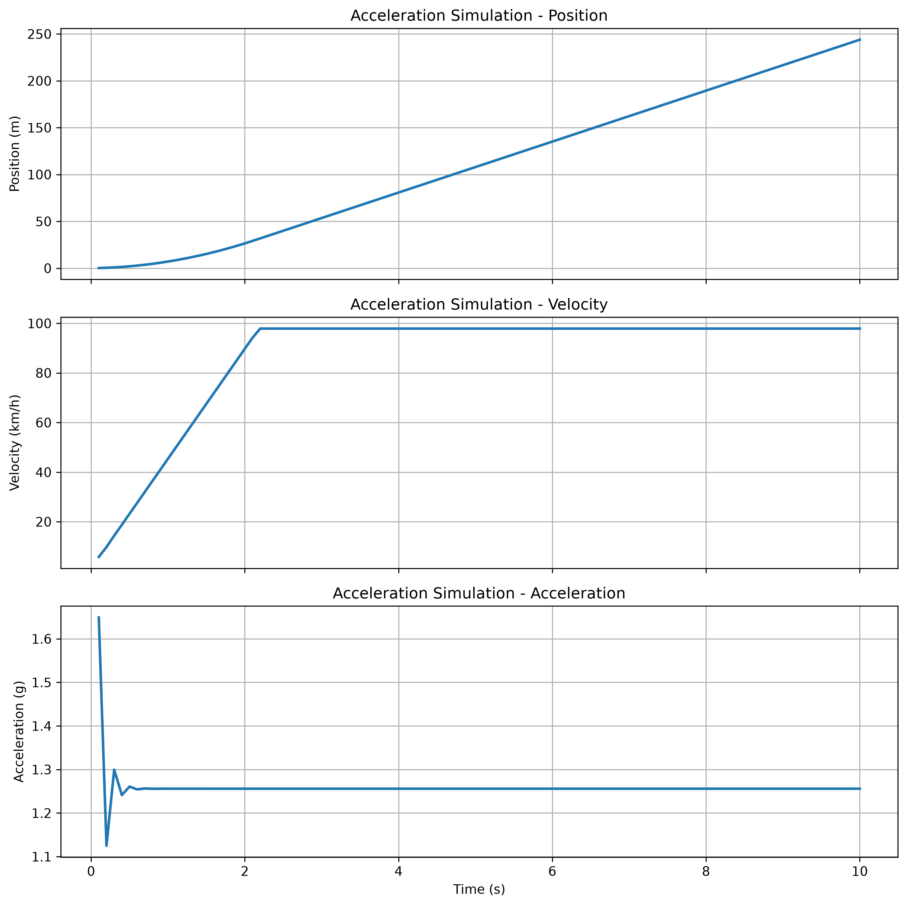

# 加速輸出檢查

[Download Code](Output_check.py)

## 參數

以下為動力系統與車輛結構之物理參數說明：

| 變數名稱 | 物理意義 | 單位 |
| --- | --- | --- |
| `g` | 重力加速度 ($g = 9.81$) | $m/s^2$ |
| `Ts`, `Tp1`, `Tr`, `Tp2` | 太陽輪、第一行星輪、齒圈、第二行星輪齒數 | 齒 |
| `M` | 齒輪模數 | $mm$ |
| `T_motor_max`, `RPM_motor_max` | 馬達最大扭矩與最高轉速 | $Nm$ / $RPM$ |
| `m` | 車輛總質量| $kg$ |
| `mu_w` | 輪胎最大縱向摩擦係數 無因次 |
| `r_w` | 輪胎有效滾動半徑| $m$ |
| `h_cog` | 重心高度 | $m$ |
| `l`, `l_f` | 車輛總軸距與重心至前軸距離  | $m$ |
| `dt`, `t_max` | 數值積分時間步長與總模擬時間 | $s$ |

## 計算

### 1. 複式行星齒輪箱傳動減速比與理論極限

行星齒輪箱之總減速比 $z$ 計算如下：

$$z = \left( \frac{T_{p1}}{T_s} \right) \cdot \left( \frac{T_r}{T_{p2}} \right)$$

經由減速比放大後，馬達輸出至單軸之總驅動力 $F_{axle}$ 與理論極速 $v_{max}$ 分別為：

$$T_{out} = T_{motor\_max} \cdot z, \quad F_{axle} = \frac{T_{out}}{r_w} \cdot 2$$

$$v_{max} = \frac{\text{RPM}_{motor\_max}}{z} \cdot \frac{2\pi \cdot r_w \cdot 60}{1000}$$

### 2. 動態軸重轉移與輪胎抓地力上限

在每個時間步長 $k$，根據前一刻的縱向加速度 $a_k$，計算車輛產生的動態後軸正向力 $N_r$ 與前軸正向力 $N_f$：

$$N_r = \frac{(m \cdot a_k) \cdot h_{cog} + m \cdot g \cdot l_f}{l}$$

$$N_f = m \cdot g - N_r$$

前後輪實際上能發揮的最大縱向驅動力 $F_f, F_r$ 受限於輪胎正向力與摩擦係數 $\mu_w$：

$$F_r = \min(F_{axle}, N_r \cdot \mu_w), \quad F_f = \min(F_{axle}, N_f \cdot \mu_w)$$

總有效推進力為 $F_{total} = F_f + F_r$。

### 3. 動態積分更新 (Time-Step Numerical Integration)

利用離散時間歐拉積分更新車輛狀態：

$$a_{k+1} = \frac{F_{total}}{m}$$

$$v_{k+1} = \min\left(v_k + a_{k+1} \cdot dt, \; \frac{v_{max}}{3.6}\right)$$

$$x_{k+1} = x_k + v_{k+1} \cdot dt$$

## 結果

檢查一下速度與加速是否符合預期

