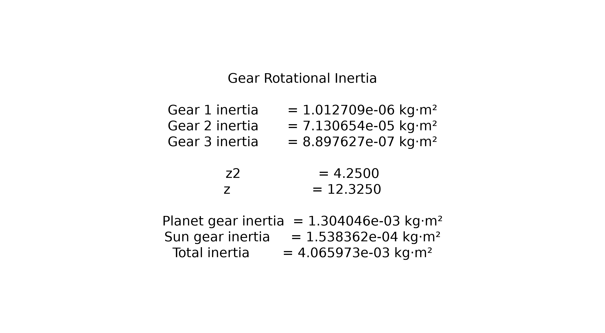

# 行星齒輪箱等效轉動慣量

[Download Code](Rotational_inertia.py)

## 簡介

**複式行星齒輪箱機構（Compound Planetary Gearbox）** 動力學上的等效轉動慣量（Equivalent Mass / Rotational Inertia）數學模型。

## 參數

以下為材料特性、齒輪幾何尺寸與系統配置之參數說明：

| 變數名稱 | 物理意義 | 單位 |
| --- | --- | --- |
| `D` | 鋼材材料密度| $kg/m^3$ |
| `M` | 齒輪模數| $mm$ |
| `N` | 行星齒輪配置數量 | 顆 |
| `ad` | 各齒輪內軸孔直徑| $mm$ |
| `h` | 各齒輪面寬 / 厚度 | $mm$ |
| `z2`, `z` | 二級速比 ($z_2 = Tr/Tp2$) 與系統總減速比 ($z = \frac{Tp1 \cdot z_2}{Ts}$) | 無因次 |
| `I_values` | 各單一齒輪（含軸孔扣除）之質量轉動慣量 | $kg \cdot m^2$ |
| `Ip`, `Is` | 折算至參考軸之雙聯行星輪組慣量與太陽輪等效慣量 | $kg \cdot m^2$ |
| `I_all` | 機構總等效轉動慣量 ($I_{all}$) | $kg \cdot m^2$ |

---

## 計算

### 1. 中空圓柱體齒輪轉動慣量 (Solid Cylinder with Shaft Hole Inertia)

將齒輪簡化為帶有中心軸孔的圓柱體。外徑為節圓直徑 $d = T \cdot M$（半徑 $r = d/2$），軸孔半徑為 $r_{in} = ad/2$，面寬厚度為 $h_m$（單位換算為 $m$）。

實心圓柱體轉動慣量公式為 $I = \frac{1}{2} m r^2 = \frac{1}{2} (\pi r^2 h_m \rho) r^2$。實際齒輪慣量需扣除中心軸孔部分：

$$I_{gear} = I_{outer} - I_{inner} = \frac{1}{2} \rho \pi h_m \left[ \left(\frac{d}{2}\right)^4 - \left(\frac{ad}{2}\right)^4 \right]$$

### 2. 傳動速比計算 (Gear Ratios)

根據機構運動學，二級傳動速比 $z_2$ 與總減速比 $z$ 計算如下：

$$z_2 = \frac{T_r}{T_{p2}} = \frac{102}{24} = 4.25$$

$$z = \frac{T_{p1}}{T_s} \cdot z_2 = \left( \frac{58}{20} \right) \cdot 4.25 = 12.325$$

### 3.等效轉動慣量 (Inertia Reflection)

根據動能相等原則，當組件繞角速度 $\omega_i$ 旋轉時，歸算至參考軸角速度 $\omega_{ref}$ 的等效轉動慣量 $I_{eq}$ 與傳動比 $z_i = \frac{\omega_i}{\omega_{ref}}$ 的平方成正比：

$$E_k = \frac{1}{2} I_{real} \omega_i^2 = \frac{1}{2} I_{eq} \omega_{ref}^2 \implies I_{eq} = z_i^2 \cdot I_{real}$$

* **雙聯行星輪組折算慣量 ($I_p$)**：包含第一與第二行星輪，乘以二級速比平方 $z_2^2$：

$$I_p = z_2^2 \cdot (I_{gear2} + I_{gear3})$$

* **太陽輪折算慣量 ($Is$)**：乘以總傳動比平方 $z^2$：

$$I_s = z^2 \cdot I_{gear1}$$

* **機構總等效轉动慣量 ($I_{all}$)**：考慮系統中佈置的 $N = 3$ 組行星輪：

$$I_{all} = N \cdot I_p + I_s$$

## 結果

