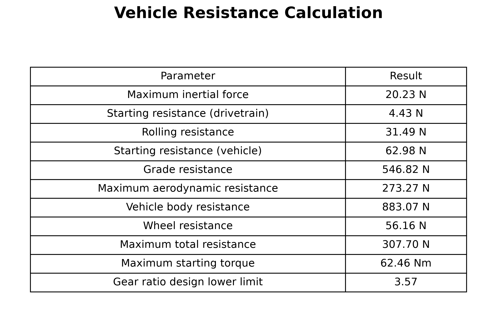

# 總阻力與減速比下限估算

[Download Code](acc_resis.py)

## 參數

以下為系統採用的車輛幾何、空氣動力學、坡度與動力傳動參數：

| 變數名稱 | 物理意義 | 單位 |
| --- | --- | --- |
| `g` | 重力加速度 ($g = 9.81$) | $m/s^2$ |
| `m` | 車輛總質量  | $kg$ |
| `mu_w` | 輪胎最大縱向摩擦係數  | 無因次 |
| `r_w` | 輪胎有效滾動半徑| $m$ |
| `I` | 單輪等效轉動慣量 | $kg \cdot m^2$ |
| `M_start` | 傳動系統起步阻抗扭矩| $Nm$ |
| `Crr`, `mu_s` | 滾動阻力係數與車輛起步阻力係數 | 無因次 |
| `theta_slope` | 爬坡角度| $\text{deg}$ |
| `h`, `w` | 車高與車寬 | $m$ |
| `C`, `rho`, `eta_air` | 風阻係數、空氣密度、粘度 | - |
| `v` | 目標車速 | $m/s$ |
| `eta`, `SF` | 傳動系統效率與安全係數| 無因次 |
| `T_motor_max` | 馬達最大峰值扭矩 | $Nm$ |

---

## 計算

### 1. 輪端阻力計算 (Wheel-Side Resistances)

* **輪軸動態慣性力 ($F_{inertia}$)**：根據輪胎極限加速度 $a_{max} = \mu_w \cdot g$ 與角加速度 $\alpha = a_{max} / r_w$ 計算：

$$F_{inertia} = \frac{I \cdot \alpha}{r_w} = \frac{I \cdot \mu_w \cdot g}{r_w^2}$$

* **傳動起步與滾動阻力 ($F_{start\_w}, F_{rr}$)**：

$$F_{start\_w} = \frac{M_{start}}{r_w}, \quad F_{rr} = C_{rr} \cdot m \cdot g$$

* **總單輪阻力 ($Resis_w$)**：

$$Resis_w = F_{rr} + F_{start\_w} + F_{inertia}$$

### 2. 車體端阻力計算 (Vehicle Body Resistances)

* **坡道阻力 ($F_{slope}$)** 與 **車體起步阻力 ($F_{start\_c}$)**：

$$F_{slope} = m \cdot g \cdot \sin(\theta_{slope}), \quad F_{start\_c} = m \cdot g \cdot \mu_s$$

* **空氣阻力 ($F_{air}$)**：包含流體一項與二項阻力（迎風面積 $A = h \cdot w$）：

$$F_{air} = \frac{1}{2} C \cdot \rho \cdot A \cdot v^2 + \left(6\pi r \cdot \eta_{air}\right) \cdot v$$

* **總車體阻力 ($Resis_{car}$)**：

$$Resis_{car} = F_{air} + F_{slope} + F_{start\_c}$$

### 3. 總阻力、起步扭矩與減速比下限 (Gear Ratio Lower Limit)

將車體阻力平均分配至四輪（$Resis_{car} / 4$），疊加單輪阻力後考慮傳動效率 $\eta$，求得單輪所需承擔的最大總阻力 $Resis_{all}$：

$$Resis_{all} = \frac{\frac{Resis_{car}}{4} + Resis_w}{\eta}$$

進而求出輪端最大起步扭矩 $T_{start}$ 與考慮安全係數 $\text{SF}$ 後的減速比下限 $z$：

$$T_{start} = Resis_{all} \cdot r_w, \quad z = \frac{\text{SF} \cdot T_{start}}{T_{motor\_max}}$$

---

## 結果

