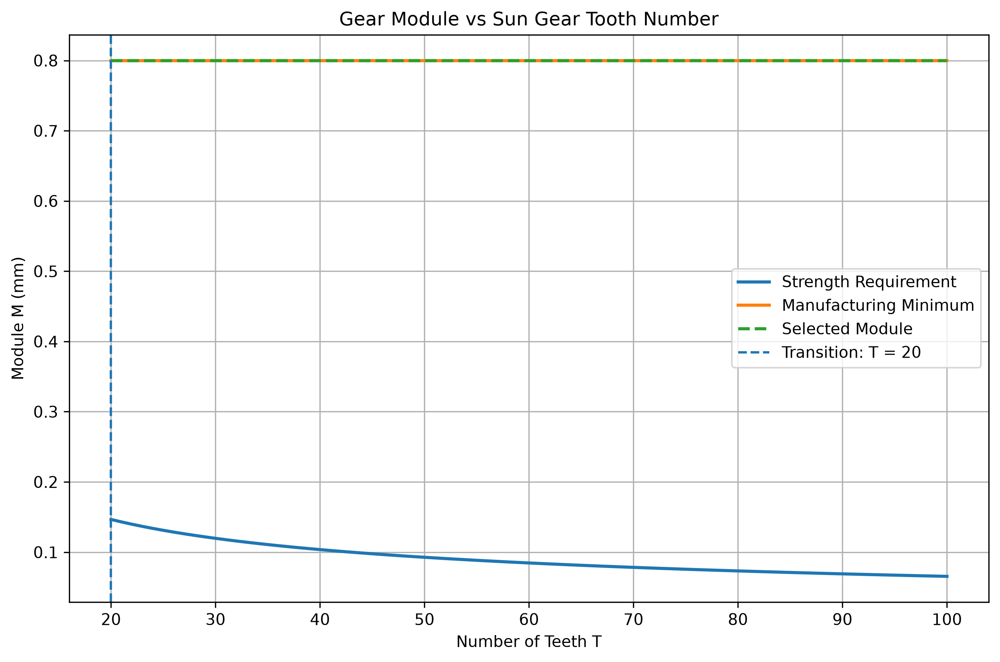

# 齒輪強度與加工限制之模數對齒數關係

[Download Code](tooth_Strength.py)

## 簡介

透過理論計算強度需求模數，與加工極限進行疊加比較，定位出**強度主導區**與**加工精度主導區**。這個分析基本上是做好玩的真正需要使用kisssoft來計算。

## 參數

以下為材料力學、幾何限制與動力系統參數說明：

| 變數名稱 | 物理意義 | 單位 |
| --- | --- | --- |
| `tau_ult` | 材料極限剪切/彎曲強度| $\text{MPa}$ ($N/mm^2$) |
| `T_min` | 最小評估齒數| 齒 |
| `z` | 傳動速比 | 無因次 |
| `T_motor` | 馬達輸入扭矩| $\text{Nm}$ |
| `h` | 齒輪齒面寬/厚度| $mm$ |
| `M_min` | 最小可加工/標準模數 | $mm$ |
| `SF` | 結構安全係數| 無因次 |
| `T_list` | 齒數評估範圍 | 齒 |

## 計算

> 參考彎曲應力模型 (Lewis Bending Stress Formulation)

## 1. 齒輪幾何關係
### 半徑 
$$
D = T M
$$

- $T$ ：齒數  
- $M$ ：模數  

$$
R = \frac{D}{2} = \frac{TM}{2}
$$
### 有效面積
齒輪齒根直線切面為矩形截面，其有效受力面積為

$$
P = \frac{\pi D}{T}
$$

$$
P = \pi M
$$

$$
A = \frac{P \cdot h}{2}
$$

- $h$ ：齒高
## 2. 齒輪受力
齒輪接觸處的切向力為

$$
V = \frac{M_{motor}\cdot e}{R}
$$

$$
V = \frac{M_{motor}\cdot e}{TM/2}
$$

假設齒輪受力近似為矩形剪力問題，最大剪應力：

$$
\tau_{max} = \frac{3V}{2A}
$$

$$
\tau_{allow} = \frac{\tau_{max}}{SF}
$$
---
強度公式整理

$$
\frac{\tau_{max}}{SF}
=
\frac{3(M_{motor}\cdot e/R)}{P\cdot h}
$$

$$
R = TM/2
$$

$$
\frac{\tau_{max}}{SF}
=
\frac{3(M_{motor}\cdot e)}{T\cdot M\cdot P\cdot h/2}
$$

$$
P = \frac{\pi D}{T}
$$

$$
\frac{\tau_{max}}{SF}
=
\frac{3(M_{motor}\cdot e)}{T\cdot M\cdot (\pi D/T)\cdot h/2}
$$

$$
D = TM
$$

$$
\frac{\tau_{max}}{SF}
=
\frac{6(M_{motor}\cdot e)}{T\cdot M^2\cdot \pi\cdot h}
$$

$$
M^2
=
\frac{6(M_{motor}\cdot e\cdot SF)}
{T\cdot\pi\cdot h\cdot\tau_{max}}
$$

$$
M =
\sqrt{
\frac{6(M_{motor}\cdot e\cdot SF)}
{T\cdot\pi\cdot h\cdot\tau_{max}}
}
$$
代表：**滿足強度要求的最小模數**

## 結果

