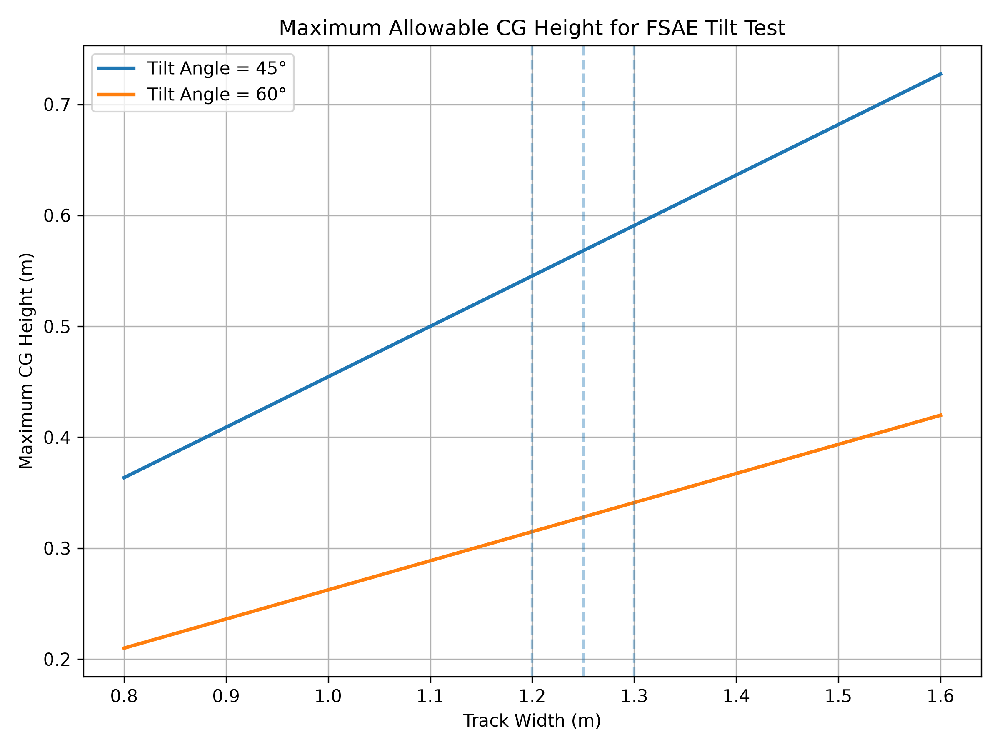

# FSAE 傾斜測試極限重心高度分析（Maximum CG Height Analysis）

[Download Code](CG.py)

## 簡介

透過掃描車輛輪距，計算在不同傾斜角度規範下，車輛為避免發生側翻所允許的最高重心高度（Maximum Allowable CG Height）。

> 參考 FSAE 競賽規則之傾斜測試規範（Tilt Test）

## 參數

以下為計算中所採用的物理量與符號說明：

| 變數名稱 | 物理意義 | 單位 |
| --- | --- | --- |
| `track_width` | 車輛輪距 ($t$) | $m$ |
| `theta_45` | 45度傾斜角 ($\theta_{45}$) | $rad$ |
| `theta_60` | 60度傾斜角 ($\theta_{60}$) | $rad$ |
| `SF` | 安全係數 ($SF$) | 無因次 |
| `h_45` | 45度傾斜下最大容許重心高度 ($h_{45}$) | $m$ |
| `h_60` | 60度傾斜下最大容許重心高度 ($h_{60}$) | $m$ |

## 計算

### 1. 靜態側翻臨界幾何推導

當車輛放置於傾斜桌上並抬升角度 $\theta$ 時，當車輛重心重力線通過外側輪胎接地中心，車輛即達到靜態側翻臨界點。理論極限重心高度與輪距的關係為：

$$\tan(\theta) = \frac{t / 2}{h_{theoretical}}$$

$$h_{theoretical} = \frac{t}{2 \cdot \tan(\theta)}$$

### 2. 導入安全係數之容許重心高度

考慮到動態幾何變形與設計裕度，導入安全係數 $SF$，實際設計所允許的最大重心高度 $h$ 為：

$$h = \frac{t}{2 \cdot \tan(\theta) \cdot SF}$$

## 結果

圖中展示了在 $45^\circ$ 與 $60^\circ$ 傾斜角度規範下，最大允許重心高度隨車輛輪距變化的線性關係。灰色虛線標註了常見的 FSAE 車輛輪距範圍。
