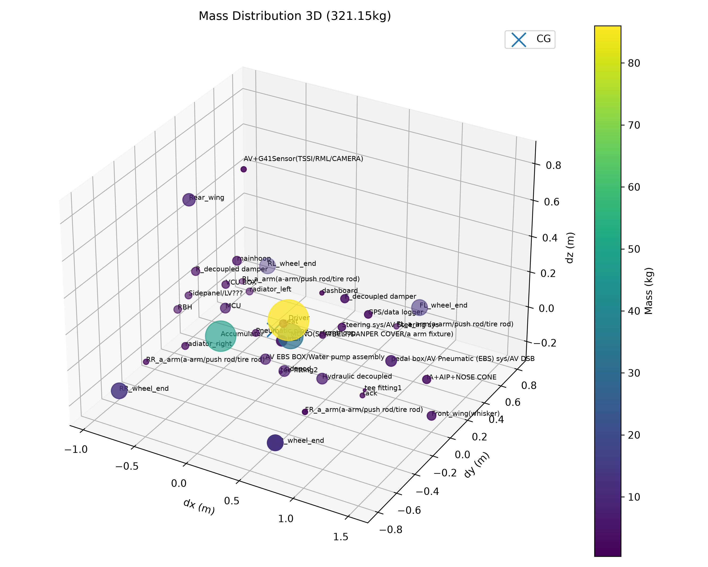
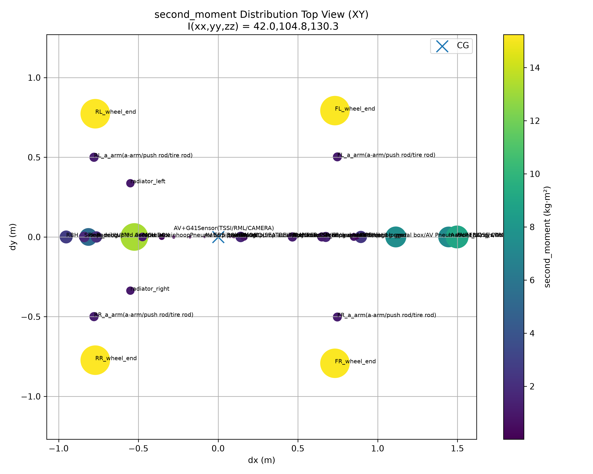
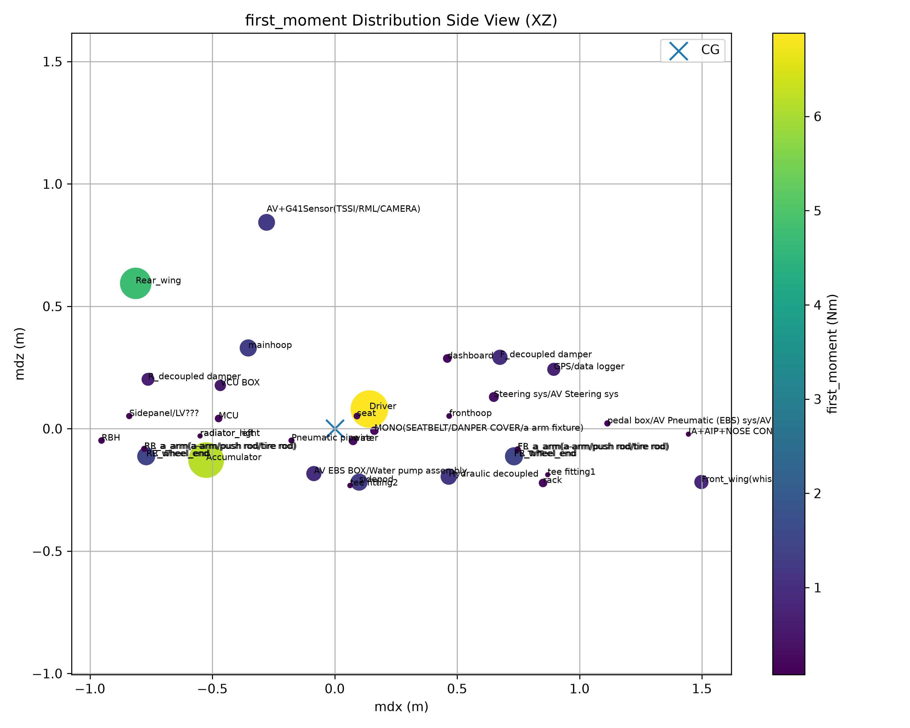

# 車輛質量分布與轉動慣量計算（Mass Distribution & Moments of Inertia Analysis）

[Download Code](COG_movable.py)

## 簡介

對車輛之簧上質量（Sprung Mass）與簧下質量（Unsprung Mass）進行系統性的質量分布、一次慣性矩（Mass Moments）與轉動慣量（Moments of Inertia, 二次慣性矩）計算。透過整合車輛各零組件之三維座標與質量數據，評估整車重心（Center of Gravity, CG）位置以及側滾（Roll）、俯仰（Pitch）、偏航（Yaw）方向之轉動慣量。

## 參數

以下為計算中所採用的物理量與符號說明：

| 變數名稱 | 物理意義 | 單位 |
| --- | --- | --- |
| `frontwheel_track` | 前輪輪距 ($t_f$) | $m$ |
| `rearwheel_track` | 後輪輪距 ($t_r$) | $m$ |
| `frontwheel_axle` | 重心與前軸距離 ($l_f$) | $m$ |
| `rearwheel_axle` | 重心與後軸距離 ($l_r$) | $m$ |
| `dx` | 零組件相對於重心之 X 軸距離 ($dx$) | $m$ |
| `dy` | 零組件相對於重心之 Y 軸距離 ($dy$) | $m$ |
| `dz` | 零組件相對於重心之 Z 軸距離 ($dz$) | $m$ |
| `dy/y` | 簧下質量 Y 軸正規化位置比例 ($dy/y$) | 無因次 |
| `weight LP03` | 零組件質量 ($m_i$) | $kg$ |
| `Mx` | 零組件對 X 軸之質量矩 ($M_x$) | $kg \cdot m$ |
| `My` | 零組件對 Y 軸之質量矩 ($M_y$) | $kg \cdot m$ |
| `Mz` | 零組件對 Z 軸之質量矩 ($M_z$) | $kg \cdot m$ |
| `Ixx_all` | 繞 X 軸總轉動慣量（Roll Inertia, $I_{xx}$） | $kg \cdot m^2$ |
| `Iyy_all` | 繞 Y 軸總轉動慣量（Pitch Inertia, $I_{yy}$） | $kg \cdot m^2$ |
| `Izz_all` | 繞 Z 軸總轉動慣量（Yaw Inertia, $I_{zz}$） | $kg \cdot m^2$ |

## 計算

### 1. 質量整合與幾何座標正規化

簧下質量（如前後輪組、懸吊零件）之 Y 軸位置透過前後輪距進行正規化展開：

$$dy_{unsprung} = \left(\frac{dy}{y}\right) \cdot t$$

將簧上與前後簧下質量之 DataFrame 進行併合，以建立整車零組件三維座標矩陣。

### 2. 一次慣性矩（質量矩）

一次慣性矩用於評估質量分佈對各軸向的偏移影響與靜力平衡：

$$M_x = \sum m_i \cdot dx_i$$

$$M_y = \sum m_i \cdot dy_i$$

$$M_z = \sum m_i \cdot dz_i$$

### 3. 二次慣性矩（轉動慣量）

根據平行軸定理與質點轉動慣量定義，計算整車繞 X 軸（Roll）、Y 軸（Pitch）與 Z 軸（Yaw）之總轉動慣量：

$$I_{xx} = \sum m_i \cdot (dy_i^2 + dz_i^2)$$

$$I_{yy} = \sum m_i \cdot (dx_i^2 + dz_i^2)$$

$$I_{zz} = \sum m_i \cdot (dx_i^2 + dy_i^2)$$

## 結果

上圖展示整車各組件在三維空間（X-Y-Z）中的質量分布。節點大小與顏色深淺代表該零組件之質量大小，原點X $(0, 0, 0)$ 為整車重心（CG）位置。

上圖為頂視圖（X-Y 平面），顯示各組件對 Z 軸轉動慣量（$I_{zz}$）的貢獻程度。散點大小代表個別組件產生的二次慣性矩大小，離重心越遠且質量越大的組件（如前後翼、輪組）會大幅增加整車的偏航慣量（Yaw Inertia）。

上圖為側視圖（X-Z 平面），顯示各組件相對於重心之一次慣性矩分布（$M_z$），用於評估車輛前後與上下質量平衡狀態。