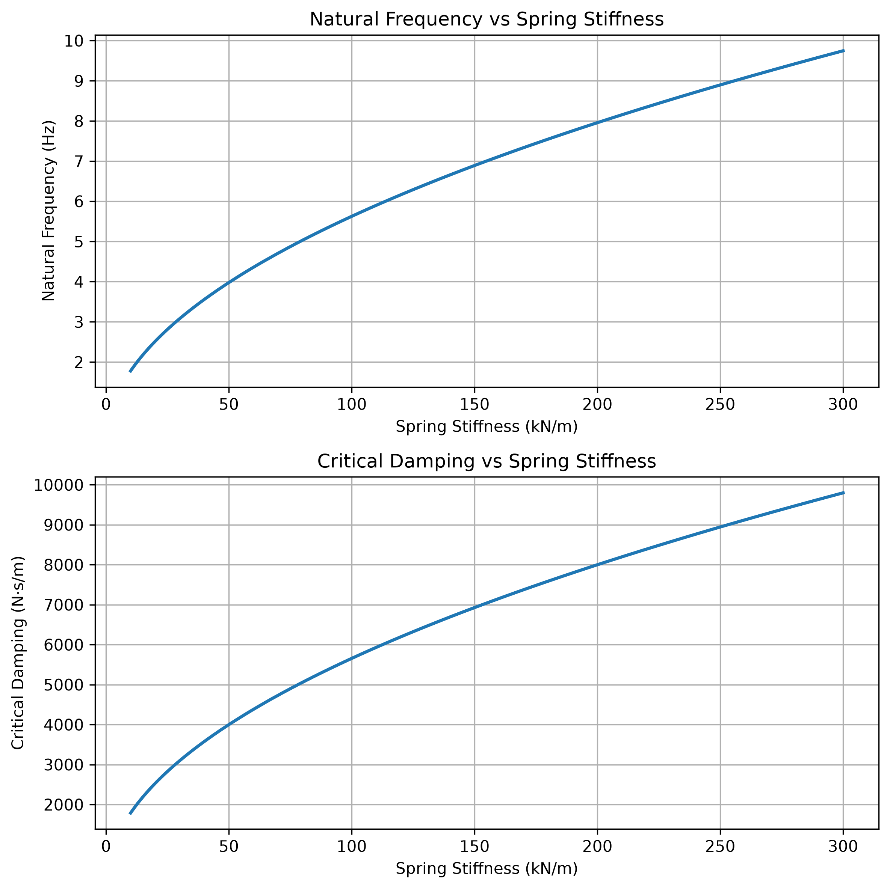

# 臨界阻尼與自然頻率分析

[Download Code](Critical_Damping_Analysis.py)

## 簡介

本分析根據四分之一車等效質量，掃描不同懸吊彈簧剛性下的自然頻率與臨界阻尼係數。臨界阻尼是阻尼器設定的重要參考值，後續若指定阻尼比 $\zeta$，即可用 $c = \zeta c_c$ 換算實際阻尼係數。

此工具適合在選擇彈簧剛性或設定 damper 初始範圍時使用，幫助確認自然頻率是否落在設計目標區間，以及阻尼器係數是否具有合理量級。

## 參數

以下為計算中所採用的物理量與符號說明：

| 變數名稱 | 物理意義 | 單位 |
| --- | --- | --- |
| `m` | 四分之一車等效質量 ($m$) | $kg$ |
| `k` | 掃描的懸吊彈簧剛性 ($k$) | $N/m$ |
| `cc` | 臨界阻尼係數 ($c_c$) | $N \cdot s/m$ |
| `fn` | 系統自然頻率 ($f_n$) | $Hz$ |

## 計算

### 1. 自然頻率

對單自由度質量彈簧系統，自然頻率可由質量與彈簧剛性計算：

$$f_n = \frac{1}{2\pi}\sqrt{\frac{k}{m}}$$

彈簧剛性增加會提高自然頻率，使車身響應更快，但也可能增加垂直加速度與舒適性負擔。

### 2. 臨界阻尼係數

臨界阻尼為系統在不產生振盪的條件下最快回到平衡位置的理想阻尼邊界：

$$c_c = 2\sqrt{km}$$

若實際阻尼係數為 $c$，阻尼比可定義為：

$$\zeta = \frac{c}{c_c}$$

## 結果

圖中上半部顯示彈簧剛性對自然頻率的影響，下半部顯示對應的臨界阻尼係數。此結果可作為彈簧與 damper 配對時的初始設計表。
