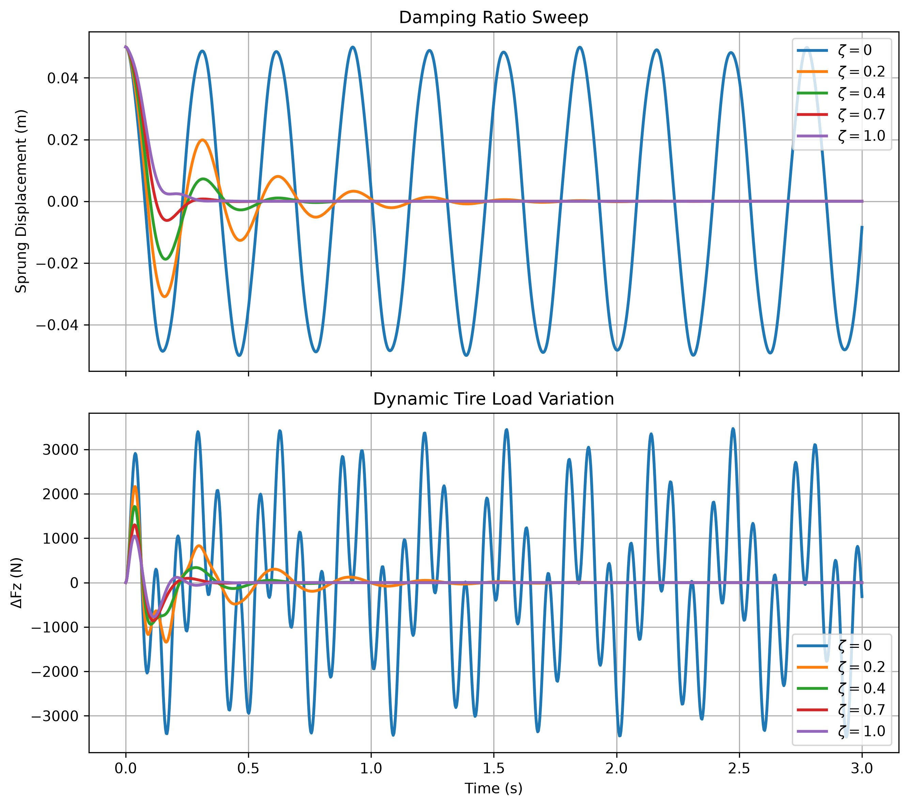

# Quarter-Car 阻尼比掃描

[Download Code](Damped_oscillation_analysis.py)

## 簡介

本分析使用含簧上質量、簧下質量、懸吊彈簧、輪胎剛性與阻尼器的二自由度 quarter-car 模型，掃描不同阻尼比下的車身位移響應與輪胎動態載荷變化。

阻尼比會同時影響車身振盪收斂速度與輪胎正向力波動。阻尼太小時車身容易持續振盪；阻尼太大時雖然車身位移較快被抑制，但可能增加輪胎載荷變化，影響抓地穩定性。

## 參數

以下為計算中所採用的物理量與符號說明：

| 變數名稱 | 物理意義 | 單位 |
| --- | --- | --- |
| `ms` | 簧上質量 ($m_s$) | $kg$ |
| `mu` | 簧下質量 ($m_u$) | $kg$ |
| `ks` | 懸吊彈簧剛性 ($k_s$) | $N/m$ |
| `kt` | 輪胎垂直剛性 ($k_t$) | $N/m$ |
| `zeta_list` | 掃描的阻尼比列表 ($\zeta$) | 無因次 |
| `cc` | 臨界阻尼係數 ($c_c$) | $N \cdot s/m$ |
| `cs` | 懸吊阻尼係數 ($c_s$) | $N \cdot s/m$ |
| `xs`, `xu` | 簧上與簧下位移 | $m$ |
| `Fz_static` | 靜態輪胎正向力 | $N$ |
| `dFz` | 動態輪胎正向力變化量 | $N$ |

## 計算

### 1. Quarter-Car 運動方程

模型狀態為簧上位移、簧上速度、簧下位移與簧下速度：

$$X = \begin{bmatrix} x_s & v_s & x_u & v_u \end{bmatrix}^T$$

懸吊相對位移與相對速度定義為：

$$dx = x_s - x_u$$

$$dv = v_s - v_u$$

### 2. 簧上與簧下加速度

簧上質量受到懸吊彈簧與阻尼器作用：

$$a_s = -\frac{k_s}{m_s}dx - \frac{c_s}{m_s}dv$$

簧下質量同時受到懸吊力與輪胎剛性作用：

$$a_u = \frac{k_s}{m_u}dx + \frac{c_s}{m_u}dv - \frac{k_t}{m_u}x_u$$

### 3. 阻尼比掃描與輪胎載荷變化

對每一個阻尼比 $\zeta$，阻尼係數由臨界阻尼換算：

$$c_s = \zeta c_c$$

其中：

$$c_c = 2\sqrt{k_s m_s}$$

輪胎正向力變化以輪胎變形造成的動態力表示：

$$\Delta F_z = F_z - F_{z,static}$$

## 結果

圖中比較不同阻尼比下的簧上位移與輪胎動態載荷變化。可藉此觀察阻尼比增加後車身振盪是否更快收斂，以及輪胎正向力波動是否仍在可接受範圍內。
