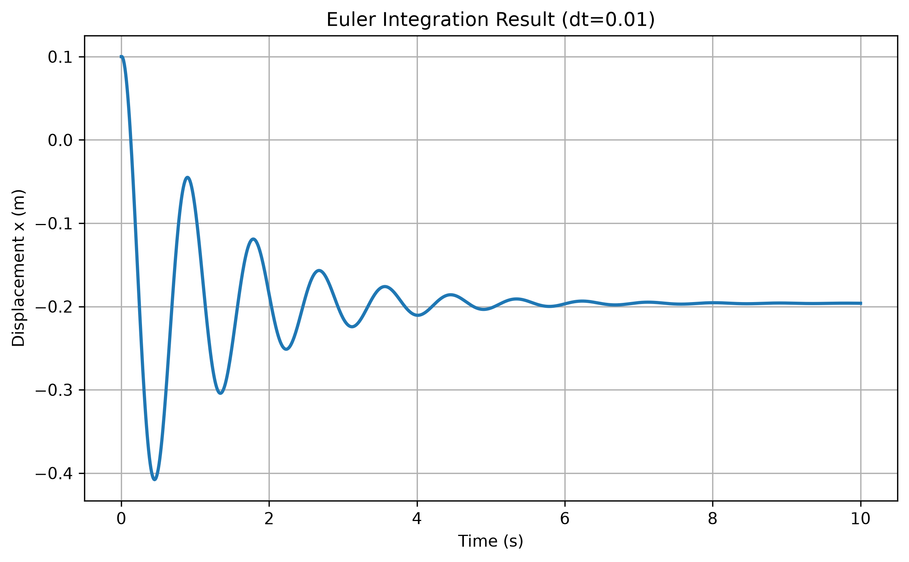

# Euler 質量彈簧阻尼積分

[Download Code](damping_int.py)

## 簡介

本分析使用顯式 Euler 方法，模擬單自由度質量-彈簧-阻尼系統在初始位移下的時間響應。模型包含質量、彈簧、阻尼與重力項，並透過固定時間步長逐步更新加速度、速度與位移。

此範例主要用於理解阻尼振盪微分方程如何轉換成數值積分流程，也可以用來觀察時間步長對模擬穩定性與精度的影響。

## 參數

以下為計算中所採用的物理量與符號說明：

| 變數名稱 | 物理意義 | 單位 |
| --- | --- | --- |
| `m` | 質量 ($m$) | $kg$ |
| `k` | 彈簧剛性 ($k$) | $N/m$ |
| `c` | 阻尼係數 ($c$) | $N \cdot s/m$ |
| `g` | 重力加速度 ($g$) | $m/s^2$ |
| `x0` | 初始位移 ($x_0$) | $m$ |
| `v0` | 初始速度 ($v_0$) | $m/s$ |
| `dt` | 積分時間步長 ($\Delta t$) | $s$ |
| `Tend` | 總模擬時間 | $s$ |
| `x`, `v` | 位移與速度陣列 | $m$, $m/s$ |

## 計算

### 1. 運動方程

程式使用的質量-彈簧-阻尼方程為：

$$m\ddot{x} + c\dot{x} + kx + mg = 0$$

整理後可得到每一個時間點的加速度：

$$a_i = \frac{-cv_i - kx_i - mg}{m}$$

### 2. 顯式 Euler 更新

速度與位移使用目前時間點的狀態向前積分：

$$v_{i+1} = v_i + a_i \Delta t$$

$$x_{i+1} = x_i + v_i \Delta t$$

由於顯式 Euler 對時間步長敏感，若 $\Delta t$ 過大，可能導致數值誤差或非物理振盪。

## 結果

圖中顯示質量在彈簧、阻尼與重力作用下的位移響應。此結果可用來檢查阻尼是否使振盪逐漸衰減，以及 Euler 積分在目前時間步長下是否保持穩定。
