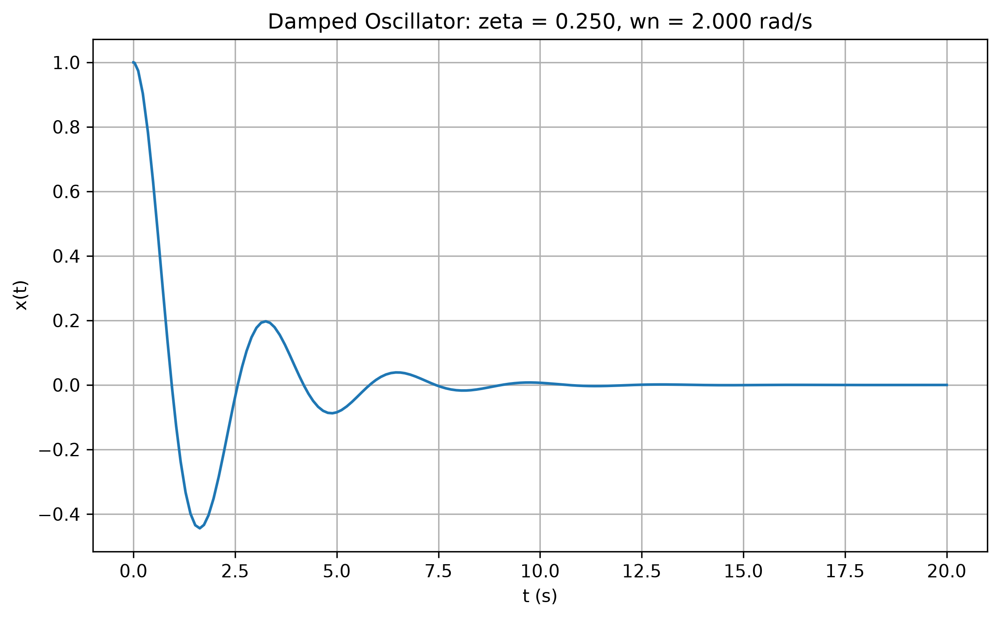
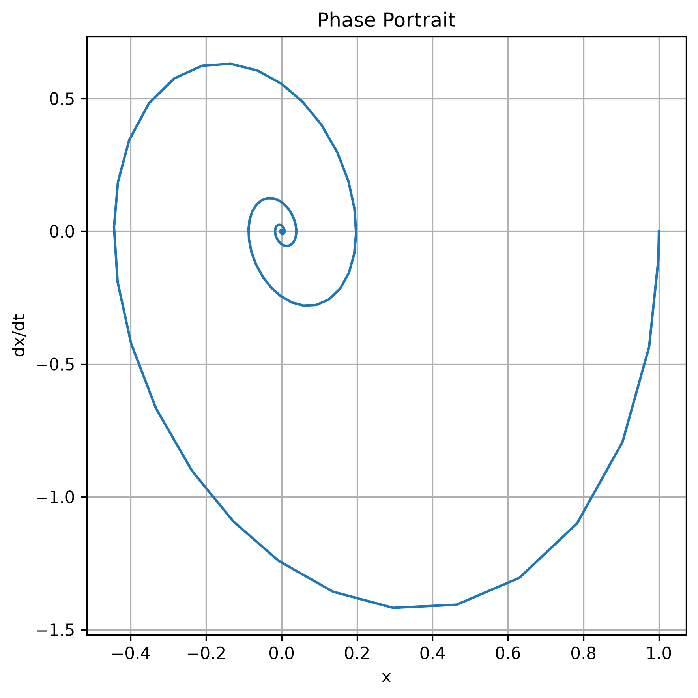

# 單自由度阻尼 ODE 模擬

[Download Code](damping_ode.py)

## 簡介

本分析使用 `solve_ivp` 求解單自由度阻尼振盪器的時間響應，並輸出位移隨時間變化與相平面圖。模型可用於比較欠阻尼、臨界阻尼與過阻尼三種典型行為。

透過質量 $m$、彈簧剛性 $k$ 與阻尼係數 $c$，可計算自然頻率與阻尼比，進一步判斷系統是否會振盪，以及收斂速度是否符合設計需求。

## 參數

以下為計算中所採用的物理量與符號說明：

| 變數名稱 | 物理意義 | 單位 |
| --- | --- | --- |
| `m` | 質量 ($m$) | $kg$ |
| `k` | 彈簧剛性 ($k$) | $N/m$ |
| `c` | 阻尼係數 ($c$) | $N \cdot s/m$ |
| `wn` | 無阻尼自然角頻率 ($\omega_n$) | $rad/s$ |
| `zeta` | 阻尼比 ($\zeta$) | 無因次 |
| `x` | 位移 | $m$ |
| `v` | 速度 | $m/s$ |

## 計算

### 1. 自然頻率與阻尼比

單自由度系統的自然角頻率為：

$$\omega_n = \sqrt{\frac{k}{m}}$$

阻尼比為實際阻尼係數與臨界阻尼係數的比例：

$$\zeta = \frac{c}{2\sqrt{mk}}$$

當 $\zeta < 1$ 為欠阻尼，$\zeta = 1$ 為臨界阻尼，$\zeta > 1$ 為過阻尼。

### 2. 狀態空間形式

原始運動方程為：

$$m\ddot{x} + c\dot{x} + kx = 0$$

將狀態定義為 $y = [x, v]^T$，可寫成：

$$\dot{x} = v$$

$$\dot{v} = -\frac{c}{m}v - \frac{k}{m}x$$

程式使用 `solve_ivp` 對此 ODE 進行數值求解。

## 結果

時間響應圖可觀察位移是否振盪以及收斂速度。

相平面圖顯示位移與速度狀態如何收斂至平衡點。欠阻尼系統通常會呈現向中心收斂的螺旋軌跡。
