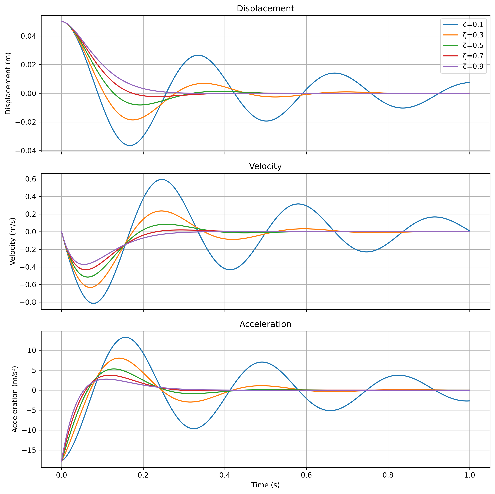
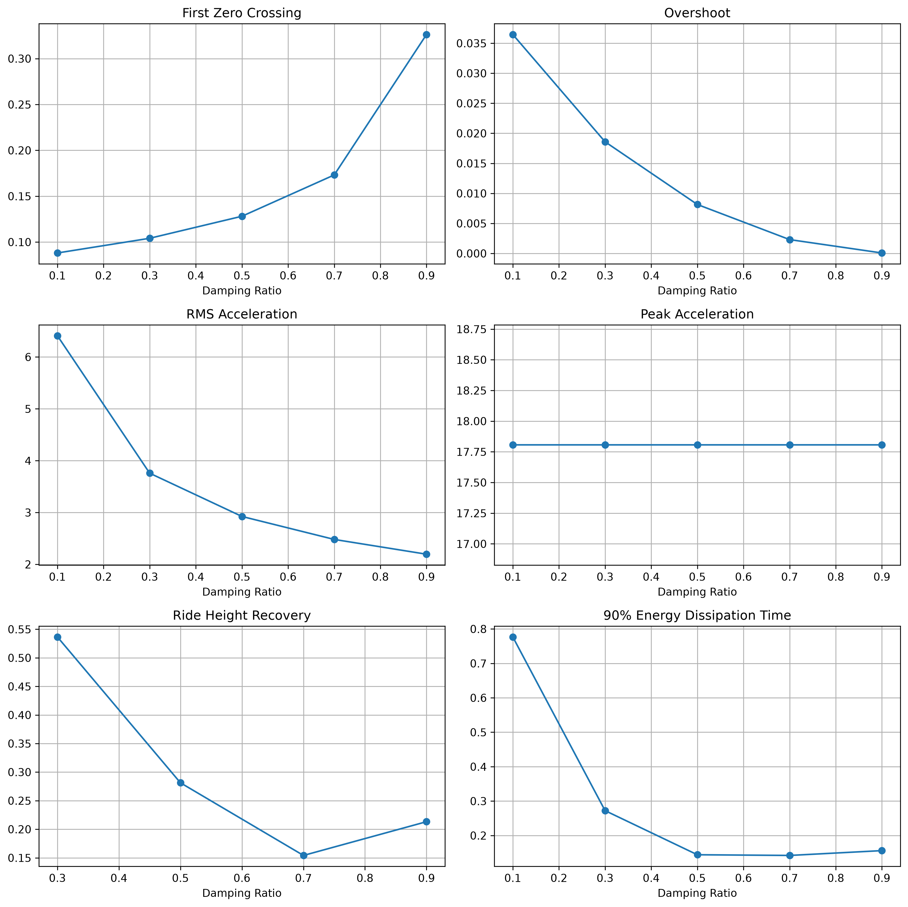
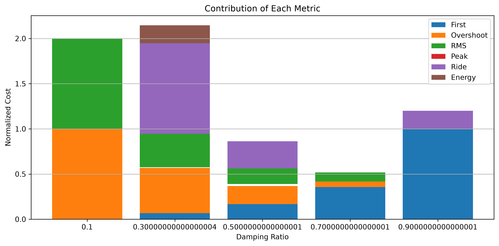

# 阻尼比評分與響應指標分析

[Download Code](damping_rate.py)

## 簡介

本分析用於比較不同阻尼比下，單自由度彈簧阻尼系統的暫態響應與多項性能指標。相較於只用臨界阻尼或自然頻率估算阻尼器設定，此工具會同時觀察第一次回到平衡點、overshoot、RMS acceleration、peak acceleration、ride height recovery 與能量耗散時間，並將這些指標正規化後合成一個綜合成本分數。

此方法適合用於阻尼設定的早期比較。它不直接代表最終 damper tuning 結果，但可以協助判斷某個阻尼比是否在收斂速度、乘坐加速度與能量耗散之間取得較合理的平衡。

## 參數

以下為計算中所採用的物理量與符號說明：

| 變數名稱 | 物理意義 | 單位 |
| --- | --- | --- |
| `m` | 等效質量 ($m$) | $kg$ |
| `k` | 彈簧剛性 ($k$) | $N/m$ |
| `omega_n` | 無阻尼自然角頻率 ($\omega_n$) | $rad/s$ |
| `f_n` | 無阻尼自然頻率 ($f_n$) | $Hz$ |
| `c_critical` | 臨界阻尼係數 ($c_c$) | $N \cdot s/m$ |
| `zeta` | 阻尼比 ($\zeta$) | 無因次 |
| `c` | 阻尼係數 ($c$) | $N \cdot s/m$ |
| `x` | 位移響應 | $m$ |
| `v` | 速度響應 | $m/s$ |
| `a` | 加速度響應 | $m/s^2$ |

## 計算

### 1. 自然頻率與臨界阻尼

單自由度彈簧質量系統的自然角頻率為：

$$\omega_n = \sqrt{\frac{k}{m}}$$

自然頻率為：

$$f_n = \frac{\omega_n}{2\pi}$$

臨界阻尼係數為：

$$c_c = 2\sqrt{km}$$

指定阻尼比後，實際阻尼係數為：

$$c = \zeta c_c$$

### 2. 彈簧阻尼系統 ODE

系統運動方程為：

$$m\ddot{x} + c\dot{x} + kx = 0$$

轉換成狀態方程後：

$$\dot{x} = v$$

$$\dot{v} = -\frac{c}{m}v - \frac{k}{m}x$$

程式使用 `solve_ivp` 對不同阻尼比進行數值積分，並輸出位移、速度與加速度響應。

### 3. 響應指標

每個阻尼比都會計算以下指標：

1. **First Zero Crossing**：第一次回到平衡位置的時間。
2. **Overshoot**：第一次穿越平衡點後的最大反向位移。
3. **RMS Acceleration**：加速度均方根，用於觀察整體振動強度。
4. **Peak Acceleration**：最大加速度，用於檢查瞬間衝擊。
5. **Ride Height Recovery**：位移進入容許範圍後不再離開的時間。
6. **Energy Dissipation Time**：系統耗散指定比例初始能量所需的時間。

### 4. 正規化評分

為了比較不同量綱的指標，程式會將每個指標正規化：

$$x_{norm} = \frac{x - x_{min}}{x_{max} - x_{min}}$$

接著將各項正規化成本加總，得到綜合評分：

$$score = \sum_i w_i x_{norm,i}$$

評分越低代表該阻尼比在目前權重設定下表現越好。若未來要偏向舒適性、回復速度或能量耗散，可以調整各指標權重。

## 結果

此圖比較不同阻尼比下的位移、速度與加速度時間響應。阻尼比越高通常會讓位移更快收斂，但加速度峰值與響應速度需要一起觀察。

此圖將各阻尼比對應的性能指標分開呈現，可用來判斷是哪一個指標限制了阻尼設定，例如 overshoot、peak acceleration 或 ride height recovery。

此圖顯示各指標正規化後對總成本的貢獻。最低總成本對應目前權重下較合適的阻尼比，可作為初步 damper tuning 的參考。
