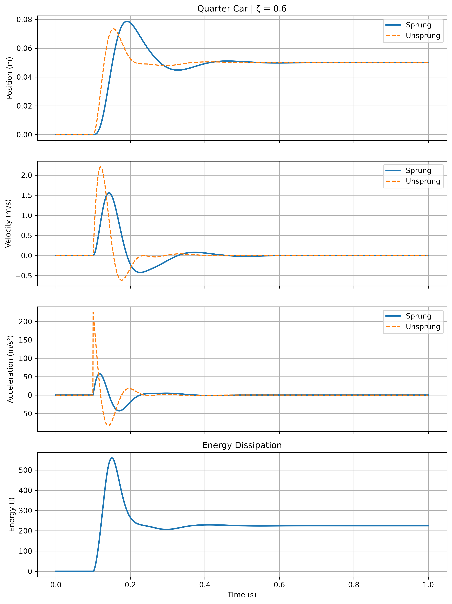

# Quarter-Car 路面階躍響應與能量耗散

[Download Code](quarter_suspension.py)

## 簡介

本分析使用二自由度 quarter-car 模型，模擬車輪遇到路面階躍輸入後的簧上與簧下動態響應。模型包含簧上質量、簧下質量、懸吊彈簧、輪胎剛性與阻尼器，並觀察位移、速度、加速度與系統能量的變化。

此工具可用於理解懸吊阻尼如何抑制車身振動、如何影響簧下質量運動，以及系統能量如何隨時間被阻尼耗散。

## 參數

以下為計算中所採用的物理量與符號說明：

| 變數名稱 | 物理意義 | 單位 |
| --- | --- | --- |
| `ms` | 簧上質量 ($m_s$) | $kg$ |
| `mu` | 簧下質量 ($m_u$) | $kg$ |
| `ks` | 懸吊彈簧剛性 ($k_s$) | $N/m$ |
| `kt` | 輪胎剛性 ($k_t$) | $N/m$ |
| `zeta` | 阻尼比 ($\zeta$) | 無因次 |
| `cc` | 臨界阻尼係數 ($c_c$) | $N \cdot s/m$ |
| `cs` | 懸吊阻尼係數 ($c_s$) | $N \cdot s/m$ |
| `xr` | 路面輸入高度 | $m$ |
| `xs`, `xu` | 簧上與簧下位移 | $m$ |
| `vs`, `vu` | 簧上與簧下速度 | $m/s$ |
| `E` | 系統總機械能 | $J$ |

## 計算

### 1. 路面階躍輸入

程式在 $t = 0.1\text{ s}$ 後施加 $0.05\text{ m}$ 的路面階躍：

$$x_r(t) =
\begin{cases}
0, & t < 0.1 \\
0.05, & t \ge 0.1
\end{cases}$$

### 2. Quarter-Car 動態方程

懸吊相對位移、相對速度與輪胎變形定義為：

$$dx = x_s - x_u$$

$$dv = v_s - v_u$$

$$x_t = x_u - x_r$$

簧上質量加速度：

$$a_s = -\frac{k_s}{m_s}dx - \frac{c_s}{m_s}dv$$

簧下質量加速度：

$$a_u = \frac{k_s}{m_u}dx + \frac{c_s}{m_u}dv - \frac{k_t}{m_u}x_t$$

### 3. 能量計算

系統動能為：

$$KE = \frac{1}{2}m_s v_s^2 + \frac{1}{2}m_u v_u^2$$

系統彈性位能為：

$$PE = \frac{1}{2}k_s(x_s-x_u)^2 + \frac{1}{2}k_t x_u^2$$

總能量為：

$$E = KE + PE$$

## 結果

圖中依序顯示簧上與簧下位置、速度、加速度，以及系統能量隨時間變化。能量曲線可用來觀察阻尼器對振動能量的耗散效果。
