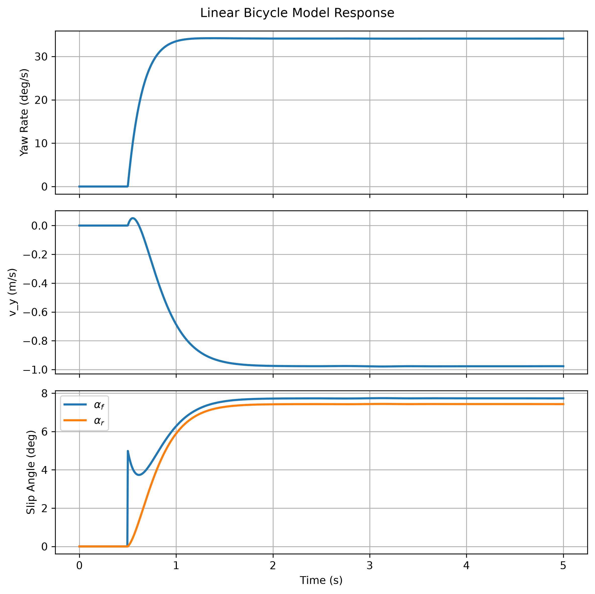

# 線性 Bicycle Model 轉向動態響應

[Download Code](Bicycle_Model.py)

## 簡介

本分析建立線性二自由度 bicycle model，用於模擬車輛在固定縱向速度下受到階躍轉向輸入後的橫向動態響應。模型狀態包含車身側向速度 $v_y$ 與 yaw rate $r$，並使用前後輪線性側偏剛性估算輪胎側向力。

此工具可用於初步觀察轉向輸入後車輛的 yaw response、側向速度建立過程，以及前後輪滑移角變化。雖然模型未包含非線性輪胎、懸吊幾何與載荷轉移，但適合作為車輛轉向穩定性與控制模型的基礎。

## 參數

以下為計算中所採用的物理量與符號說明：

| 變數名稱 | 物理意義 | 單位 |
| --- | --- | --- |
| `m` | 車輛總質量 ($m$) | $kg$ |
| `Iz` | 車輛繞 Z 軸 yaw inertia ($I_z$) | $kg \cdot m^2$ |
| `lf` | 重心至前軸距離 ($l_f$) | $m$ |
| `lr` | 重心至後軸距離 ($l_r$) | $m$ |
| `L` | 車輛軸距 ($L = l_f + l_r$) | $m$ |
| `Cf` | 前輪等效側偏剛性 ($C_f$) | $N/rad$ |
| `Cr` | 後輪等效側偏剛性 ($C_r$) | $N/rad$ |
| `vx` | 固定縱向車速 ($v_x$) | $m/s$ |
| `vy` | 車身側向速度 ($v_y$) | $m/s$ |
| `r` | 車身 yaw rate ($r$) | $rad/s$ |
| `delta` | 前輪轉向角輸入 ($\delta$) | $rad$ |
| `alpha_f`, `alpha_r` | 前後輪滑移角 ($\alpha_f, \alpha_r$) | $rad$ |

## 計算

### 1. 轉向輸入與狀態設定

程式使用階躍轉向輸入，在 $t > 0.5\text{ s}$ 後給定 $5^\circ$ 的前輪轉角：

$$\delta(t) =
\begin{cases}
0, & t \le 0.5 \\
5^\circ, & t > 0.5
\end{cases}$$

狀態向量定義為：

$$x = \begin{bmatrix} v_y \\ r \end{bmatrix}$$

### 2. 前後輪滑移角

在小角度與固定縱向速度假設下，前後輪滑移角分別為：

$$\alpha_f = \delta - \frac{v_y + l_f r}{v_x}$$

$$\alpha_r = -\frac{v_y - l_r r}{v_x}$$

### 3. 線性輪胎側向力

使用線性側偏剛性模型估算前後輪側向力：

$$F_{y,f} = C_f \alpha_f$$

$$F_{y,r} = C_r \alpha_r$$

### 4. 車輛橫向與 yaw 動態方程

車身側向速度與 yaw rate 的狀態微分為：

$$\dot{v_y} = \frac{F_{y,f} + F_{y,r}}{m} - v_x r$$

$$\dot{r} = \frac{l_f F_{y,f} - l_r F_{y,r}}{I_z}$$

程式使用 `solve_ivp` 對上述 ODE 進行數值積分，並輸出 yaw rate、側向速度與前後輪滑移角隨時間的變化。

## 結果

圖中可觀察階躍轉向後 yaw rate 的建立、側向速度的暫態變化，以及前後輪滑移角的收斂狀態。若後續調整前後側偏剛性、重心位置或 yaw inertia，可用此模型比較車輛轉向響應速度與穩定性差異。
