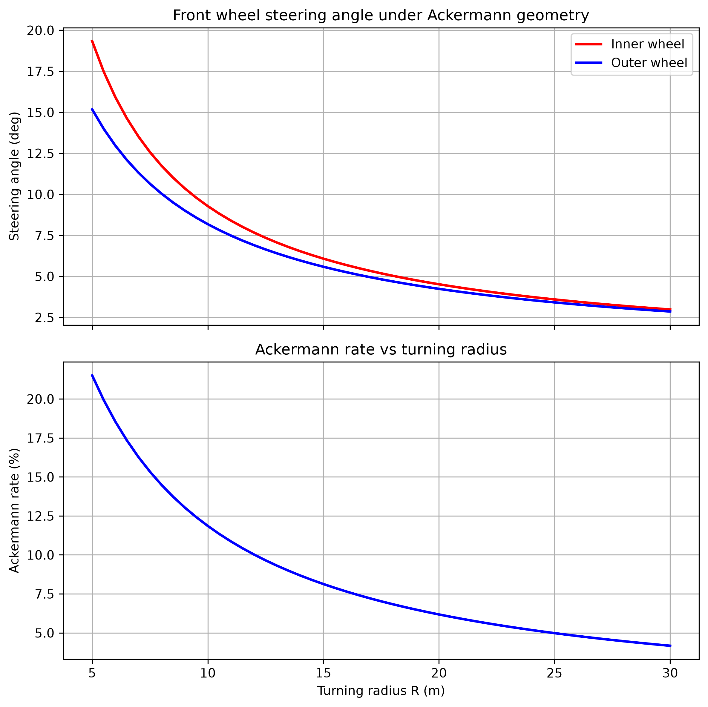

# 理想 Ackermann 轉向幾何分析

[Download Code](ideal_ackemann.py)

## 簡介

本分析用於計算理想 Ackermann steering geometry 在不同轉彎半徑下所需的前輪轉角。當車輛低速轉彎且輪胎側滑可忽略時，四個輪胎應繞同一瞬時轉向中心運動，因此內側前輪需要比外側前輪更大的轉角，避免輪胎產生不必要的 scrub。

透過掃描轉彎半徑，可以觀察內外輪轉角差與 Ackermann rate 的變化，作為轉向梯形、轉向臂位置與 rack travel 設計的幾何基準。

## 參數

以下為計算中所採用的幾何參數與符號說明：

| 變數名稱 | 物理意義 | 單位 |
| --- | --- | --- |
| `L` | 車輛軸距 ($L$) | $m$ |
| `W` | 前輪輪距 ($W$) | $m$ |
| `R` | 車輛轉彎半徑 ($R$) | $m$ |
| `delta_i` | 內側前輪轉角 ($\delta_i$) | $rad$ / $deg$ |
| `delta_o` | 外側前輪轉角 ($\delta_o$) | $rad$ / $deg$ |
| `ackermann_rate` | 內外輪轉角差相對於內輪轉角的比例 | $\%$ |

## 計算

### 1. 內外輪轉角幾何關係

在理想 Ackermann 幾何下，內外前輪延長線會交於後軸延長線上的瞬時轉向中心。若轉彎半徑 $R$ 以車輛中心線為基準，則內側輪與外側輪對應的轉彎半徑分別為 $R - W/2$ 與 $R + W/2$。

內側輪轉角為：

$$\delta_i = \tan^{-1}\left(\frac{L}{R - \frac{W}{2}}\right)$$

外側輪轉角為：

$$\delta_o = \tan^{-1}\left(\frac{L}{R + \frac{W}{2}}\right)$$

### 2. Ackermann rate 計算

為了量化內外輪轉角差，程式使用內外輪轉角差相對於內輪轉角的比例作為 Ackermann rate：

$$\text{Ackermann rate} = \frac{\delta_i - \delta_o}{\delta_i} \times 100\%$$

此比例會隨轉彎半徑改變。半徑越小時，內外輪轉角差越明顯；半徑越大時，兩者逐漸接近。

## 結果

圖中上半部顯示不同轉彎半徑下的內外輪轉角需求，下半部顯示 Ackermann rate 隨轉彎半徑的變化。此結果可用來判斷實際轉向幾何是否接近理想 Ackermann，或是否需要刻意設計成 parallel steering / anti-Ackermann 以配合輪胎工作條件。
