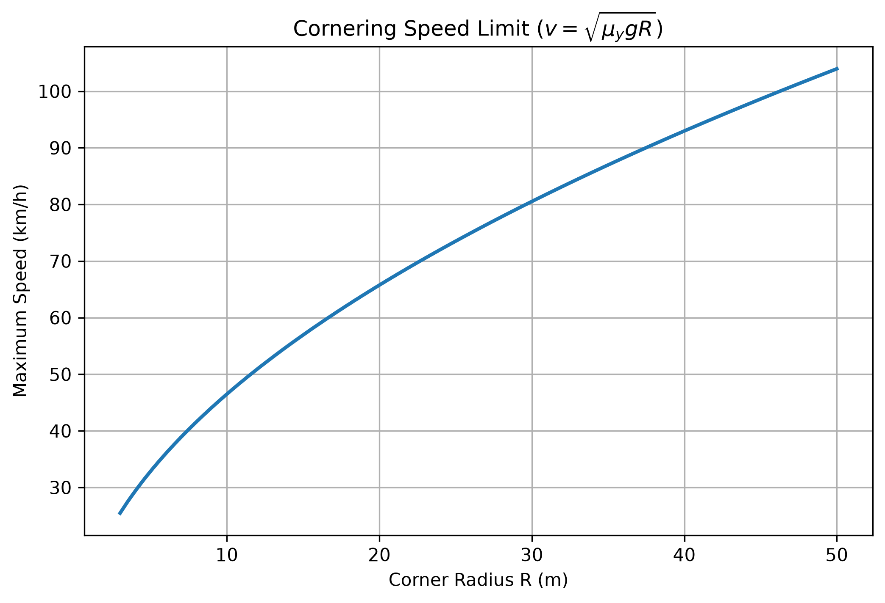

# 轉彎半徑與極限車速估算

[Download Code](speed_vs_R.py)

## 簡介

本分析使用簡化的穩態圓周運動模型，估算車輛在不同轉彎半徑下的理論極限過彎速度。假設輪胎可提供固定側向摩擦係數 $\mu_y$，且車輛處於接近穩態過彎狀態，則最大側向加速度由輪胎摩擦上限決定。

此工具適合用於早期性能目標設定，例如由 skidpad 半徑反推目標車速，或由賽道彎角半徑估算車輛所需的側向抓地能力。

## 參數

以下為計算中所採用的物理量與符號說明：

| 變數名稱 | 物理意義 | 單位 |
| --- | --- | --- |
| `mu_y` | 輪胎側向摩擦係數 ($\mu_y$) | 無因次 |
| `g` | 重力加速度 ($g$) | $m/s^2$ |
| `R_list` | 掃描的轉彎半徑列表 ($R$) | $m$ |
| `v_ext` | 理論極限過彎速度 ($v$) | $m/s$ / $km/h$ |

## 計算

### 1. 側向加速度需求

車輛以速度 $v$ 通過半徑 $R$ 的圓弧時，所需側向加速度為：

$$a_y = \frac{v^2}{R}$$

輪胎可提供的最大側向加速度近似為：

$$a_{y,max} = \mu_y g$$

### 2. 極限過彎速度

令需求側向加速度等於輪胎摩擦上限，可得到不同轉彎半徑下的理論極限速度：

$$v = \sqrt{\mu_y g R}$$

程式將 $R = 3 \sim 50\text{ m}$ 的範圍進行掃描，並將速度同時輸出為 $m/s$ 與 $km/h$。

## 結果

圖中顯示極限過彎速度會隨轉彎半徑增加而上升，但因為速度與半徑為平方根關係，半徑越大時速度增加幅度會逐漸變緩。此結果是理想化估算，尚未考慮空力下壓力、載荷轉移、輪胎負載敏感性與 transient response。
