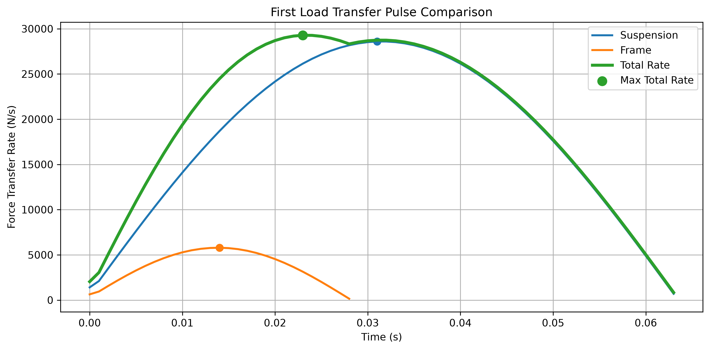
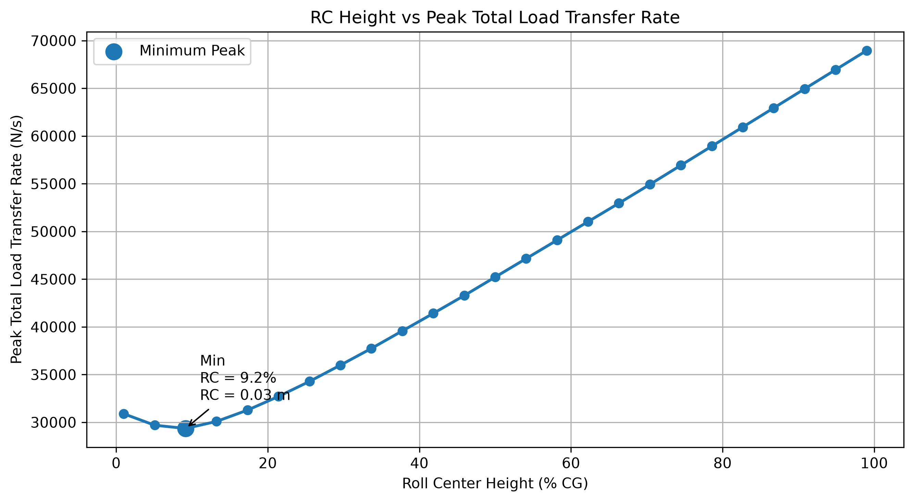

# Roll Center 最小負載轉移速率分析

[Download Code](roll_center_min_load.py)

## 簡介

本分析用於評估 roll center 高度對側向負載轉移速率的影響。車輛過彎時，側向加速度會透過重心高度產生側傾力矩；其中一部分由懸吊彈簧與 roll stiffness 承擔，另一部分則會透過 roll center 的幾何力路徑直接傳遞到車架與輪胎。

由於前軸通常具有較高 roll stiffness，若幾何力路徑能分擔部分負載轉移，就有機會降低第一波總負載轉移速率的峰值。本工具透過掃描 roll center 高度，尋找使總負載轉移速率峰值最小的設定。

## 參數

以下為計算中所採用的物理量與符號說明：

| 變數名稱 | 物理意義 | 單位 |
| --- | --- | --- |
| `ms` | 半車簧上質量 ($m_s$) | $kg$ |
| `h_cg` | 重心高度 ($h_{CG}$) | $m$ |
| `h_rc` | Roll center 高度 ($h_{RC}$) | $m$ |
| `track` | 車輛輪距 ($t$) | $m$ |
| `Ix` | 車身 roll 方向轉動慣量 ($I_x$) | $kg \cdot m^2$ |
| `k_roll` | 懸吊 roll 剛性 ($K_{roll}$) | $N \cdot m/rad$ |
| `k_frame` | 幾何力路徑等效車架剛性 | $N/m$ |
| `ay` | 側向加速度 ($a_y$) | $m/s^2$ |
| `d_roll` | 車身側傾角位移 | $rad$ |
| `d_frame` | 幾何力路徑等效變形位移 | $m$ |

## 計算

### 1. 懸吊彈簧負載轉移

車身側傾角位移會透過 roll stiffness 產生抵抗側傾的懸吊力：

$$F_{roll} = -K_{roll}d_{roll}$$

其對車身造成的力矩可表示為：

$$M_{spring} = F_{roll}t$$

### 2. Roll center 幾何力路徑

側向加速度作用於簧上質量，roll center 高度會形成幾何力矩：

$$M_{RC} = -a_y m_s h_{RC}$$

此力矩可轉換為作用在車架等效變形方向上的力：

$$F_{frame,cmd} = \frac{M_{RC}}{t}$$

車架等效變形產生的負載轉移力為：

$$dF_{roll} = K_{frame}d_{frame}$$

### 3. 總側傾動態

側向慣性力造成的外部側傾力矩為：

$$M_{ext} = a_y m_s h_{CG}$$

總側傾力矩由懸吊彈簧、側向慣性力與 roll center 幾何力矩共同組成：

$$M_x = M_{spring} + M_{ext} + M_{RC}$$

車身 roll 角加速度為：

$$\alpha_{roll} = \frac{M_x}{I_x}$$

### 4. 第一波轉移速率與掃描

程式使用數值積分得到懸吊與幾何力路徑的負載變化，再取其時間梯度：

$$\dot{F} = \frac{dF}{dt}$$

接著擷取第一波負載轉移脈衝，將懸吊轉移速率與車架幾何轉移速率相加：

$$\dot{F}_{total} = \dot{F}_{roll} + \dot{F}_{frame}$$

最後掃描不同 roll center 高度比例，尋找使第一波總負載轉移速率峰值最小的設定。

## 結果

此圖比較第一波負載轉移中，懸吊彈簧路徑、roll center 幾何路徑與總負載轉移速率的時間變化。透過觀察三者的峰值與相位，可以判斷幾何力路徑是否有助於降低總轉移峰值。

此圖顯示 roll center 高度比例與總負載轉移速率峰值的關係。最低點代表在目前模型假設下，使第一波總負載轉移最平順的 roll center 高度比例，可作為懸吊幾何設定的初步參考。
