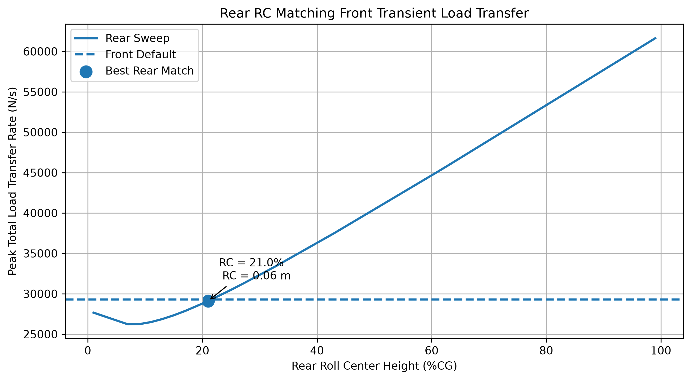

# 前後軸負載轉移速率匹配

[Download Code](roll_center_same_load.py)

## 簡介

本分析用於比較前後軸在側向加速度輸入下的第一波負載轉移速率，並透過調整後軸 roll center 高度，使後軸負載轉移速率盡可能接近前軸基準。

當前後軸 roll stiffness 不同時，負載轉移建立速度也會不同。若後軸懸吊剛性較低，可以利用較高的 roll center 讓幾何力路徑分擔更多負載轉移，補償彈簧路徑反應較慢的問題，讓前後軸 transient load transfer 更接近。

## 參數

以下為計算中所採用的物理量與符號說明：

| 變數名稱 | 物理意義 | 單位 |
| --- | --- | --- |
| `ms` | 半車簧上質量 ($m_s$) | $kg$ |
| `h_cg` | 重心高度 ($h_{CG}$) | $m$ |
| `h_rc` | Roll center 高度 ($h_{RC}$) | $m$ |
| `track` | 車輛輪距 ($t$) | $m$ |
| `Ix` | 車身 roll 方向轉動慣量 ($I_x$) | $kg \cdot m^2$ |
| `k_roll` | 前軸或後軸 roll 剛性 ($K_{roll}$) | $N \cdot m/rad$ |
| `k_frame` | 幾何力路徑等效車架剛性 | $N/m$ |
| `ay` | 側向加速度 ($a_y$) | $m/s^2$ |
| `front_peak` | 前軸基準負載轉移速率峰值 | $N/s$ |
| `rear_peak_list` | 後軸不同 roll center 高度下的轉移速率峰值 | $N/s$ |

## 計算

### 1. 前軸基準響應

程式先使用前軸懸吊設定與目前 roll center 高度，計算前軸第一波總負載轉移速率峰值：

$$\dot{F}_{front,peak} = \max \left|\dot{F}_{front,total}\right|$$

此值作為後軸調整 roll center 高度時的匹配目標。

### 2. 後軸 roll center 掃描

後軸使用較低的 roll stiffness，並掃描不同 roll center 高度比例：

$$h_{RC,rear} = ratio \cdot h_{CG}$$

對每一個後軸 roll center 高度，計算第一波總負載轉移速率峰值：

$$\dot{F}_{rear,peak}(ratio) = \max \left|\dot{F}_{rear,total}\right|$$

### 3. 前後軸速率匹配

程式以後軸峰值與前軸基準峰值之差作為誤差：

$$error = \left|\dot{F}_{rear,peak} - \dot{F}_{front,peak}\right|$$

最佳後軸 roll center 高度為使誤差最小的比例：

$$ratio_{best} = \arg\min(error)$$

## 結果

圖中曲線為後軸 roll center 高度掃描後得到的負載轉移速率峰值，虛線為前軸基準值。標記點代表最接近前軸負載轉移速率的後軸 roll center 高度，可作為前後軸 transient balance 調整的參考。
